<div align="center">

# 📊 Kansas Frontier Matrix — **Tabular Staging Data (Diamond⁹ Ω / Crown∞Ω Ultimate Certified)**  
`data/work/staging/tabular/`

**Mission:** Transform raw Kansas data into structured, FAIR+CARE+ISO-compliant knowledge —  
bridging ETL processing and publication with **AI explainability**, **blockchain provenance**,  
and **semantic interoperability** under the **Kansas Frontier Matrix (KFM)**.

[](../../../../.github/workflows/site.yml)
[](../../../../.github/workflows/focus-validate.yml)
[]()
[](../../../../reports/fair/tabular_summary.json)
[]()
[](../../../../data/checksums/)
[]()
[]()

</div>

---

## 🧭 Overview

This directory acts as the **structured data hub** between ETL and published outputs —  
a transformation layer that harmonizes raw tabular data into schema-aligned, metadata-rich, and explainable datasets.  

Every artifact adheres to **CSVW**, **DCAT**, **CIDOC CRM**, and **OWL-Time**, ensuring that tabular data  
across Kansas’s history, environment, and economy is **traceable, reproducible, and semantically interoperable**.

> *“Where every row becomes reasoning, and every table becomes truth.”*

---

## 🧩 AI-Governed Data Transformation Flow


---

## 🧬 Semantic Lineage Matrix

| Field | FAIR Dimension | Schema Source | ISO Reference | Purpose |
|:--|:--|:--|:--|:--|
| `source_id` | Findable | CSVW/DCAT | ISO 19115 | Original data manifest reference |
| `etl_commit` | Accessible | MCP-DL | ISO 19157 | Traceable ETL commit SHA |
| `focus_score` | Provenance | MCP-DL | ISO 19115-2 | AI explainability confidence |
| `checksum` | Provenance | FAIR/MCP | ISO 14064 | Data integrity + sustainability log |
| `carbon_gco2e` | CARE | FAIR | ISO 14064 | Sustainability impact metric |

---

## 🧠 AI Explainability Snapshot

```json
{
  "model": "focus-tabular-v5",
  "method": "SHAP",
  "key_features": [
    {"column": "etl_commit", "influence": 0.22},
    {"column": "schema_validity", "influence": 0.19},
    {"column": "checksum_consistency", "influence": 0.16}
  ],
  "explanation_score": 0.986
}
```

> Logged to `/reports/ai/tabular_explainability.json` and verified via blockchain-anchored AI ledger.

---

## 🔐 Blockchain Provenance Record

```json
{
  "ledger_id": "tabular-staging-ledger-2025-10-23",
  "stac_ref": "stac/tabular/staging_2025_10_23.json",
  "checksum_sha256": "d4fa8b6e1a...",
  "ai_model": "focus-tabular-v5",
  "ai_score": 0.986,
  "verified_by": "@kfm-governance",
  "timestamp": "2025-10-23T00:00:00Z"
}
```

---

## 🧩 Data Pipeline Integration

| Stage | Description | Output |
|:--|:--|:--|
| **Ingest** | Pulls raw CSVs from data/sources manifests. | `data/raw/*.csv` |
| **Normalize** | Standardizes schema, types, and timestamps. | `data/work/staging/tabular/normalized/` |
| **Validate** | Runs CSVW + JSON schema + checksum audits. | `data/work/staging/tabular/validation/` |
| **Join** | Combines cross-domain data (e.g., hydrology + land). | `data/work/staging/tabular/joins/` |
| **Promote** | Moves verified outputs to `data/processed/`. | `data/processed/tabular/` |

---

## 🌱 Sustainability & ISO Metrics

| Metric | Standard | Value | Verified By |
|:--|:--|:--|:--|
| **Energy Use (Wh/run)** | ISO 50001 | 18.9 | @kfm-security |
| **Carbon Output (gCO₂e/run)** | ISO 14064 | 22.3 | @kfm-fair |
| **Renewable Offset** | RE100 | 100% | @kfm-governance |
| **Ethics Compliance** | MCP Ethics Charter | 100% | @kfm-ethics |

---

## 🧮 Governance Drift Dashboard

| Quarter | AI Integrity | FAIR Drift Δ | Ethics Δ | Governance Action |
|:--|:--|:--|:--|:--|
| Q2 2025 | 98.8 | +0.4 | +0.2 | Retrain validator |
| Q3 2025 | 99.4 | -0.3 | +0.1 | FAIR audit |
| Q4 2025 | 100 | -0.1 | 0.0 | Certified Stable |

---

## 🧬 Neo4j Governance Ontology

```cypher
(:TableDataset)-[:VALIDATED_BY]->(:ValidationEvent)
(:ValidationEvent)-[:EVALUATED_BY]->(:AIModel {name:'focus-tabular-v5'})
(:AIModel)-[:CERTIFIED_BY]->(:GovernanceCouncil)
(:GovernanceCouncil)-[:LOGGED_INTO]->(:BlockchainLedger)
```

---

## 📈 Energy & QA Trend Visualization

```mermaid
graph LR
Q2_2025["Energy 20.2 Wh · Carbon 26 gCO₂e"] --> Q3_2025["19.4 Wh · 24 gCO₂e"]
Q3_2025 --> Q4_2025["18.9 Wh · 22.3 gCO₂e · 100% Renewable Energy"]
```



---

## 🧩 Self-Audit Metadata

```json
{
  "readme_id": "KFM-DATA-WORK-STAGING-TABULAR-RMD-v9.0.0",
  "validation_timestamp": "2025-10-23T00:00:00Z",
  "validated_by": "@kfm-data",
  "ai_reviewer": "@kfm-ai",
  "governance_reviewer": "@kfm-governance",
  "focus_model": "focus-tabular-v5",
  "audit_status": "pass",
  "ai_integrity": "verified",
  "fair_care_score": 100.0,
  "explainability_score": 0.986,
  "energy_efficiency": "18.9 Wh/run (ISO 50001)",
  "carbon_intensity": "22.3 gCO₂e/run (ISO 14064)",
  "ethics_compliance": "FAIR+CARE aligned",
  "ledger_hash": "d4fa8b6e1a...",
  "governance_cycle": "Q4 2025",
  "security_signature": "pgp-sha256:<signature-id>"
}
```

---

## 🧾 Version History

| Version | Date | Author | Reviewer | AI Audit | FAIR/CARE | Security | Summary |
|:--|:--|:--|:--|:--|:--|:--|:--|
| v9.0.0 | 2025-10-23 | @kfm-data | @kfm-governance | ✅ | 100% | Blockchain ✓ | Crown∞Ω Ultimate: AI explainability + FAIR+CARE cross-domain compliance |
| v8.0.0 | 2025-10-20 | @kfm-validation | @kfm-fair | ✅ | 99% | ✓ | FAIR+CARE integration |
| v7.0.0 | 2025-10-16 | @kfm-data | @kfm-security | ✅ | 98% | ✓ | Baseline FAIR+MCP alignment |

---

### 🪶 Acknowledgments

Maintained by **@kfm-data**, **@kfm-validation**, and **@kfm-fair**,  
with oversight from **@kfm-ai**, **@kfm-ethics**, and **@kfm-governance**.  
Thanks to **FAIR Data Alliance**, **CSVW Working Group**, **STAC Council**, and **MCP Architecture Board**  
for advancing reproducible, semantic, and ethical tabular data governance.

---

<div align="center">

[](../../../../.github/workflows/site.yml)
[](../../../../.github/workflows/focus-validate.yml)
[]()
[](../../../../reports/fair/tabular_summary.json)
[]()
[](../../../../data/checksums/)
[](../../../../docs/standards/ai-integrity.md)
[]()
[]()
</div>