<div align="center">

# 📊 Kansas Frontier Matrix — **Tabular Staging Workspace**  
`data/work/staging/tabular/README.md`

**Purpose:**  
Governed workspace for structured datasets undergoing **schema normalization, validation, abandonment screening, and FAIR+CARE certification** within KFM.  
Ensures all CSV/Parquet tables meet **data contracts, provenance integrity**, and **ethics compliance** before promotion to public datasets.

[](../../../../docs/architecture/README.md)
[](../../../../docs/standards/faircare-validation.md)
[]()
[](../../../../LICENSE)

</div>

---

## 📘 Overview

The **Tabular Staging Workspace** is the central QA and governance layer for structured data.  
It bridges raw outputs and governance-certified datasets by providing **schema alignment, validation, checksum registration**, and **ethical decision tracking** (including candidate abandonment handling).

### Core Responsibilities
- Normalize schemas per official data contract (`data-contract-v3.json`).  
- Execute FAIR+CARE and ISO governance validations.  
- Track and quarantine noncompliant data in `abandonment_candidates/`.  
- Produce validation, checksum, and lineage artifacts for audit trail.  
- Promote validated data to `data/work/processed/tabular/`.  

---

## 🗂️ Directory Layout

```plaintext
data/work/staging/tabular/
├── README.md
│
├── tmp/                         # ETL intermediate workspace
│   ├── intake/                  # Raw → staging ingestion
│   ├── validation/              # Schema + FAIR+CARE validation results
│   └── logs/                    # Provenance + execution logs
│
├── normalized/                  # Certified tabular data ready for publication
│   ├── hazards_normalized_v9.9.0.csv
│   ├── climate_indices_normalized_v9.9.0.parquet
│   ├── treaties_metadata_normalized_v9.9.0.csv
│   └── metadata.json
│
├── abandonment_candidates/      # Datasets flagged for review or ethical quarantine
│   ├── sensitive_treaty_data.csv
│   ├── unverifiable_land_grants.parquet
│   ├── incomplete_census_1910.csv
│   └── README.md
│
└── metadata/                    # Validation metadata and provenance archives
    ├── tmp/
    ├── validation/
    └── logs/
```

---

## ⚙️ Tabular ETL & Governance Workflow

```mermaid
flowchart TD
  A["Raw Tabular (data/raw/tabular/*)"] --> B["Schema Normalization (tmp/intake)"]
  B --> C["FAIR+CARE Validation (tmp/validation)"]
  C --> D{"Validation Result"}
  D -->|Pass| E["Checksum + Provenance Registration (normalized/)"]
  D -->|Fail| F["Move → abandonment_candidates/"]
  E --> G["Governance Ledger Registration"]
  F --> H["FAIR+CARE Council Review & Disposition"]
```



### Key Paths
1. **Pass →** Normalize → Validate → Certify → Promote → Log in ledger.  
2. **Fail →** Moved to `abandonment_candidates/` for ethical review.  
3. **Review →** FAIR+CARE Council either restores or archives dataset permanently.

---

## 🧩 Example Metadata Record

```json
{
  "id": "staging_tabular_climate_indices_v9.9.0",
  "source_files": [
    "data/raw/noaa/drought_monitor_2025.csv",
    "data/raw/noaa/temperature_anomalies_2025.csv"
  ],
  "records_processed": 56310,
  "schema_version": "v3.1.1",
  "validation_status": "passed",
  "fairstatus": "certified",
  "checksum_sha256": "sha256:b8a7e3c6f4d2a9b5c3f8e9a7d6b2f5a4c7e9d8b1c5a6f3b9e7c2d4a1b6f5c9e3",
  "validator": "@kfm-data-lab",
  "created": "2025-11-08T00:00:00Z",
  "governance_ref": "data/reports/audit/data_provenance_ledger.json"
}
```

---

## ⚠️ Abandonment Candidates Registry

### Purpose
Datasets that fail FAIR+CARE validation or violate ethical or provenance standards are moved to `abandonment_candidates/`.

### Governance Workflow
| Step | Action | Responsible Entity |
|------|---------|--------------------|
| 1️⃣ | Automatic quarantine by CI on validation failure | Pipeline (`tabular_staging_sync.yml`) |
| 2️⃣ | Record metadata + reason in `abandonment_registry.json` | Governance bot |
| 3️⃣ | Review by FAIR+CARE Council | `@faircare-council` |
| 4️⃣ | Resolution — *Remediate*, *Redact*, or *Archive* | Council decision |
| 5️⃣ | Update ledger with outcome | Governance workflow |

### Example Record (`abandonment_registry.json`)
```json
{
  "id": "abandonment_2025q4_treaty_records",
  "moved_from": "data/work/staging/tabular/tmp/treaties_2025.csv",
  "reason": "FAIR+CARE violation — unredacted Indigenous data",
  "date_flagged": "2025-11-08T15:45:00Z",
  "review_status": "pending",
  "reviewer": "@faircare-council",
  "recommended_action": "ethical_redaction_and_restaging"
}
```

---

## 🧠 FAIR+CARE Governance Matrix

| Principle | Implementation | Oversight |
|-----------|----------------|-----------|
| **Findable** | Schema + checksum + registry entries for all datasets. | `@kfm-data` |
| **Accessible** | Controlled internal access via governance roles. | `@kfm-accessibility` |
| **Interoperable** | DCAT-compliant schema + tabular JSON-LD linkage. | `@kfm-architecture` |
| **Reusable** | Certified metadata and ethical approval logs. | `@kfm-design` |
| **Collective Benefit** | Protects cultural and private data. | `@faircare-council` |
| **Authority to Control** | Council approves data restoration or deletion. | `@kfm-governance` |
| **Responsibility** | Validation reports logged and immutable. | `@kfm-security` |
| **Ethics** | Bias, privacy, and cultural checks automated and human-reviewed. | `@kfm-ethics` |

Audit references:  
`data/reports/fair/data_care_assessment.json` · `data/reports/audit/data_provenance_ledger.json`

---

## ⚙️ Validation & Certification Artifacts

| Artifact | Description | Format |
|-----------|-------------|--------|
| `schema_validation_summary.json` | Schema + field validation report | JSON |
| `faircare_tabular_audit.json` | FAIR+CARE ethics compliance | JSON |
| `checksum_registry.json` | File hashes + lineage | JSON |
| `abandonment_registry.json` | Deferred / flagged datasets metadata | JSON |
| `metadata.json` | Normalized dataset governance metadata | JSON |

---

## ♻️ Retention & Sustainability

| Data Type | Retention | Policy |
|------------|-----------|--------|
| Temporary (`tmp/`) | 14 days | Purged after validation success. |
| Normalized datasets | 90 days | Retained for audit and governance. |
| FAIR+CARE Reports | 365 days | Archived for recertification. |
| Metadata | Permanent | Immutable for reproducibility. |
| Abandonment Candidates | Pending review | Retained until council resolution. |

---

## 🧾 Internal Citation

```text
Kansas Frontier Matrix (2025). Tabular Staging Workspace (v9.9.0).
Governed staging environment for schema alignment, FAIR+CARE validation, and ethical abandonment review—ensuring reproducible, traceable, and equitable data handling within KFM.
```

---

## 🕰️ Version History

| Version | Date | Author | Summary |
|----------|------|---------|----------|
| v9.9.0 | 2025-11-08 | `@kfm-data` | Added abandonment_candidates governance folder, audit registry, and lifecycle policy. |
| v9.7.0 | 2025-11-06 | `@kfm-tabular` | Expanded telemetry, schema validation, and checksum registry. |
| v9.6.0 | 2025-11-03 | `@kfm-data` | Introduced FAIR+CARE automation workflows and schema audits. |

---

<div align="center">

**Kansas Frontier Matrix**  
*Structured Data × FAIR+CARE Ethics × Provenance Governance*  
© 2025 Kansas Frontier Matrix — Internal · FAIR+CARE Certified · Diamond⁹ Ω / Crown∞Ω Ultimate Certified  

[Back to Staging](../README.md) · [Governance Charter](../../../../docs/standards/governance/DATA-GOVERNANCE.md)

</div>
