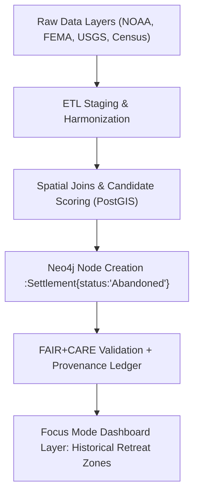

<div align="center">

# 🏚️ Kansas Frontier Matrix — **Abandonment Candidate Analysis**
`data/work/staging/tabular/abandonment_candidates/README.md`

**Purpose:**  
Defines the **triage methodology, spatial layers, and analytic workflow** used to detect **historical and environmental abandonment or relocation sites** in Kansas, leveraging FAIR+CARE-aligned data fusion and Neo4j spatial reasoning within the Kansas Frontier Matrix (KFM).

[](../../../../docs/)
[](../../../../LICENSE)
[](../../../../docs/standards/FAIRCARE.md)
[](../../../../)

</div>

---

## 📘 Overview

This analytical workspace identifies **potentially abandoned or relocated settlements** across Kansas by integrating drought, flood, census, parcel, and FEMA buyout data.  
The workflow prioritizes historically significant displacements (e.g., Dust Bowl migrations, 1993 flood retreats) and quantifies **environmental migration patterns** under FAIR+CARE governance.

---

## 🗂️ Directory Layout

```plaintext
data/
  work/
    staging/
      tabular/
        abandonment_candidates/
          README.md              # This documentation file
          abandonment_candidates.csv  # Output candidate list
          queries/
            abandonment_query.sql      # Core PostGIS selection query
            scoring_heuristic.sql      # Weighted ranking logic
          reports/
            validation_report.json     # FAIR+CARE validation results
            provenance_trace.json      # Data lineage for governance ledger
          metadata/
            abandonment-schema.json    # Data dictionary / schema definition
            ai/
              summarization_prompt.md  # AI-driven site summaries
              drift_report.json        # Model drift telemetry
```

---

## 🧾 Layer Stack

| Layer ID | Source | Purpose |
|-----------|---------|----------|
| `hydro_floods_1993` | USGS / FEMA | Identify 1993 flood retreat areas |
| `drought_dustbowl_1930s` | NOAA / USDA | Detect Dust Bowl–era abandonment |
| `census_loss_1930_1940` | US Census TIGER | Quantify historical depopulation |
| `fema_buyouts` | FEMA OpenFEMA | Identify managed retreat parcels |
| `parcel_history` | County cadastral archives | Confirm land forfeitures |
| `railroad_abandonments` | FRA / Historic GIS | Context for lost economic corridors |
| `aerial_ortho_historic` | USGS EarthExplorer | Verify relocation evidence |

---

## ⚙️ SQL Query — Candidate Detection

```sql
SELECT
  c.geoid,
  c.county_name,
  p.parcel_id,
  p.owner_hist,
  f.buyout_id,
  ST_Area(ST_Intersection(c.geom, f.geom)) AS overlap_area,
  d.drought_severity,
  h.flood_depth
FROM census_loss_1930_1940 c
LEFT JOIN fema_buyouts f ON ST_Intersects(c.geom, f.geom)
LEFT JOIN drought_dustbowl_1930s d ON ST_Intersects(c.geom, d.geom)
LEFT JOIN hydro_floods_1993 h ON ST_Intersects(c.geom, h.geom)
LEFT JOIN parcel_history p ON ST_Intersects(c.geom, p.geom)
WHERE c.pop_change_pct <= -50
  AND (f.buyout_id IS NOT NULL OR d.drought_severity >= 3)
ORDER BY overlap_area DESC, c.pop_change_pct ASC;
```

---

## 🧮 Scoring Heuristic

| Factor | Weight | Metric | Description |
|---------|---------|---------|-------------|
| Population decline | 0.4 | % loss 1930–1940 | Historical depopulation |
| FEMA buyout density | 0.3 | per km² | Managed retreat indicator |
| Drought severity | 0.2 | PDSI index | Drought pressure |
| Railroad proximity | 0.1 | distance < 1 km | Infrastructure loss proxy |

**Composite Score:**  
`score = Σ(weight × normalized_metric)`  
Top scores mark verified abandonment or relocation sites.

---

## 🧩 Integration Pipeline



---

## ⚖️ FAIR+CARE Alignment

| Principle | Implementation | Audit Reference |
|------------|----------------|-----------------|
| **F1: Findable** | Indexed GeoJSON + CSV in STAC/DCAT catalog | `manifest_ref` |
| **A1: Accessible** | FAIR-compliant access via Neo4j + API | `api/routes/abandonment` |
| **I1: Interoperable** | Linked to CIDOC CRM & DCAT 3.0 vocabularies | `ontology/schema.geo.ttl` |
| **R1: Reusable** | CC-BY 4.0 license + JSON schema metadata | `metadata/abandonment-schema.json` |
| **CARE Principles** | Ethical governance of historical displacement data | `governance_ref` |

---

## 🕰️ Version History

| Version | Date | Author | Summary |
|----------|------|--------|----------|
| v9.8.0 | 2025-11-08 | A. Barta | Initial release of abandonment candidate module |
| v9.7.0 | 2025-11-05 | A. Barta | Prototype draft for environmental retreat triage |
| v9.6.0 | 2025-11-01 | FAIR+CARE Council | Schema and governance integration updates |

---

<div align="center">

© 2025 Kansas Frontier Matrix Project · Master Coder Protocol v6.3  
FAIR+CARE Certified · Diamond⁹ Ω / Crown∞Ω Ultimate Certified  

[Back to Data Work Index](../../../README.md) · [Governance Charter](../../../../docs/standards/governance/ROOT-GOVERNANCE.md)

</div>
````
