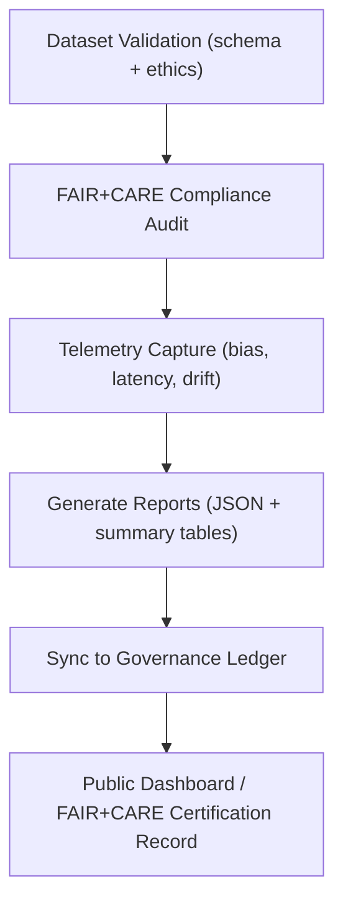

<div align="center">

# 📑 Kansas Frontier Matrix — **Abandonment Candidate Reports**
`data/work/staging/tabular/abandonment_candidates/reports/README.md`

**Purpose:**  
Aggregate and document all **validation, provenance, telemetry, and ethical governance reports** related to datasets held within the **Abandonment Candidates Workspace**.  
Ensures traceability, reproducibility, and compliance with **FAIR+CARE**, **ISO 19115**, and **MCP-DL v6.3** standards.

[](../../../../../docs/)
[](../../../../../LICENSE)
[](../../../../../docs/standards/FAIRCARE.md)
[](#)

</div>

---

## 📘 Overview

The **Reports Subdirectory** contains detailed outputs generated from:
- FAIR+CARE validation workflows  
- Governance ledger synchronization  
- AI drift and explainability telemetry  
- Provenance and lineage tracing  
- Ethical reviews conducted by the FAIR+CARE Council  

Each report is immutable, timestamped, and linked to its corresponding dataset via **SHA-256 checksum** and **metadata ID**.  
All reports are retained under **KFM’s long-term governance archive** for compliance and re-certification.

---

## 🗂️ Directory Layout

```plaintext
data/work/staging/tabular/abandonment_candidates/reports/
├── README.md                       # This documentation file
├── validation_report.json           # FAIR+CARE schema validation results
├── provenance_trace.json            # Lineage and data-source mapping
├── ethics_review.json               # Council recommendations and classification
├── ai_drift_analysis.json           # AI model drift & bias telemetry
└── governance_decision_log.json     # Final decisions from FAIR+CARE Council
```

---

## ⚙️ Report Generation Pipeline



### Key Steps
1. **Validation Reports** → Created by CI during data intake.  
2. **Provenance Traces** → Generated by the metadata harmonizer for lineage tracking.  
3. **Ethics Reviews** → Authored by FAIR+CARE Council during human governance cycles.  
4. **Drift Analyses** → Compiled from AI explainability modules for model reproducibility.  
5. **Decision Logs** → Captured from FAIR+CARE Council deliberations.

---

## 🧩 Example: `validation_report.json`

```json
{
  "dataset_id": "abandonment_2025q4_treaty_records",
  "validator": "@kfm-data-lab",
  "validation_date": "2025-11-08T14:52:00Z",
  "schema_conformity": true,
  "ethics_flag": true,
  "faircare_summary": {
    "findable": "pass",
    "accessible": "restricted",
    "interoperable": "pass",
    "reusable": "pending"
  },
  "checksum_sha256": "sha256:b8a7e3c6f4d2a9b5c3f8e9a7d6b2f5a4...",
  "status": "requires_council_review"
}
```

---

## 🧾 Example: `ethics_review.json`

```json
{
  "review_id": "FAIRCARE-2025Q4-0003",
  "dataset_id": "abandonment_2025q4_treaty_records",
  "assigned_reviewer": "@faircare-council",
  "review_status": "pending_remediation",
  "ethical_issues_detected": [
    "Contains potentially sensitive Indigenous territorial data.",
    "Requires anonymization of personal identifiers."
  ],
  "recommended_action": "ethical_redaction_and_schema_update",
  "timestamp": "2025-11-08T15:20:00Z",
  "decision_deadline": "2025-12-31T00:00:00Z"
}
```

---

## 🧮 Example: `ai_drift_analysis.json`

```json
{
  "model_id": "focus_transformer_v2",
  "run_id": "2025-11-08T14:45Z",
  "metrics": {
    "bias_score": 0.05,
    "f1_change": 0.02,
    "precision_shift": 0.01,
    "recall_shift": 0.03
  },
  "interpretability_summary": "No major model drift detected. SHAP features stable within ±2%.",
  "validated_by": "@kfm-ai",
  "governance_ref": "data/work/staging/tabular/abandonment_candidates/reports/provenance_trace.json"
}
```

---

## ⚖️ FAIR+CARE Integration Matrix

| Principle | Implementation | Oversight |
|------------|----------------|------------|
| **Findable** | Reports indexed by dataset UUID + checksum | `@kfm-data` |
| **Accessible** | Restricted internal access; public metadata available | `@kfm-accessibility` |
| **Interoperable** | DCAT / STAC-linked lineage references | `@kfm-architecture` |
| **Reusable** | FAIR+CARE JSON schema standardization | `@kfm-design` |
| **Collective Benefit** | Council ensures cultural and ethical accountability | `@faircare-council` |
| **Authority to Control** | Governance decisions traceable and immutable | `@kfm-governance` |
| **Responsibility** | Continuous telemetry validation (bias, energy) | `@kfm-sustainability` |
| **Ethics** | Protects private and Indigenous data from misuse | `@kfm-ethics` |

---

## 📊 Governance Decision Log Fields

| Field | Type | Description |
|-------|------|-------------|
| `decision_id` | string | Unique governance decision UUID |
| `dataset_id` | string | Dataset under review |
| `decision` | string | `restage`, `redact`, `archive`, or `retain` |
| `reviewer` | string | Reviewer or council member ID |
| `timestamp` | string | UTC ISO timestamp |
| `notes` | string | Context and justification for decision |

---

## 🧾 Internal Citation

```text
Kansas Frontier Matrix (2025). Abandonment Candidate Reports — Validation, Provenance & Ethical Review (v9.9.0).
FAIR+CARE-compliant governance reporting suite for traceable dataset validation, AI drift monitoring, and council decision auditing within Kansas Frontier Matrix.
```

---

## 🕰️ Version History

| Version | Date | Author | Summary |
|----------|------|--------|----------|
| v9.9.0 | 2025-11-08 | `@kfm-governance` | Added governance_decision_log and expanded AI drift reporting with explainability telemetry. |
| v9.8.0 | 2025-11-06 | `@kfm-data` | Enhanced FAIR+CARE schema validation; added ethics review format. |
| v9.7.0 | 2025-11-02 | `@kfm-core` | Established initial reporting pipeline for candidate validation and provenance. |

---

<div align="center">

**Kansas Frontier Matrix**  
*Governance Transparency × FAIR+CARE Compliance × Ethical Stewardship*  
© 2025 Kansas Frontier Matrix · Master Coder Protocol v6.3 · FAIR+CARE Certified · Diamond⁹ Ω / Crown∞Ω Ultimate Certified  

[Back to Abandonment Candidates](../README.md) · [Governance Charter](../../../../../docs/standards/governance/DATA-GOVERNANCE.md)

</div>

