<div align="center">

# 📚 Kansas Frontier Matrix — **Tabular Logs**  
`data/work/staging/tabular/logs/`

### *“The measure of data integrity is found in the story its logs tell.”*

**Purpose:**  
This directory captures all **persistent operational, validation, and provenance logs** for the tabular staging system of the Kansas Frontier Matrix (KFM).  
Unlike temporary logs stored in `/tmp/`, these logs represent **archived, auditable records** of data lineage, validation events, AI operations, and FAIR+CARE ethical reviews across all ingestion and transformation layers.

[](../../../../../docs/architecture/repo-focus.md)  
[](../../../../../LICENSE)  
[]()  
[]()  
[]()

</div>

---

## 🧭 Overview

The **Tabular Logs Layer** functions as a **long-term recordkeeping and audit trace** for all data-handling activities within KFM’s tabular data pipelines.  
It unifies logging data from:
- ETL pipeline executions  
- Schema and FAIR+CARE validation processes  
- AI model inference and explainability cycles  
- Normalization and conflict resolution phases  
- Governance ledger synchronization  
- Curator and human oversight actions  

All logs here are **checksum-verified**, **time-synchronized**, and **archived in governance records** to ensure total lifecycle reproducibility.

---

## 🗂️ Directory Layout

```text
data/work/staging/tabular/logs/
├── etl_run_history.log                 # Historical record of ETL pipeline executions
├── validation_audit.log                # FAIR+CARE and schema validation event logs
├── ai_governance.log                   # AI validation and explainability audit traces
├── normalization_trace.log             # Field-level harmonization and schema mapping logs
├── conflict_resolution.log             # Reconciliation outcomes and provenance adjustments
├── governance_sync_history.log         # Ledger update and compliance recording history
├── tabular_logs_manifest.json          # Registry and metadata for all logged files
├── integrity_checksums.json            # File-level SHA-256 verification ledger
└── README.md                           # This document
```

---

## 🔁 Log Generation Workflow

```mermaid
flowchart TD
    A["Data Pipeline Executes ETL / Validation / AI Process"] --> B["Log Event + Metadata Context"]
    B --> C["Append to Appropriate Log File (etl_run_history.log, etc.)"]
    C --> D["Compute Hash → integrity_checksums.json"]
    D --> E["Register Entry → tabular_logs_manifest.json"]
    E --> F["Governance Synchronization → tabular_logs_ledger.jsonld"]
```



---

## 🧩 Logs Manifest Schema

| Field | Description | Example |
|-------|--------------|----------|
| `log_id` | Unique identifier for a log entry | `tabular_log_2025_10_26_001` |
| `process` | Type of logged operation | `ETL / Validation / AI / Governance` |
| `file_path` | Path to log file | `validation_audit.log` |
| `record_count` | Number of records in log | `482` |
| `checksum` | SHA-256 hash verifying log integrity | `9bfae87c3a9151b9e7...` |
| `curator_verified` | Boolean flag indicating human review | `true` |
| `timestamp` | UTC time of last log update | `2025-10-26T17:26:50Z` |
| `governance_ref` | Link to provenance ledger | `governance/tabular_logs_ledger.jsonld#tabular_log_2025_10_26_001` |

---

## ⚙️ Core Components

| Component | Function | Output |
|------------|-----------|---------|
| **ETL Logger** | Records extraction, transformation, and load executions | `etl_run_history.log` |
| **Validation Logger** | Tracks FAIR+CARE, schema, and integrity checks | `validation_audit.log` |
| **AI Governance Logger** | Captures AI model decisions and reasoning | `ai_governance.log` |
| **Normalization Tracker** | Logs harmonization and encoding conversions | `normalization_trace.log` |
| **Conflict Resolver Log** | Details provenance resolution events | `conflict_resolution.log` |
| **Governance Sync Log** | Records governance updates and ledger commits | `governance_sync_history.log` |
| **Integrity Verifier** | Validates checksum and file authenticity | `integrity_checksums.json` |

> 🧠 *Tabular logs turn system activity into permanent accountability — one entry at a time.*

---

## ⚙️ Curator Workflow

1. Inspect ETL and validation logs for anomalies:
   ```bash
   tail -n 50 validation_audit.log
   ```
2. Run checksum validation for all logs:
   ```bash
   make logs-verify
   ```
3. Review AI model trace summaries for governance review:
   ```bash
   cat ai_governance.log
   ```
4. Archive finalized logs and update ledger:
   ```bash
   make governance-update
   ```

---

## 📈 Monitoring Metrics

| Metric | Description | Target |
|---------|-------------|---------|
| **Logging Completeness** | % of operations successfully logged | 100% |
| **Checksum Verification Rate** | % of logs validated for integrity | 100% |
| **Governance Synchronization Rate** | % of logs recorded in ledger | 100% |
| **Curator Oversight Coverage** | Logs reviewed by human auditors | ≥ 90% |
| **Ethical Trace Completeness** | Logs with FAIR+CARE provenance context | 100% |

---

## 🧾 Compliance Matrix

| Standard | Scope | Validator |
|-----------|--------|-----------|
| **FAIR+CARE** | Provenance-based ethical traceability | `fair-audit` |
| **MCP-DL v6.3** | Documentation and lifecycle governance | `docs-validate` |
| **ISO 9001:2015** | Operational process consistency and quality | `quality-audit` |
| **CIDOC CRM / PROV-O** | Provenance event structure validation | `graph-lint` |
| **STAC / DCAT 3.0** | Metadata discoverability for logged processes | `stac-validate` |

---

## 🪶 Version History

| Version | Date | Author | Notes |
|----------|------|---------|-------|
| v9.0.0 | 2025-10-26 | `@kfm-architecture` | Initial creation of Tabular Logs documentation under Diamond⁹ Ω / Crown∞Ω certification. |

---

<div align="center">

### 🜂 Kansas Frontier Matrix — *Accountability · Continuity · Trust*  
**“What we record today becomes the foundation of tomorrow’s reproducibility.”**

[]()
[]()
[]()
[]()
[]()

<br><br>
<a href="#-kansas-frontier-matrix--tabular-logs-ingestion-validation--governance-trace-layer--diamond⁹-Ω--crown∞Ω-certified">⬆ Back to Top</a>

</div>
