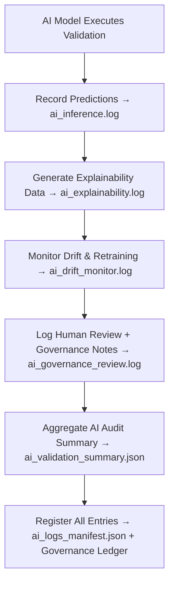

<div align="center">

# 🤖 Kansas Frontier Matrix — **AI Logs**  
`data/work/staging/tabular/logs/ai/`

### *“AI validation is only transparent when every prediction leaves a footprint.”*

**Purpose:**  
The **AI Logs Layer** captures all **AI-assisted validation, inference, explainability, and ethical reasoning events** that occur within the Kansas Frontier Matrix (KFM) tabular staging pipeline.  
It provides an immutable and reviewable trail of every model decision — ensuring **traceability, accountability, and explainability** under FAIR+CARE and MCP-DL documentation governance.

[](../../../../../../../docs/architecture/repo-focus.md)  
[](../../../../../../../LICENSE)  
[]()  
[]()  
[]()

</div>

---

## 🧭 Overview

The **AI Logs Sub-Layer** is the **auditable memory** of KFM’s machine intelligence.  
It documents:
- AI model inference results and decision scores  
- Explainability data from SHAP, LIME, or LLM reasoning  
- Drift monitoring and retraining triggers  
- FAIR+CARE ethical evaluation of AI decisions  
- Curator feedback and post-decision review cycles  

Every log entry is version-controlled, checksum-validated, and linked to the **AI Governance Ledger** for reproducibility and oversight.

---

## 🗂️ Directory Layout

```text
data/work/staging/tabular/logs/ai/
├── ai_inference.log                     # Model predictions and anomaly detection summaries
├── ai_explainability.log                # SHAP/LIME explainability traces and reasoning output
├── ai_drift_monitor.log                 # Drift and retraining event logs
├── ai_governance_review.log             # Human and governance oversight of AI decisions
├── ai_validation_summary.json           # Consolidated AI validation performance and outcomes
├── ai_logs_manifest.json                # Metadata and integrity registry of AI log files
└── README.md                            # This document
```

---

## 🔁 AI Validation Logging Workflow



---

## 🧩 AI Logs Manifest Schema

| Field | Description | Example |
|-------|--------------|----------|
| `log_id` | Unique identifier for AI log entry | `ai_log_2025_10_26_020` |
| `model_name` | AI model generating log | `Anomaly Detector v3.2` |
| `dataset_id` | Dataset analyzed | `ks_population_1890` |
| `log_type` | Category of AI event | `Inference / Explainability / Drift / Governance` |
| `ai_confidence` | Confidence score of AI validation | `0.987` |
| `drift_score` | Detected model drift (0–1) | `0.034` |
| `checksum` | SHA-256 verification hash | `e4a7c6f81b93d2a...` |
| `timestamp` | Time of event logging | `2025-10-26T17:31:44Z` |
| `governance_ref` | Provenance link to AI ledger | `governance/ai_logs_ledger.jsonld#ai_log_2025_10_26_020` |

---

## ⚙️ Core Components

| Component | Function | Output |
|------------|-----------|---------|
| **AI Inference Logger** | Captures predictions, scores, and anomalies | `ai_inference.log` |
| **Explainability Engine** | Records interpretability output (SHAP, LIME, LLM summaries) | `ai_explainability.log` |
| **Drift Detector** | Tracks model performance over time and retraining signals | `ai_drift_monitor.log` |
| **Governance Reviewer** | Captures curator and auditor commentary | `ai_governance_review.log` |
| **AI Summary Aggregator** | Consolidates validation metrics and FAIR+CARE scores | `ai_validation_summary.json` |
| **Integrity Verifier** | Confirms checksum authenticity for each log | `ai_logs_manifest.json` |

> 🧠 *Transparency isn’t optional — every AI decision must explain itself, and every explanation must be traceable.*

---

## ⚙️ Curator & Governance Workflow

1. Review AI inference logs for irregularities:
   ```bash
   tail -n 25 ai_inference.log
   ```
2. Examine explainability reports and reasoning traces:
   ```bash
   less ai_explainability.log
   ```
3. Check for drift warnings or retraining triggers:
   ```bash
   grep "drift" ai_drift_monitor.log
   ```
4. Log curator governance decisions:
   ```bash
   echo "Curator verified AI anomaly classification at 0.98 confidence." >> ai_governance_review.log
   ```
5. Sync all logs and metrics with the AI Governance Ledger:
   ```bash
   make governance-update
   ```

---

## 📈 AI Monitoring & Audit Metrics

| Metric | Description | Target |
|---------|-------------|---------|
| **AI Inference Accuracy** | Correct predictions validated by curators | ≥ 0.95 |
| **Explainability Coverage** | % of predictions with reasoning traces | 100% |
| **Drift Detection Precision** | Correctly detected performance drift events | ≥ 0.9 |
| **Governance Review Completion** | % of AI events reviewed by curators | 100% |
| **Ledger Synchronization Rate** | Frequency of AI log updates to ledger | Daily |

---

## 🧾 Compliance Matrix

| Standard | Scope | Validator |
|-----------|--------|-----------|
| **FAIR+CARE** | Ethical and provenance alignment for AI systems | `fair-audit` |
| **MCP-DL v6.3** | Documentation-driven AI explainability framework | `docs-validate` |
| **ISO/IEC 23053:2022** | AI lifecycle transparency and audit governance | `ai-validate` |
| **CIDOC CRM / PROV-O** | Provenance and semantic integrity in AI processes | `graph-lint` |
| **STAC / DCAT 3.0** | Metadata interoperability and AI audit discoverability | `stac-validate` |

---

## 🪶 Version History

| Version | Date | Author | Notes |
|----------|------|---------|-------|
| v9.0.0 | 2025-10-26 | `@kfm-architecture` | Initial creation of AI Logs documentation under Diamond⁹ Ω / Crown∞Ω certification. |

---

<div align="center">

### 🜂 Kansas Frontier Matrix — *Intelligence · Explainability · Accountability*  
**“AI without logs is speculation — AI with logs is science.”**

[]()
[]()
[]()
[]()
[]()

<br><br>
<a href="#-kansas-frontier-matrix--ai-logs-model-validation--explainability-trace-layer--diamond⁹-Ω--crown∞Ω-certified">⬆ Back to Top</a>

</div>
