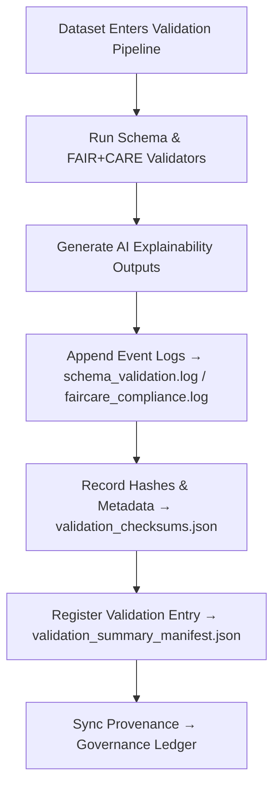

<div align="center">

# ✅ Kansas Frontier Matrix — **Validation Logs**  
`data/work/staging/tabular/logs/validation/`

### *“Validation isn’t complete until its proof is documented.”*

**Purpose:**  
The **Validation Logs Sub-Layer** provides a full, auditable record of schema, FAIR+CARE, and AI validation events across the tabular staging environment in the Kansas Frontier Matrix (KFM).  
It ensures every dataset validation — whether successful or failed — is **captured, timestamped, and governed** as part of KFM’s reproducible open-science standard.

[](../../../../../../../docs/architecture/repo-focus.md)  
[](../../../../../../../LICENSE)  
[]()  
[]()  
[]()

</div>

---

## 🧭 Overview

The **Validation Logs Layer** records all automated and human-involved validation actions that occur within KFM’s data staging and transformation workflows.  
Each log entry connects validation outcomes to:
- Schema conformity checks (STAC, DCAT, CIDOC CRM)  
- FAIR+CARE ethical metadata validation  
- AI-assisted validation and explainability reports  
- Curator reviews, overrides, and ethical annotations  
- Governance ledger registration  

These logs form a permanent **audit trail of quality assurance** for every dataset that passes through KFM’s tabular staging process.

---

## 🗂️ Directory Layout

```text
data/work/staging/tabular/logs/validation/
├── schema_validation.log               # STAC/DCAT/CIDOC schema validation output
├── faircare_compliance.log             # FAIR+CARE metadata validation and audit results
├── ai_validation_trace.log             # AI-assisted validation reasoning summaries
├── human_review_notes.log              # Curator-led review and override annotations
├── validation_summary_manifest.json    # Registry of all validation events and outcomes
├── validation_checksums.json           # File integrity and hash validation reports
└── README.md                           # This document
```

---

## 🔁 Validation Logging Workflow



---

## 🧩 Validation Summary Manifest Schema

| Field | Description | Example |
|-------|--------------|----------|
| `validation_id` | Unique identifier for validation run | `val_2025_10_26_012` |
| `dataset_id` | Dataset validated | `ks_treaty_1851` |
| `validator_type` | Validation method used | `Schema / FAIR+CARE / AI` |
| `result_status` | Outcome of validation | `Passed / Warning / Failed` |
| `ai_confidence` | Confidence of AI-driven validation (0–1) | `0.964` |
| `curator_override` | Whether human correction occurred | `false` |
| `checksum` | Integrity verification hash | `c28f4e97b1a91e3...` |
| `timestamp` | UTC validation time | `2025-10-26T17:29:02Z` |
| `governance_ref` | Provenance ledger entry link | `governance/validation_logs_ledger.jsonld#val_2025_10_26_012` |

---

## ⚙️ Core Components

| Component | Function | Output |
|------------|-----------|---------|
| **Schema Validator** | Ensures structural compliance with declared schemas | `schema_validation.log` |
| **FAIR+CARE Auditor** | Scores ethical metadata completeness and governance quality | `faircare_compliance.log` |
| **AI Validation Engine** | Generates reasoning and anomaly detection logs | `ai_validation_trace.log` |
| **Curator Review Module** | Captures manual input and oversight comments | `human_review_notes.log` |
| **Integrity Verifier** | Confirms validation record checksums | `validation_checksums.json` |
| **Governance Mapper** | Links validation logs to provenance graph | `validation_summary_manifest.json` |

> 🧠 *Validation isn’t over until its evidence is immutable — every pass, fail, and exception has a log.*

---

## ⚙️ Curator & Auditor Workflow

1. Review schema and FAIR+CARE validation logs:
   ```bash
   tail -n 50 schema_validation.log
   tail -n 50 faircare_compliance.log
   ```
2. Inspect AI reasoning output:
   ```bash
   cat ai_validation_trace.log
   ```
3. Append curator feedback or override notes:
   ```bash
   echo "Revalidated dataset: FAIR+CARE threshold adjusted due to incomplete metadata." >> human_review_notes.log
   ```
4. Update manifest and governance ledger:
   ```bash
   make governance-update
   ```

---

## 📈 Validation Performance Metrics

| Metric | Description | Target |
|---------|-------------|---------|
| **Schema Validation Success Rate** | % of datasets passing schema checks | ≥ 98% |
| **FAIR+CARE Compliance Rate** | % of datasets meeting ethical criteria | ≥ 95% |
| **AI Validation Accuracy** | Confidence match between AI and curator validation | ≥ 0.9 |
| **Checksum Integrity Rate** | % of logs validated for hash consistency | 100% |
| **Governance Traceability** | % of validations registered to ledger | 100% |

---

## 🧾 Compliance Matrix

| Standard | Scope | Validator |
|-----------|--------|-----------|
| **FAIR+CARE** | Ethical and metadata validation | `fair-audit` |
| **MCP-DL v6.3** | Documentation-first audit trace | `docs-validate` |
| **CIDOC CRM / DCAT 3.0** | Structural and semantic compliance | `graph-lint` |
| **ISO/IEC 23053:2022** | AI validation and lifecycle transparency | `ai-validate` |
| **STAC / STAC-JSON** | Validation metadata interoperability | `stac-validate` |

---

## 🪶 Version History

| Version | Date | Author | Notes |
|----------|------|---------|-------|
| v9.0.0 | 2025-10-26 | `@kfm-architecture` | Initial creation of Validation Logs documentation under Diamond⁹ Ω / Crown∞Ω certification. |

---

<div align="center">

### 🜂 Kansas Frontier Matrix — *Validation · Documentation · Governance*  
**“The only proof of quality is a traceable log that others can reproduce.”**

[]()
[]()
[]()
[]()
[]()

<br><br>
<a href="#-kansas-frontier-matrix--validation-logs-schema-faircare--ai-audit-trace-layer--diamond⁹-Ω--crown∞Ω-certified">⬆ Back to Top</a>

</div>
