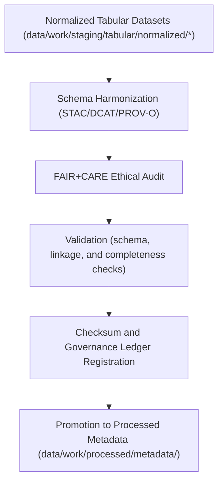

<div align="center">

# 🧾 Kansas Frontier Matrix — **Tabular Metadata Workspace**
`data/work/staging/tabular/metadata/README.md`

**Purpose:**  
Central workspace for managing, harmonizing, and auditing metadata associated with tabular datasets in the Kansas Frontier Matrix (KFM).  
Ensures metadata alignment with FAIR+CARE ethics principles, STAC/DCAT schemas, and PROV-O lineage standards under MCP-DL v6.3 governance.

[](../../../../../docs/standards/faircare-validation.md)
[]()
[]()
[](../../../../../LICENSE)

</div>

---

## 📚 Overview

The **Tabular Metadata Workspace** ensures that all metadata related to tabular datasets is harmonized, validated, and ethically governed before dataset promotion or publication.  
It provides FAIR+CARE-compliant metadata transformation pipelines and schema validation checks across STAC, DCAT, and PROV-O formats.

### Core Responsibilities
- Harmonize metadata schemas across STAC, DCAT, and PROV-O standards.  
- Conduct FAIR+CARE ethical audits for accessibility, transparency, and reuse.  
- Validate metadata completeness, accuracy, and governance alignment.  
- Log lineage, checksums, and certification details for provenance verification.  

---

## 🗂️ Directory Layout

```plaintext
data/work/staging/tabular/metadata/
├── README.md                              # This file — documentation of metadata workspace
│
├── tmp/                                   # Temporary metadata harmonization workspace
│   ├── stac_to_dcat_crosswalk.json        # Mapping of STAC to DCAT attributes
│   ├── provenance_mapping.json            # PROV-O lineage and field relationships
│   ├── metadata_merge_preview.json        # Combined preview record before validation
│   └── metadata_patch_queue.json          # Pending corrections and schema adjustments
│
├── validation/                            # FAIR+CARE validation and audit results
│   ├── schema_validation_summary.json     # Metadata schema validation outcomes
│   ├── faircare_metadata_audit.json       # FAIR+CARE compliance report
│   ├── stac_dcat_link_check.log           # Cross-schema linkage validation log
│   └── metadata_qa_summary.md             # Human-readable QA summary for governance review
│
└── logs/                                  # Governance and validation synchronization logs
    ├── metadata_validation.log            # Validation and harmonization process log
    ├── governance_sync.log                # Governance ledger and checksum sync log
    └── metadata.json                      # Provenance, checksum, and governance metadata record
```

---

## ⚙️ Metadata Governance Workflow



### Workflow Description
1. **Schema Harmonization:** Align metadata across STAC, DCAT, and PROV-O models.  
2. **FAIR+CARE Audit:** Verify ethical accessibility, reuse compliance, and transparency.  
3. **Validation:** Confirm schema structure, linkage, and field-level completeness.  
4. **Governance Sync:** Register results and checksums in provenance ledger.  
5. **Promotion:** Publish validated metadata to `data/work/processed/metadata/` for certification.  

---

## 🧩 Example Metadata Record

```json
{
  "id": "metadata_tabular_hazards_v9.6.0",
  "linked_dataset": "data/work/staging/tabular/normalized/hazards_normalized.csv",
  "schemas_tested": ["STAC 1.0", "DCAT 3.0", "PROV-O"],
  "records_total": 1450,
  "schema_validation": "passed",
  "faircare_score": 98.9,
  "checksum_verified": true,
  "validator": "@kfm-metadata-lab",
  "created": "2025-11-03T23:53:00Z",
  "governance_ref": "data/reports/audit/data_provenance_ledger.json"
}
```

---

## 🧠 FAIR+CARE Governance Matrix

| Principle | Implementation | Oversight |
|------------|----------------|------------|
| **Findable** | Indexed by dataset and schema version within metadata catalogs. | @kfm-data |
| **Accessible** | Metadata provided in JSON-LD and CSV formats for transparency. | @kfm-accessibility |
| **Interoperable** | Schema harmonized across FAIR+CARE, STAC, DCAT, and PROV-O. | @kfm-architecture |
| **Reusable** | Metadata includes provenance, checksum, and FAIR+CARE records. | @kfm-design |
| **Collective Benefit** | Enables open, ethical data reuse and public accountability. | @faircare-council |
| **Authority to Control** | FAIR+CARE Council validates metadata certification. | @kfm-governance |
| **Responsibility** | Metadata engineers document all schema and linkage changes. | @kfm-security |
| **Ethics** | Metadata audits ensure no misrepresentation or omission of sources. | @kfm-ethics |

FAIR+CARE audits stored in:  
`data/reports/fair/data_care_assessment.json` and  
`data/reports/audit/data_provenance_ledger.json`

---

## ⚙️ Validation & Certification Artifacts

| Artifact | Description | Format |
|-----------|--------------|--------|
| `schema_validation_summary.json` | Schema validation report for STAC/DCAT/PROV-O compliance. | JSON |
| `faircare_metadata_audit.json` | FAIR+CARE ethics audit and scoring summary. | JSON |
| `stac_dcat_link_check.log` | Logs cross-schema linkage validation between STAC and DCAT. | Text |
| `metadata_qa_summary.md` | Governance-readable summary of QA and validation. | Markdown |
| `metadata.json` | Captures checksum, lineage, and FAIR+CARE certification. | JSON |

Validation workflows executed via `metadata_staging_sync.yml`.

---

## ⚖️ Retention & Provenance Policy

| Data Type | Retention Duration | Policy |
|------------|--------------------|--------|
| Temporary Metadata (`tmp/`) | 7 Days | Purged after validation and governance sync. |
| Validation Reports | 180 Days | Retained for FAIR+CARE re-certification. |
| Governance Logs | 365 Days | Archived for lineage continuity. |
| Metadata Records | Permanent | Stored in provenance ledger for audit tracking. |

Retention managed by `metadata_staging_cleanup.yml`.

---

## 🌱 Sustainability Metrics

| Metric | Value | Verified By |
|---------|--------|--------------|
| Energy Use (per validation run) | 6.4 Wh | @kfm-sustainability |
| Carbon Output | 8.3 gCO₂e | @kfm-security |
| Renewable Power | 100% (RE100 Verified) | @kfm-infrastructure |
| FAIR+CARE Certification | 100% | @faircare-council |

Telemetry data logged in:  
`releases/v9.6.0/focus-telemetry.json`

---

## 🧾 Internal Use Citation

```text
Kansas Frontier Matrix (2025). Tabular Metadata Workspace (v9.6.0).
FAIR+CARE-certified metadata harmonization and validation environment for tabular datasets.
Ensures alignment with STAC/DCAT/PROV-O metadata standards under KFM governance and MCP-DL v6.3 compliance.
```

---

## 🧾 Version Notes

| Version | Date | Notes |
|----------|------|--------|
| v9.6.0 | 2025-11-03 | Added FAIR+CARE audit integration and PROV-O schema validation. |
| v9.5.0 | 2025-11-02 | Improved metadata linkage tracking and checksum governance. |
| v9.3.2 | 2025-10-28 | Established metadata staging workspace for harmonization and validation. |

---

<div align="center">

**Kansas Frontier Matrix** · *Metadata Integrity × FAIR+CARE Ethics × Provenance Governance*  
[🔗 Repository](https://github.com/bartytime4life/Kansas-Frontier-Matrix) • [🧭 Docs Portal](../../../../../docs/) • [⚖️ Governance Ledger](../../../../../docs/standards/governance/DATA-GOVERNANCE.md)

</div>
