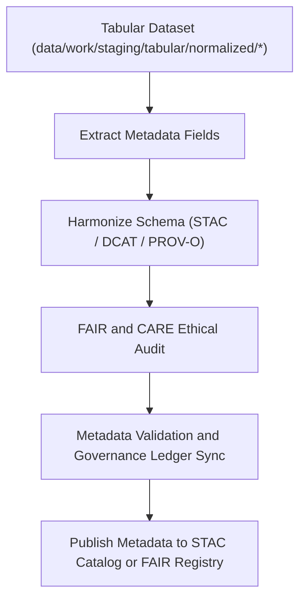

<div align="center">

# 🧾 Kansas Frontier Matrix — **Tabular Metadata Workspace**
`data/work/staging/tabular/metadata/README.md`

**Purpose:** Centralized workspace for harmonizing, validating, and FAIR+CARE auditing metadata associated with tabular datasets in the Kansas Frontier Matrix (KFM).  
Ensures all dataset descriptors, data contracts, and provenance metadata conform to STAC, DCAT, and PROV-O standards for reproducible open data governance.

[](../../../../../docs/standards/faircare-validation.md)
[](../../../../../LICENSE)
[](../../../../../docs/architecture/repo-focus.md)

</div>

---

## 📚 Overview

The `data/work/staging/tabular/metadata/` directory is responsible for managing and validating all **tabular dataset metadata** during staging operations.  
It bridges technical schema validation with ethical governance by unifying DCAT, STAC, and KFM metadata standards under FAIR+CARE principles.

### Core Functions:
- Harmonize tabular metadata to STAC/DCAT schemas.  
- Validate JSON schema structure and completeness.  
- Audit FAIR+CARE compliance and ethical data descriptors.  
- Integrate PROV-O lineage metadata for dataset traceability.  
- Synchronize with the governance ledger for provenance certification.  

This workspace ensures all tabular data are documented with transparent, interoperable, and ethics-compliant metadata prior to publication.

---

## 🗂️ Directory Layout

```plaintext
data/work/staging/tabular/metadata/
├── README.md                              # This file — overview of metadata workspace
│
├── tmp/                                   # Temporary metadata conversion and harmonization
│   ├── stac_to_dcat_crosswalk.json
│   ├── provenance_mapping.json
│   ├── metadata_merge_preview.json
│   └── metadata_patch_queue.json
│
├── validation/                            # Metadata QA and schema conformance results
│   ├── schema_validation_summary.json
│   ├── faircare_metadata_audit.json
│   ├── stac_dcat_link_check.log
│   └── metadata_qa_summary.md
│
└── logs/                                  # Governance logs and synchronization traces
    ├── metadata_validation.log
    ├── governance_sync.log
    └── metadata.json
```

---

## ⚙️ Metadata Workflow



### Workflow Description:
1. **Extraction:** Metadata auto-generated from normalized tabular data.  
2. **Harmonization:** Aligns attributes across STAC, DCAT, and schema.org.  
3. **Ethical Review:** FAIR+CARE audits ensure metadata meets open-data ethics standards.  
4. **Validation:** Schema structure validated using JSON schema definitions.  
5. **Governance:** Logs synchronized to provenance ledger for transparency.

---

## 🧩 Example Metadata Record

```json
{
  "id": "metadata_tabular_climate_indices_v9.3.2",
  "linked_dataset": "data/work/staging/tabular/normalized/climate_indices_normalized.parquet",
  "schema_versions": ["STAC 1.0.0", "DCAT 3.0"],
  "fields_documented": 34,
  "validator": "@kfm-metadata-lab",
  "created": "2025-10-28T14:50:00Z",
  "checksum": "sha256:3b7e8c10a49a0c9b54d27c7d38f7310d79f8b4b8...",
  "fairstatus": "certified",
  "governance_ledger_ref": "data/reports/audit/data_provenance_ledger.json"
}
```

---

## 🧠 FAIR+CARE Metadata Governance

| Principle | Implementation |
|------------|----------------|
| **Findable** | Metadata indexed with dataset IDs, schema versions, and catalog links. |
| **Accessible** | Stored as open JSON-LD, accessible via KFM metadata APIs. |
| **Interoperable** | Conforms to STAC 1.0, DCAT 3.0, and PROV-O for cross-domain sharing. |
| **Reusable** | Provenance, licensing, and attribution metadata embedded in records. |
| **Collective Benefit** | Promotes transparent metadata documentation across datasets. |
| **Authority to Control** | FAIR+CARE Council reviews metadata structure and schema linkage. |
| **Responsibility** | Validators document all metadata changes and QA logs. |
| **Ethics** | Metadata validated for truthful, non-biased, and open representation. |

FAIR+CARE audit reports registered in:  
`data/reports/fair/data_care_assessment.json`  
and `data/reports/audit/data_provenance_ledger.json`.

---

## ⚙️ Validation Tools and Standards

| Tool | Function | Output |
|------|-----------|--------|
| **stac-validator** | Validates STAC item and collection compliance. | JSON log |
| **jsonschema-cli** | Checks schema conformance for DCAT and PROV-O models. | JSON summary |
| **faircare-validator** | Performs ethical FAIR+CARE metadata audit. | JSON |
| **prov-audit.py** | Validates provenance lineage and relationships. | JSON |
| **metadata-sync.yml** | Automates governance ledger and catalog updates. | YAML log |

---

## ⚖️ Governance & Provenance Integration

| Record | Description |
|---------|-------------|
| `metadata.json` | Captures session metadata, schema version, and checksum. |
| `data/reports/audit/data_provenance_ledger.json` | Logs metadata validation lineage and FAIR+CARE certification. |
| `data/reports/fair/data_care_assessment.json` | Tracks ethical metadata compliance metrics. |
| `releases/v9.3.2/manifest.zip` | Stores checksum records for metadata files. |

Synchronization and validation performed via `metadata_tabular_sync.yml`.

---

## 🧾 Retention Policy

| File Category | Retention Duration | Policy |
|----------------|--------------------|--------|
| Temporary Files (`tmp/`) | 7 days | Deleted post-validation. |
| Validation Reports | 180 days | Retained for FAIR+CARE re-audit. |
| Governance Logs | 365 days | Archived for provenance continuity. |
| Metadata Summaries | Permanent | Stored in STAC and governance repositories. |

Cleanup managed by `metadata_cleanup.yml` automation.

---

## 🧾 Internal Use Citation

```text
Kansas Frontier Matrix (2025). Tabular Metadata Workspace (v9.3.2).
Governed environment for harmonizing and validating tabular dataset metadata under FAIR+CARE and open data standards.
Restricted to internal ETL, QA, and governance workflows.
```

---

## 🧾 Version Notes

| Version | Date | Notes |
|----------|------|--------|
| v9.3.2 | 2025-10-28 | Integrated FAIR+CARE metadata auditing and governance synchronization. |
| v9.2.0 | 2024-07-15 | Added STAC/DCAT/PROV-O harmonization and schema validation tools. |
| v9.0.0 | 2023-01-10 | Established metadata staging workspace for tabular datasets. |

---

<div align="center">

**Kansas Frontier Matrix** · *Metadata Interoperability × FAIR+CARE Ethics × Provenance Transparency*  
[🔗 Repository](https://github.com/bartytime4life/Kansas-Frontier-Matrix) • [🧭 Docs Portal](../../../../../docs/) • [⚖️ Governance Ledger](../../../../../docs/standards/governance/)

</div>

