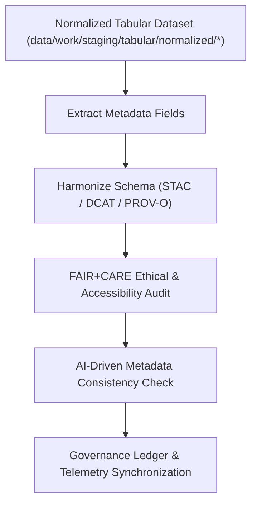

<div align="center">

# 🧾 Kansas Frontier Matrix — **Tabular Metadata Workspace**
`data/work/staging/tabular/metadata/README.md`

**Purpose:** Centralized workspace for harmonizing, validating, and FAIR+CARE auditing metadata associated with tabular datasets in the Kansas Frontier Matrix (KFM).  
Ensures all descriptors, contracts, and provenance metadata align with STAC, DCAT, and PROV-O standards while maintaining ethical and reproducible governance.

[](../../../../../docs/standards/faircare-validation.md)
[](../../../../../LICENSE)
[](../../../../../docs/architecture/repo-focus.md)

</div>

---

## 📚 Overview

The `data/work/staging/tabular/metadata/` directory governs all **tabular dataset metadata** during staging workflows.  
It harmonizes technical schema validation with FAIR+CARE ethical governance, combining STAC, DCAT, and PROV-O into a unified KFM metadata standard.

### Core Functions
- Harmonize metadata between STAC 1.0, DCAT 3.0, PROV-O, and KFM JSON schema.  
- Validate metadata structure, completeness, and FAIR+CARE compliance.  
- Capture PROV-O lineage for transparent data traceability.  
- Synchronize governance metadata with the central provenance ledger.  
- Emit telemetry for metadata integrity, validation duration, and drift detection.  

All metadata within this workspace undergoes audit validation prior to promotion to the catalog registry or public FAIR repository.

---

## 🗂️ Directory Layout

```plaintext
data/work/staging/tabular/metadata/
├── README.md
│
├── tmp/                                   # Temporary harmonization workspace
│   ├── stac_to_dcat_crosswalk.json
│   ├── provenance_mapping.json
│   ├── metadata_merge_preview.json
│   └── metadata_patch_queue.json
│
├── validation/                            # Metadata validation and audit results
│   ├── schema_validation_summary.json
│   ├── faircare_metadata_audit.json
│   ├── stac_dcat_link_check.log
│   ├── ai_metadata_anomaly_report.json
│   └── metadata_qa_summary.md
│
└── logs/                                  # Metadata pipeline and governance logs
    ├── metadata_validation.log
    ├── governance_sync.log
    ├── ai_validation_trace.log
    └── metadata.json
```

---

## ⚙️ Metadata Workflow



### Workflow Description
1. **Extraction:** Parse schema metadata from normalized tabular datasets.  
2. **Harmonization:** Crosswalk STAC/DCAT fields and integrate PROV-O lineage metadata.  
3. **Ethics Review:** Perform FAIR+CARE audits for open-data compliance and attribution.  
4. **AI Validation:** Use metadata anomaly detection to identify missing or inconsistent fields.  
5. **Governance:** Sync validation results, checksums, and telemetry events to the provenance ledger.

---

## 🧩 Example Metadata Record

```json
{
  "id": "metadata_tabular_climate_indices_v9.5.0",
  "linked_dataset": "data/work/staging/tabular/normalized/climate_indices_normalized.parquet",
  "schema_versions": ["STAC 1.0.0", "DCAT 3.0", "PROV-O v2.1"],
  "fields_documented": 34,
  "validator": "@kfm-metadata-lab",
  "created": "2025-11-02T16:35:00Z",
  "checksum": "sha256:3b7e8c10a49a0c9b54d27c7d38f7310d79f8b4b8...",
  "fairstatus": "certified",
  "telemetry_link": "releases/v9.5.0/focus-telemetry.json",
  "ai_confidence_score": 0.992,
  "governance_ledger_ref": "data/reports/audit/data_provenance_ledger.json"
}
```

---

## 🧠 FAIR+CARE Metadata Governance

| Principle | Implementation |
|------------|----------------|
| **Findable** | Indexed by dataset ID, schema version, checksum, and telemetry. |
| **Accessible** | Exposed via JSON-LD and FAIR APIs for internal governance. |
| **Interoperable** | Schema harmonized with STAC, DCAT, and PROV-O standards. |
| **Reusable** | Embedded provenance and ethics metadata guarantee reproducibility. |
| **Collective Benefit** | Strengthens open science through transparent metadata governance. |
| **Authority to Control** | FAIR+CARE Council oversees metadata approval and audit cycles. |
| **Responsibility** | Validators and AI auditors record all metadata modifications. |
| **Ethics** | Metadata reviewed for completeness, attribution, and representation equity. |

All FAIR+CARE audit results and metadata QA reports stored in:  
`data/reports/fair/data_care_assessment.json` • `data/reports/audit/data_provenance_ledger.json`

---

## ⚙️ Validation & QA Standards

| Tool | Function | Output |
|------|-----------|--------|
| **stac-validator** | Verifies STAC/DCAT conformance. | JSON log |
| **jsonschema-cli** | Validates field structure and metadata integrity. | JSON |
| **faircare-validator** | Executes FAIR+CARE audit for accessibility and licensing. | JSON |
| **ai-metadata-auditor.py** | Detects missing fields and metadata drift using AI models. | JSON |
| **prov-audit.py** | Validates PROV-O lineage and entity relations. | JSON |

All validation events synchronized through **`metadata_tabular_sync.yml`**.

---

## ⚖️ Governance & Provenance Integration

| Record | Description |
|---------|-------------|
| `metadata.json` | Captures runtime, checksum, validator identity, and telemetry. |
| `data/reports/audit/data_provenance_ledger.json` | Logs lineage and FAIR+CARE certification results. |
| `data/reports/fair/data_care_assessment.json` | Tracks metadata FAIR+CARE ethics outcomes. |
| `releases/v9.5.0/manifest.zip` | Archives all checksum and validation signatures. |

Governance and telemetry synchronization automated by **`metadata_tabular_sync.yml`**.

---

## 🧾 Retention Policy

| Category | Retention | Policy |
|-----------|-----------|--------|
| Temporary Files (`tmp/`) | 7 days | Purged post-validation success. |
| Validation Reports | 180 days | Retained for governance and ethics re-audits. |
| Governance Logs | 365 days | Archived for lineage and compliance audits. |
| Metadata Summaries | Permanent | Stored in STAC/DCAT registries and governance ledgers. |

Automated cleanup managed by **`metadata_cleanup.yml`**.

---

## 🧾 Internal Use Citation

```text
Kansas Frontier Matrix (2025). Tabular Metadata Workspace (v9.5.0).
FAIR+CARE-certified metadata harmonization workspace ensuring DCAT/STAC interoperability, ethical compliance, and full provenance synchronization.
Restricted to internal governance, QA, and certification operations.
```

---

## 🧾 Version Notes

| Version | Date | Notes |
|----------|------|--------|
| v9.5.0 | 2025-11-02 | Added telemetry and AI-driven anomaly detection for metadata validation; upgraded PROV-O harmonization and FAIR+CARE automation. |
| v9.4.0 | 2025-11-02 | Improved governance sync and extended validation QA metrics. |
| v9.3.2 | 2025-10-28 | Integrated FAIR+CARE auditing and metadata governance synchronization. |
| v9.2.0 | 2024-07-15 | Introduced STAC/DCAT/PROV-O harmonization and schema validation tools. |
| v9.0.0 | 2023-01-10 | Established metadata staging workspace for tabular datasets. |

---

<div align="center">

**Kansas Frontier Matrix** · *Metadata Interoperability × FAIR+CARE Ethics × Provenance Intelligence × Telemetry Traceability*  
[🔗 Repository](https://github.com/bartytime4life/Kansas-Frontier-Matrix) • [🧭 Docs Portal](../../../../../docs/) • [⚖️ Governance Ledger](../../../../../docs/standards/governance/)

</div>
