<div align="center">

# 🧾 Kansas Frontier Matrix — **Tabular Metadata Workspace**
`data/work/staging/tabular/metadata/README.md`

**Purpose:**  
Central workspace for managing, harmonizing, and auditing **tabular metadata** in KFM.  
Ensures alignment with **FAIR+CARE** ethics, **STAC/DCAT** schemas, and **PROV-O/ISO 19115** lineage standards under MCP-DL v6.3 governance.

[](../../../../../docs/architecture/README.md)
[](../../../../../docs/standards/faircare-validation.md)
[]()
[]()
[](../../../../../LICENSE)

</div>

---

## 📘 Overview

The **Tabular Metadata Workspace** guarantees that metadata for structured datasets is **harmonized, validated, and ethically governed** before dataset promotion or publication.  
Pipelines provide FAIR+CARE-compliant transformations and schema checks across **STAC**, **DCAT**, and **PROV-O**.

### Core Responsibilities
- Harmonize metadata across STAC/DCAT/PROV-O standards.  
- Conduct FAIR+CARE audits for accessibility, transparency, and reuse.  
- Validate completeness, accuracy, and governance alignment.  
- Log lineage, checksums, and certification details for provenance.  

---

## 🗂️ Directory Layout

```plaintext
data/work/staging/tabular/metadata/
├── README.md
├── tmp/
│   ├── stac_to_dcat_crosswalk.json
│   ├── provenance_mapping.json
│   ├── metadata_merge_preview.json
│   └── metadata_patch_queue.json
├── validation/
│   ├── schema_validation_summary.json
│   ├── faircare_metadata_audit.json
│   ├── stac_dcat_link_check.log
│   └── metadata_qa_summary.md
└── logs/
    ├── metadata_validation.log
    ├── governance_sync.log
    └── metadata.json
```

---

## ⚙️ Metadata Governance Workflow

```mermaid
flowchart TD
    A["Normalized Tabular (staging/tabular/normalized/*)"] --> B["Schema Harmonization (STAC/DCAT/PROV-O)"]
    B --> C["FAIR + CARE Ethical Audit"]
    C --> D["Validation: Schema · Linkage · Completeness"]
    D --> E["Checksum + Governance Ledger Registration"]
    E --> F["Promotion → Processed Metadata (data/work/processed/metadata/)"]
```



### Steps
1. **Harmonization** — Align metadata with target standards.  
2. **Ethics Audit** — FAIR+CARE checks for openness & stewardship.  
3. **Validation** — Confirm structural + linkage integrity.  
4. **Governance** — Register checksums and results in provenance ledger.  
5. **Promotion** — Publish to processed metadata collections.

---

## 🧩 Example Metadata Record

```json
{
  "id": "metadata_tabular_hazards_v9.7.0",
  "linked_dataset": "data/work/staging/tabular/normalized/hazards_normalized_v9.7.0.csv",
  "schemas_tested": ["STAC 1.0", "DCAT 3.0", "PROV-O"],
  "records_total": 1450,
  "schema_validation": "passed",
  "faircare_score": 98.9,
  "checksum_verified": true,
  "validator": "@kfm-metadata-lab",
  "created": "2025-11-06T23:53:00Z",
  "governance_ref": "data/reports/audit/data_provenance_ledger.json"
}
```

---

## 🧠 FAIR+CARE Governance Matrix

| Principle | Implementation | Oversight |
|-----------|----------------|-----------|
| **Findable** | Indexed with dataset + schema version in catalogs. | `@kfm-data` |
| **Accessible** | JSON-LD + CSV artifacts for review. | `@kfm-accessibility` |
| **Interoperable** | STAC/DCAT/PROV-O/ISO 19115 harmonization. | `@kfm-architecture` |
| **Reusable** | Provenance, checksums, and certification embedded. | `@kfm-design` |
| **Collective Benefit** | Enables ethical reuse and accountability. | `@faircare-council` |
| **Authority to Control** | Council validates metadata certification. | `@kfm-governance` |
| **Responsibility** | Engineers document schema + linkage changes. | `@kfm-security` |
| **Ethics** | Audits ensure accurate, respectful representation. | `@kfm-ethics` |

**Audit refs:**  
`data/reports/fair/data_care_assessment.json` · `data/reports/audit/data_provenance_ledger.json`

---

## ⚙️ Validation & Certification Artifacts

| Artifact                         | Description                                     | Format |
|----------------------------------|-------------------------------------------------|--------|
| `schema_validation_summary.json` | STAC/DCAT/PROV-O compliance check               | JSON   |
| `faircare_metadata_audit.json`   | FAIR+CARE ethics audit + scoring                | JSON   |
| `stac_dcat_link_check.log`       | Cross-schema linkage verification               | Text   |
| `metadata_qa_summary.md`         | Governance-readable QA summary                  | Markdown |
| `metadata.json`                  | Checksum, lineage, and certification references | JSON   |

**Automation:** `metadata_staging_sync.yml`

---

## ♻️ Retention & Sustainability

| Data Type            | Retention | Policy |
|---------------------|----------:|--------|
| Temporary (`tmp/`)  | 7 Days    | Purged after validation + sync. |
| Validation Reports  | 180 Days  | Retained for FAIR+CARE audits.   |
| Governance Logs     | 365 Days  | Archived for lineage tracking.   |
| Metadata Records    | Permanent | Stored in provenance ledger.     |

**Telemetry:** `../../../../../releases/v9.7.0/focus-telemetry.json`

---

## 🧾 Internal Citation

```text
Kansas Frontier Matrix (2025). Tabular Metadata Workspace (v9.7.0).
FAIR+CARE-certified metadata harmonization + validation environment for tabular datasets, aligned with STAC, DCAT, and PROV-O under MCP-DL v6.3 governance.
```

---

## 🕰️ Version History

| Version | Date       | Author               | Summary |
|--------:|------------|----------------------|---------|
| v9.7.0  | 2025-11-06 | `@kfm-metadata`      | Upgraded to v9.7.0; telemetry/schema refs aligned; QA artifacts refreshed. |
| v9.6.0  | 2025-11-03 | `@kfm-metadata`      | Added FAIR+CARE audit integration and PROV-O validation. |

---

<div align="center">

**Kansas Frontier Matrix**  
*Metadata Integrity × FAIR+CARE Ethics × Provenance Governance*  
© 2025 Kansas Frontier Matrix — Internal · FAIR+CARE Certified · Diamond⁹ Ω / Crown∞Ω Ultimate Certified  

[Back to Tabular Staging](../README.md) · [Governance Charter](../../../../../docs/standards/governance/DATA-GOVERNANCE.md)

</div>