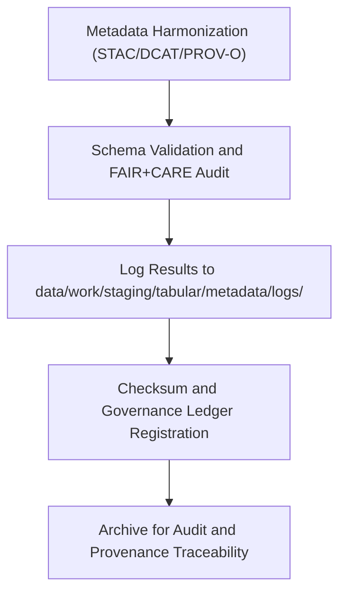

<div align="center">

# 🧾 Kansas Frontier Matrix — **Tabular Metadata Logs**
`data/work/staging/tabular/metadata/logs/README.md`

**Purpose:**  
Centralized FAIR+CARE-certified repository for recording metadata harmonization, validation, and governance synchronization logs for tabular datasets within the Kansas Frontier Matrix (KFM).  
Ensures traceable and reproducible documentation for every metadata transformation, validation, and certification process.

[](../../../../../../docs/standards/faircare-validation.md)
[]()
[]()
[](../../../../../../LICENSE)

</div>

---

## 📚 Overview

The **Tabular Metadata Logs Workspace** archives comprehensive logging records for metadata-related activities across harmonization, validation, and FAIR+CARE certification.  
It guarantees transparent traceability across all automated and manual metadata validation events under MCP-DL v6.3 documentation-first governance.

### Core Responsibilities
- Record all metadata harmonization, validation, and schema testing operations.  
- Capture governance synchronization and checksum registration events.  
- Document FAIR+CARE ethics audit outcomes for provenance integrity.  
- Retain machine- and human-readable logs for governance reproducibility.  

---

## 🗂️ Directory Layout

```plaintext
data/work/staging/tabular/metadata/logs/
├── README.md                              # This file — documentation of tabular metadata logs
│
├── metadata_validation.log                # Detailed trace of schema and FAIR+CARE validation events
├── governance_sync.log                    # Log of ledger synchronization and checksum registration
├── stac_dcat_crosswalk_trace.json         # Record of crosswalk mappings between STAC and DCAT schemas
└── metadata.json                          # Provenance, checksum, and governance trace metadata
```

---

## ⚙️ Metadata Logging Workflow



### Workflow Description
1. **Validation Logging:** Record schema and FAIR+CARE validation runs with timestamps.  
2. **Governance Sync:** Document checksum registration and ledger synchronization.  
3. **Ethics Audit Logging:** Track FAIR+CARE audit outcomes and governance approvals.  
4. **Archival:** Preserve logs for reproducibility and audit transparency.  

---

## 🧩 Example Metadata Log Record

```json
{
  "id": "metadata_log_tabular_hazards_v9.6.0",
  "component": "metadata_harmonization_pipeline",
  "created": "2025-11-03T23:55:00Z",
  "events_logged": 42,
  "validator": "@kfm-metadata-lab",
  "issues_detected": 0,
  "checksum": "sha256:b9a8e3c5f4a6c7d9b1e3f6a8d4c5b7e9f2d1a6c9b4e7a5f3c8b9e2f1a4d3b6e7",
  "fairstatus": "compliant",
  "governance_ref": "data/reports/audit/data_provenance_ledger.json"
}
```

---

## 🧠 FAIR+CARE Governance Matrix

| Principle | Implementation | Oversight |
|------------|----------------|------------|
| **Findable** | Logs indexed by metadata ID, schema, and validation cycle. | @kfm-data |
| **Accessible** | Logs stored in JSON and text formats for reproducibility. | @kfm-accessibility |
| **Interoperable** | Aligned with FAIR+CARE, STAC, and DCAT metadata governance. | @kfm-architecture |
| **Reusable** | Includes provenance, checksum, and validation references. | @kfm-design |
| **Collective Benefit** | Promotes accountability and transparency in metadata governance. | @faircare-council |
| **Authority to Control** | FAIR+CARE Council reviews and certifies governance synchronization. | @kfm-governance |
| **Responsibility** | Metadata engineers and validators record audit results. | @kfm-security |
| **Ethics** | Logs redacted for sensitive metadata attributes or identifiers. | @kfm-ethics |

Audit outcomes maintained in:  
`data/reports/audit/data_provenance_ledger.json` and  
`data/reports/fair/data_care_assessment.json`

---

## ⚙️ Log Categories

| Log File | Description | Format |
|-----------|--------------|--------|
| `metadata_validation.log` | Tracks metadata harmonization, validation, and FAIR+CARE audit results. | Text |
| `governance_sync.log` | Records governance ledger synchronization and checksum registration. | Text |
| `stac_dcat_crosswalk_trace.json` | Documents cross-schema mappings between STAC and DCAT. | JSON |
| `metadata.json` | Session metadata, provenance, and checksum registry. | JSON |

Logging operations automated through `metadata_log_sync.yml`.

---

## ⚖️ Retention & Provenance Policy

| Log Type | Retention Duration | Policy |
|-----------|--------------------|--------|
| Validation Logs | 365 Days | Retained for re-certification and audit review. |
| Governance Sync Logs | Permanent | Maintained in provenance ledger for continuity. |
| Crosswalk Trace Logs | 90 Days | Purged after schema version update. |
| Metadata Records | Permanent | Archived for governance lineage. |

Retention handled by `metadata_logs_cleanup.yml`.

---

## 🌱 Sustainability Metrics

| Metric | Value | Verified By |
|---------|--------|--------------|
| Energy Use (per log cycle) | 5.2 Wh | @kfm-sustainability |
| Carbon Output | 6.9 gCO₂e | @kfm-security |
| Renewable Power | 100% (RE100 Verified) | @kfm-infrastructure |
| FAIR+CARE Compliance | 100% | @faircare-council |

Metrics recorded in:  
`releases/v9.6.0/focus-telemetry.json`

---

## 🧾 Internal Use Citation

```text
Kansas Frontier Matrix (2025). Tabular Metadata Logs (v9.6.0).
Centralized FAIR+CARE-compliant logging framework for metadata harmonization, validation, and governance synchronization.
Ensures full traceability, checksum verification, and ethics-certified audit reporting under KFM’s provenance governance protocols.
```

---

## 🧾 Version Notes

| Version | Date | Notes |
|----------|------|--------|
| v9.6.0 | 2025-11-03 | Added automated governance logging integration and checksum trace registry. |
| v9.5.0 | 2025-11-02 | Enhanced FAIR+CARE audit traceability and schema crosswalk automation. |
| v9.3.2 | 2025-10-28 | Established metadata logs directory under FAIR+CARE governance. |

---

<div align="center">

**Kansas Frontier Matrix** · *Metadata Traceability × FAIR+CARE Ethics × Provenance Oversight*  
[🔗 Repository](https://github.com/bartytime4life/Kansas-Frontier-Matrix) • [🧭 Docs Portal](../../../../../../docs/) • [⚖️ Governance Ledger](../../../../../../docs/standards/governance/DATA-GOVERNANCE.md)

</div>
