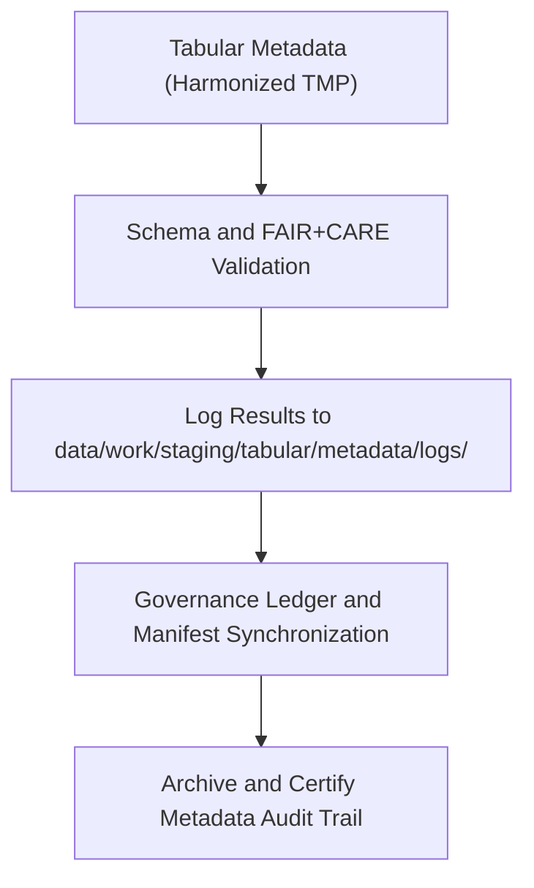

<div align="center">

# 🧾 Kansas Frontier Matrix — **Tabular Metadata Logs**
`data/work/staging/tabular/metadata/logs/README.md`

**Purpose:** Centralized logging environment for metadata harmonization, validation, and FAIR+CARE audit activities associated with tabular datasets in the Kansas Frontier Matrix (KFM).  
Captures detailed execution traces, schema mapping operations, and governance synchronization records under MCP-DL v6.3 standards.

[](../../../../../../docs/standards/faircare-validation.md)
[](../../../../../../LICENSE)
[](../../../../../../docs/architecture/repo-focus.md)

</div>

---

## 📚 Overview

The `data/work/staging/tabular/metadata/logs/` directory records all **metadata transformation, validation, and governance synchronization activities** for tabular datasets.  
It ensures complete traceability of metadata harmonization, FAIR+CARE audits, and STAC/DCAT catalog integration workflows.

### Functions:
- Record metadata harmonization events between STAC, DCAT, and PROV-O.  
- Capture FAIR+CARE ethical audit and schema validation results.  
- Track governance ledger updates and checksum registrations.  
- Provide reproducible logs for metadata lineage verification.  

All log entries are machine-readable, timestamped, and checksum-verified for audit reproducibility.

---

## 🗂️ Directory Layout

```plaintext
data/work/staging/tabular/metadata/logs/
├── README.md                              # This file — overview of tabular metadata logs
│
├── metadata_validation.log                # Schema and FAIR+CARE audit validation trace
├── governance_sync.log                    # Governance and ledger synchronization log
├── stac_dcat_crosswalk_trace.json         # Field mapping between STAC and DCAT metadata
└── metadata.json                          # Log-level provenance and checksum record
```

---

## ⚙️ Metadata Logging Workflow



### Workflow Description:
1. **Validation Logging:** Tracks schema alignment, field corrections, and ethics audits.  
2. **Crosswalk Recording:** Logs all STAC/DCAT/PROV-O harmonization operations.  
3. **Governance Synchronization:** Registers logs in `data/reports/audit/data_provenance_ledger.json`.  
4. **Archival:** Logs checksum and integrity metadata stored in the manifest for reproducibility.

---

## 🧩 Example Metadata Log Record

```json
{
  "id": "metadata_log_tabular_climate_indices_v9.3.2",
  "component": "metadata_harmonization_pipeline",
  "created": "2025-10-28T15:50:00Z",
  "events_logged": 38,
  "fairstatus": "compliant",
  "validator": "@kfm-metadata-lab",
  "checksum": "sha256:ef92a7bc13fa09f50b8dd47192ec68df92884eaf...",
  "governance_ledger_ref": "data/reports/audit/data_provenance_ledger.json"
}
```

---

## 🧠 FAIR+CARE Governance Alignment

| Principle | Implementation |
|------------|----------------|
| **Findable** | Each log entry includes dataset ID, schema version, and checksum. |
| **Accessible** | Logs stored in open formats for internal governance visibility. |
| **Interoperable** | Aligned with FAIR+CARE and MCP-DL logging schema standards. |
| **Reusable** | Log provenance retained for reproducible governance workflows. |
| **Collective Benefit** | Supports transparent auditing and metadata ethics assurance. |
| **Authority to Control** | FAIR+CARE Council authorizes log archival and publication. |
| **Responsibility** | Metadata maintainers document schema and FAIR+CARE results. |
| **Ethics** | Logs reviewed to ensure no exposure of sensitive metadata. |

FAIR+CARE audit integration recorded in:  
`data/reports/fair/data_care_assessment.json`  
and `data/reports/audit/data_provenance_ledger.json`.

---

## ⚙️ Log Types

| Log File | Description | Format |
|-----------|--------------|--------|
| `metadata_validation.log` | Tracks metadata validation and FAIR+CARE ethics audits. | Text |
| `governance_sync.log` | Records synchronization events with governance ledger. | Text |
| `stac_dcat_crosswalk_trace.json` | Captures STAC/DCAT/PROV-O field mappings. | JSON |
| `metadata.json` | Contains checksum, provenance, and runtime context. | JSON |

---

## ⚖️ Governance & Provenance Integration

| Record | Description |
|---------|-------------|
| `metadata.json` | Defines validator identity, checksum, and session provenance. |
| `data/reports/audit/data_provenance_ledger.json` | Centralized ledger tracking metadata validation lineage. |
| `data/reports/validation/schema_validation_summary.json` | Schema validation outcomes and structural compliance. |
| `releases/v9.3.2/manifest.zip` | Contains SHA-256 log checksums for reproducibility. |

All log synchronization automated via `metadata_log_sync.yml`.

---

## 🧾 Retention Policy

| Log Type | Retention Duration | Policy |
|-----------|--------------------|--------|
| Metadata Validation Logs | 180 days | Archived after certification. |
| Governance Sync Logs | 365 days | Retained permanently for lineage tracking. |
| STAC/DCAT Crosswalk Logs | 90 days | Purged after schema updates. |
| Log Metadata | Permanent | Maintained in governance ledger. |

Cleanup managed by `metadata_logs_cleanup.yml`.

---

## 🧾 Internal Use Citation

```text
Kansas Frontier Matrix (2025). Tabular Metadata Logs (v9.3.2).
Comprehensive logging environment for tabular metadata harmonization, validation, and FAIR+CARE governance synchronization.
Restricted to internal provenance and reproducibility workflows.
```

---

## 🧾 Version Notes

| Version | Date | Notes |
|----------|------|--------|
| v9.3.2 | 2025-10-28 | Introduced FAIR+CARE metadata validation logging and checksum governance linkage. |
| v9.2.0 | 2024-07-15 | Added STAC/DCAT crosswalk trace and ledger synchronization logs. |
| v9.0.0 | 2023-01-10 | Established metadata logging structure for tabular datasets. |

---

<div align="center">

**Kansas Frontier Matrix** · *Metadata Integrity × FAIR+CARE Ethics × Provenance Accountability*  
[🔗 Repository](https://github.com/bartytime4life/Kansas-Frontier-Matrix) • [🧭 Docs Portal](../../../../../../docs/) • [⚖️ Governance Ledger](../../../../../../docs/standards/governance/)

</div>

