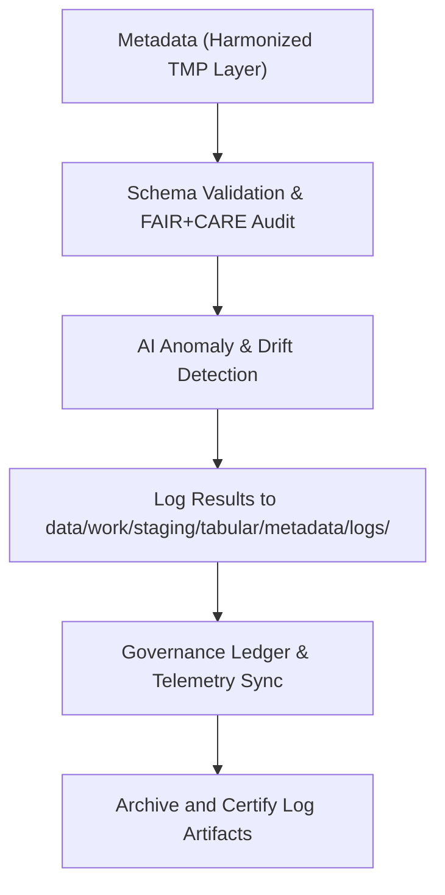

<div align="center">

# 🧾 Kansas Frontier Matrix — **Tabular Metadata Logs**
`data/work/staging/tabular/metadata/logs/README.md`

**Purpose:** Centralized logging environment for metadata harmonization, validation, and FAIR+CARE audit workflows associated with tabular datasets in the Kansas Frontier Matrix (KFM).  
Captures detailed traces of schema crosswalks, AI anomaly audits, and governance synchronization under FAIR+CARE and MCP-DL v6.3 standards.

[](../../../../../../docs/standards/faircare-validation.md)
[](../../../../../../LICENSE)
[](../../../../../../docs/architecture/repo-focus.md)

</div>

---

## 📚 Overview

The `data/work/staging/tabular/metadata/logs/` directory archives **execution traces, validation outputs, and governance synchronization events** for all metadata-related tabular operations.  
It ensures transparency and auditability across metadata harmonization, FAIR+CARE certification, and AI-driven quality assurance activities.

### Core Functions
- Log metadata harmonization workflows (STAC ↔ DCAT ↔ PROV-O).  
- Record FAIR+CARE ethical audits and validation metrics.  
- Capture AI metadata anomaly detection and drift monitoring.  
- Track governance and telemetry synchronization with the KFM Ledger.  

All entries are timestamped, checksum-verified, and telemetrically registered for traceability and reproducibility.

---

## 🗂️ Directory Layout

```plaintext
data/work/staging/tabular/metadata/logs/
├── README.md
│
├── metadata_validation.log                # Schema + FAIR+CARE audit trace for metadata
├── governance_sync.log                    # Governance + provenance ledger synchronization
├── stac_dcat_crosswalk_trace.json         # Field mappings between STAC, DCAT, and PROV-O
├── ai_metadata_audit.log                  # AI-assisted metadata anomaly detection trace
└── metadata.json                          # Log metadata (checksum, runtime context, telemetry)
```

---

## ⚙️ Metadata Logging Workflow



### Workflow Steps
1. **Validation Trace:** Records metadata validation, FAIR+CARE audit, and schema alignment.  
2. **AI Log Capture:** Detects anomalies, field drift, and missing descriptors.  
3. **Governance Sync:** Updates `data/reports/audit/data_provenance_ledger.json`.  
4. **Checksum Archival:** Logs cryptographic hashes into manifest for audit reproducibility.  
5. **Telemetry Update:** Pushes runtime and quality metrics to dashboards.

---

## 🧩 Example Metadata Log Record

```json
{
  "id": "metadata_log_tabular_climate_indices_v9.5.0",
  "component": "metadata_harmonization_pipeline",
  "created": "2025-11-02T16:55:00Z",
  "events_logged": 42,
  "ai_anomalies_detected": 0,
  "fairstatus": "compliant",
  "validator": "@kfm-metadata-lab",
  "telemetry_link": "releases/v9.5.0/focus-telemetry.json",
  "checksum": "sha256:ef92a7bc13fa09f50b8dd47192ec68df92884eaf...",
  "governance_ledger_ref": "data/reports/audit/data_provenance_ledger.json"
}
```

---

## 🧠 FAIR+CARE Governance Alignment

| Principle | Implementation |
|------------|----------------|
| **Findable** | Logs contain dataset IDs, schema versions, and checksums. |
| **Accessible** | Machine-readable JSON/Text formats accessible via governance API. |
| **Interoperable** | Logging schema aligns with FAIR+CARE and MCP-DL v6.3 models. |
| **Reusable** | Includes provenance, checksum, and AI metrics for full reproducibility. |
| **Collective Benefit** | Promotes transparent metadata governance for open science. |
| **Authority to Control** | FAIR+CARE Council authorizes log publication. |
| **Responsibility** | Validators record schema, ethics, and telemetry results. |
| **Ethics** | All logs reviewed for sensitive metadata and ethical compliance. |

FAIR+CARE and audit logs referenced in:  
`data/reports/fair/data_care_assessment.json` • `data/reports/audit/data_provenance_ledger.json`

---

## ⚙️ Log Types

| Log File | Description | Format |
|-----------|--------------|--------|
| `metadata_validation.log` | Trace of schema and FAIR+CARE audit results. | Text |
| `governance_sync.log` | Governance ledger and provenance synchronization. | Text |
| `stac_dcat_crosswalk_trace.json` | Field-level STAC/DCAT/PROV-O mappings. | JSON |
| `ai_metadata_audit.log` | AI-driven anomaly and metadata drift results. | Text |
| `metadata.json` | Captures runtime context, checksum, validator, and telemetry. | JSON |

---

## ⚖️ Governance & Provenance Integration

| Record | Description |
|---------|-------------|
| `metadata.json` | Tracks log provenance, checksums, and telemetry pointers. |
| `data/reports/audit/data_provenance_ledger.json` | Records metadata lineage, FAIR+CARE audit status, and AI verification results. |
| `data/reports/validation/schema_validation_summary.json` | Documents validation outcomes for metadata QA. |
| `releases/v9.5.0/manifest.zip` | Stores log integrity records and checksum verifications. |

Governance and telemetry integration automated via **`metadata_log_sync.yml`**.

---

## 🧾 Retention Policy

| Log Type | Retention Duration | Policy |
|-----------|--------------------|--------|
| Metadata Validation Logs | 180 days | Archived after certification completion. |
| Governance Sync Logs | 365 days | Retained for lineage and compliance tracking. |
| STAC/DCAT Crosswalk Logs | 90 days | Purged post-schema harmonization update. |
| AI Audit Logs | 120 days | Retained for model explainability traceability. |
| Metadata Provenance Records | Permanent | Stored in governance ledger indefinitely. |

Cleanup handled by **`metadata_logs_cleanup.yml`**.

---

## 🧾 Internal Use Citation

```text
Kansas Frontier Matrix (2025). Tabular Metadata Logs (v9.5.0).
Comprehensive logging system for metadata harmonization, FAIR+CARE auditing, and AI-driven anomaly detection under reproducible governance.
Restricted to internal QA, provenance, and telemetry workflows.
```

---

## 🧾 Version Notes

| Version | Date | Notes |
|----------|------|--------|
| v9.5.0 | 2025-11-02 | Added AI audit integration, telemetry tracking, and improved governance synchronization. |
| v9.3.2 | 2025-10-28 | Introduced FAIR+CARE metadata validation logging and checksum governance linkage. |
| v9.2.0 | 2024-07-15 | Added STAC/DCAT crosswalk trace and ledger sync logs. |
| v9.0.0 | 2023-01-10 | Established metadata logging structure for tabular datasets. |

---

<div align="center">

**Kansas Frontier Matrix** · *Metadata Integrity × FAIR+CARE Ethics × AI Governance × Provenance Accountability × Telemetry Traceability*  
[🔗 Repository](https://github.com/bartytime4life/Kansas-Frontier-Matrix) • [🧭 Docs Portal](../../../../../../docs/) • [⚖️ Governance Ledger](../../../../../../docs/standards/governance/)

</div>
