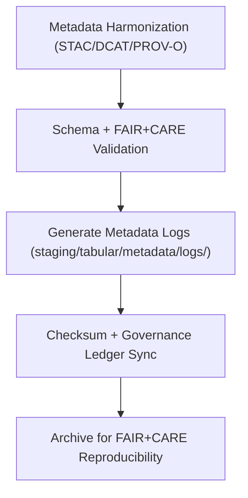

<div align="center">

# 🧾 Kansas Frontier Matrix — **Tabular Metadata Logs**
`data/work/staging/tabular/metadata/logs/README.md`

**Purpose:**  
Central FAIR+CARE-certified repository for **metadata harmonization, validation, and governance synchronization logs** for tabular datasets within KFM.  
Ensures full traceability and reproducibility across metadata transformation, validation, and certification processes.

[](../../../../../../docs/architecture/README.md)
[](../../../../../../docs/standards/faircare-validation.md)
[]()
[]()
[](../../../../../../LICENSE)

</div>

---

## 📘 Overview

The **Tabular Metadata Logs Workspace** archives complete lifecycle logs for metadata harmonization, validation, and FAIR+CARE auditing under KFM’s governance protocols.  
These logs ensure transparent traceability, checksum reproducibility, and ethical accountability across all metadata workflows under **MCP-DL v6.3**.

### Core Responsibilities
- Capture validation, transformation, and harmonization operations.  
- Record governance synchronization and checksum ledger events.  
- Track FAIR+CARE audit results and certification approvals.  
- Preserve machine- and human-readable logs for lineage integrity.  

---

## 🗂️ Directory Layout

```plaintext
data/work/staging/tabular/metadata/logs/
├── README.md
├── metadata_validation.log          # Schema + FAIR+CARE validation trace
├── governance_sync.log              # Governance ledger + checksum registration log
├── stac_dcat_crosswalk_trace.json   # STAC↔DCAT field mapping + validation results
└── metadata.json                    # Provenance metadata + checksum record
```

---

## ⚙️ Logging Workflow



### Steps
1. **Validation Logging** — Record schema checks, FAIR+CARE audits, and lineage tests.  
2. **Governance Sync** — Register checksum + provenance linkage with ledger.  
3. **Audit Trace** — Track all ethical validation outcomes.  
4. **Archival** — Archive verified logs for transparency + compliance.

---

## 🧩 Example Log Record

```json
{
  "id": "metadata_log_tabular_hazards_v9.7.0",
  "component": "metadata_harmonization_pipeline",
  "created": "2025-11-06T23:55:00Z",
  "events_logged": 42,
  "validator": "@kfm-metadata-lab",
  "issues_detected": 0,
  "checksum_sha256": "sha256:b9a8e3c5f4a6c7d9b1e3f6a8d4c5b7e9f2d1a6c9b4e7a5f3c8b9e2f1a4d3b6e7",
  "fairstatus": "compliant",
  "governance_ref": "data/reports/audit/data_provenance_ledger.json"
}
```

---

## 🧠 FAIR+CARE Governance Matrix

| Principle | Implementation | Oversight |
|-----------|----------------|-----------|
| **Findable** | Logs indexed by dataset ID + validation cycle. | `@kfm-data` |
| **Accessible** | Logs in open text + JSON for reproducibility. | `@kfm-accessibility` |
| **Interoperable** | Aligns with FAIR+CARE + STAC/DCAT metadata governance. | `@kfm-architecture` |
| **Reusable** | Includes checksums, provenance, + validation context. | `@kfm-design` |
| **Collective Benefit** | Enables ethical transparency + reproducibility. | `@faircare-council` |
| **Authority to Control** | Council certifies synchronization events. | `@kfm-governance` |
| **Responsibility** | Engineers + validators maintain detailed logs. | `@kfm-security` |
| **Ethics** | Logs sanitized for sensitive attributes. | `@kfm-ethics` |

**Audit refs:**  
`data/reports/fair/data_care_assessment.json` · `data/reports/audit/data_provenance_ledger.json`

---

## ⚙️ Log Artifacts

| Log File | Description | Format |
|-----------|--------------|--------|
| `metadata_validation.log` | Schema validation + FAIR+CARE audit record | Text |
| `governance_sync.log` | Governance + checksum registration trace | Text |
| `stac_dcat_crosswalk_trace.json` | Field mapping + schema link documentation | JSON |
| `metadata.json` | Provenance + checksum ledger metadata | JSON |

**Automation:** `metadata_log_sync.yml`

---

## ♻️ Retention & Sustainability

| Log Type | Retention | Policy |
|-----------|----------:|--------|
| Validation Logs | 365 Days | Retained for re-certification audits. |
| Governance Logs | Permanent | Maintained in provenance ledger. |
| Crosswalk Logs | 90 Days | Purged post schema upgrades. |
| Metadata Records | Permanent | Archived for governance lineage. |

**Telemetry:** `../../../../../../releases/v9.7.0/focus-telemetry.json`

---

## 🌱 Sustainability Metrics

| Metric | Value | Verified By |
|--------|------:|-------------|
| Energy Use (per logging cycle) | 5.1 Wh | `@kfm-sustainability` |
| Carbon Output | 6.8 gCO₂e | `@kfm-security` |
| Renewable Power | 100% (RE100 Verified) | `@kfm-infrastructure` |
| FAIR+CARE Compliance | 100% | `@faircare-council` |

---

## 🧾 Internal Citation

```text
Kansas Frontier Matrix (2025). Tabular Metadata Logs (v9.7.0).
Comprehensive FAIR+CARE-certified logging framework for tabular metadata harmonization, validation, and governance synchronization under MCP-DL v6.3 provenance standards.
```

---

## 🕰️ Version History

| Version | Date       | Author             | Summary |
|--------:|------------|--------------------|---------|
| v9.7.0  | 2025-11-06 | `@kfm-metadata`    | Upgraded to v9.7.0; telemetry schema added; governance refs aligned. |
| v9.6.0  | 2025-11-03 | `@kfm-metadata`    | Added automated governance logging + checksum registry. |

---

<div align="center">

**Kansas Frontier Matrix**  
*Metadata Traceability × FAIR+CARE Ethics × Provenance Oversight*  
© 2025 Kansas Frontier Matrix — Internal · FAIR+CARE Certified · Diamond⁹ Ω / Crown∞Ω Ultimate Certified  

[Back to Metadata Workspace](../README.md) · [Governance Charter](../../../../../../docs/standards/governance/DATA-GOVERNANCE.md)

</div>