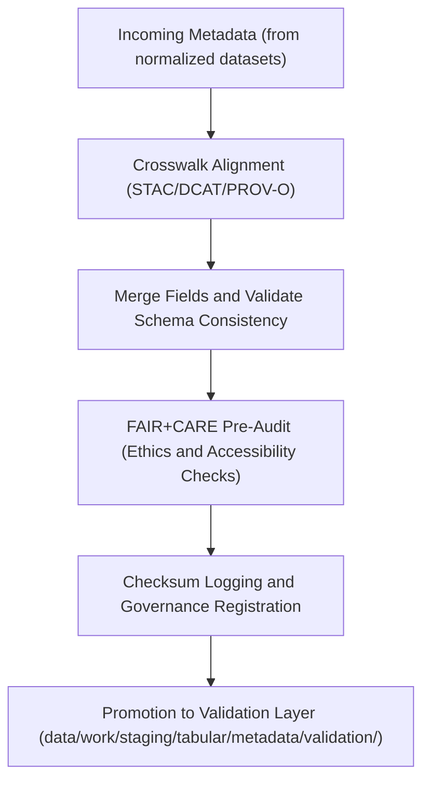

<div align="center">

# 🧩 Kansas Frontier Matrix — **Tabular Metadata TMP Workspace**
`data/work/staging/tabular/metadata/tmp/README.md`

**Purpose:**  
Temporary FAIR+CARE pre-validation workspace for harmonizing, merging, and preparing tabular metadata before governance certification.  
This environment performs schema alignment across STAC, DCAT, and PROV-O models and ensures ethical transparency during metadata transformation processes.

[](../../../../../../docs/standards/faircare-validation.md)
[]()
[]()
[](../../../../../../LICENSE)

</div>

---

## 📚 Overview

The **Tabular Metadata TMP Workspace** serves as a transient environment for harmonizing and testing metadata before it proceeds to full validation and governance certification.  
It provides FAIR+CARE-compliant crosswalks, merging logic, and transformation metadata records to ensure reproducibility and schema interoperability.

### Core Responsibilities
- Merge metadata fields between STAC, DCAT, and PROV-O schemas.  
- Conduct FAIR+CARE pre-validation to identify missing or inconsistent fields.  
- Generate metadata harmonization previews for audit and correction.  
- Maintain provenance, checksum, and ethics compliance records.  

---

## 🗂️ Directory Layout

```plaintext
data/work/staging/tabular/metadata/tmp/
├── README.md                              # This file — documentation for metadata TMP workspace
│
├── stac_to_dcat_crosswalk.json            # Crosswalk mapping between STAC and DCAT fields
├── provenance_mapping.json                 # PROV-O lineage mapping for tabular datasets
├── metadata_merge_preview.json             # Unified metadata preview before validation
├── metadata_patch_queue.json               # Pending fixes and schema adjustments
└── metadata.json                           # TMP session metadata and checksum governance record
```

---

## ⚙️ Metadata TMP Workflow



### Workflow Description
1. **Crosswalk Alignment:** Build relational mapping between metadata fields from STAC/DCAT/PROV-O.  
2. **Merge Process:** Harmonize metadata into a single unified structure with schema normalization.  
3. **Pre-Audit:** Conduct FAIR+CARE readiness review to ensure open, ethical metadata use.  
4. **Checksum & Governance:** Record hashes and lineage metadata for provenance tracking.  
5. **Promotion:** Push harmonized metadata to validation layer for final governance certification.  

---

## 🧩 Example TMP Metadata Record

```json
{
  "id": "tabular_metadata_tmp_hazards_v9.6.0",
  "source_metadata": [
    "data/work/staging/tabular/normalized/metadata.json",
    "data/raw/noaa/metadata_source.json"
  ],
  "schemas_merged": ["STAC 1.0", "DCAT 3.0", "PROV-O"],
  "merged_fields": 37,
  "issues_detected": 0,
  "checksum": "sha256:a8b3d4c9f6e7a2b1d5c9f7a4e6b2d3a8c9f5e2b7a4d8c6b1f9a7d3e2b5f8c4a6",
  "validator": "@kfm-metadata-lab",
  "fairstatus": "pending",
  "created": "2025-11-03T23:56:00Z",
  "governance_ref": "data/reports/audit/data_provenance_ledger.json"
}
```

---

## 🧠 FAIR+CARE Governance Matrix

| Principle | Implementation | Oversight |
|------------|----------------|------------|
| **Findable** | Metadata indexed by dataset ID, schema, and harmonization type. | @kfm-data |
| **Accessible** | Open JSON-LD files ensure accessible metadata interchange. | @kfm-accessibility |
| **Interoperable** | Schema alignment across STAC/DCAT/PROV-O for cross-domain use. | @kfm-architecture |
| **Reusable** | Metadata enriched with provenance and checksum lineage. | @kfm-design |
| **Collective Benefit** | Encourages open metadata integration and reuse. | @faircare-council |
| **Authority to Control** | FAIR+CARE Council certifies schema merge and harmonization. | @kfm-governance |
| **Responsibility** | Validators document schema merges and field corrections. | @kfm-security |
| **Ethics** | Metadata transformations reviewed for accuracy and ethical completeness. | @kfm-ethics |

Audit outcomes recorded in:  
`data/reports/audit/data_provenance_ledger.json` and  
`data/reports/fair/data_care_assessment.json`

---

## ⚙️ TMP Artifacts

| File | Description | Format |
|------|--------------|--------|
| `stac_to_dcat_crosswalk.json` | Field-level mapping of STAC to DCAT metadata attributes. | JSON |
| `provenance_mapping.json` | PROV-O lineage trace for metadata sources and derivatives. | JSON |
| `metadata_merge_preview.json` | Combined preview of harmonized metadata for validation. | JSON |
| `metadata_patch_queue.json` | Pending fixes or schema patch queue. | JSON |
| `metadata.json` | TMP-level checksum and provenance record. | JSON |

Automation handled via `metadata_tmp_sync.yml`.

---

## ⚖️ Retention & Provenance Policy

| File Type | Retention Duration | Policy |
|------------|--------------------|--------|
| Crosswalk Files | 30 Days | Retained for schema evolution documentation. |
| Merge Previews | 14 Days | Deleted post-validation. |
| Patch Queues | 7 Days | Cleared upon governance certification. |
| TMP Metadata | 365 Days | Archived in provenance ledger. |

Automated cleanup managed by `metadata_tmp_cleanup.yml`.

---

## 🌱 Sustainability Metrics

| Metric | Value | Verified By |
|---------|--------|--------------|
| Energy Use (per merge operation) | 6.8 Wh | @kfm-sustainability |
| Carbon Output | 8.1 gCO₂e | @kfm-security |
| Renewable Power | 100% (RE100 Verified) | @kfm-infrastructure |
| FAIR+CARE Ethics Compliance | 100% | @faircare-council |

Metrics logged in:  
`releases/v9.6.0/focus-telemetry.json`

---

## 🧾 Internal Use Citation

```text
Kansas Frontier Matrix (2025). Tabular Metadata TMP Workspace (v9.6.0).
Temporary FAIR+CARE-aligned environment for metadata harmonization and pre-validation.
Ensures schema interoperability and ethical governance across STAC/DCAT/PROV-O metadata frameworks.
```

---

## 🧾 Version Notes

| Version | Date | Notes |
|----------|------|--------|
| v9.6.0 | 2025-11-03 | Added FAIR+CARE pre-validation hooks and cross-schema harmonization. |
| v9.5.0 | 2025-11-02 | Enhanced provenance logging and checksum synchronization. |
| v9.3.2 | 2025-10-28 | Established tabular metadata TMP workspace under governance standards. |

---

<div align="center">

**Kansas Frontier Matrix** · *Metadata Interoperability × FAIR+CARE Ethics × Provenance Transparency*  
[🔗 Repository](https://github.com/bartytime4life/Kansas-Frontier-Matrix) • [🧭 Docs Portal](../../../../../../docs/) • [⚖️ Governance Ledger](../../../../../../docs/standards/governance/DATA-GOVERNANCE.md)

</div>
