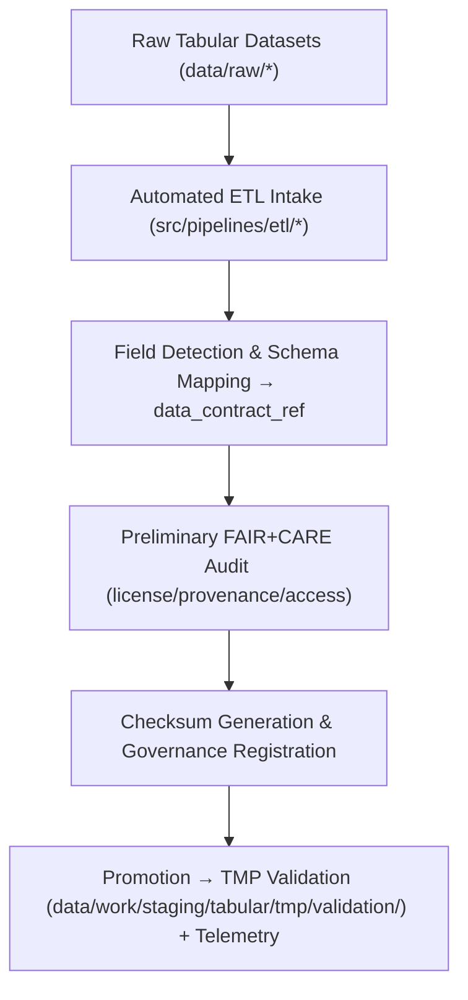

<div align="center">

# 📥 Kansas Frontier Matrix — **Tabular Intake TMP Workspace**
`data/work/staging/tabular/tmp/intake/README.md`

**Purpose:** Temporary workspace for ingesting and structuring raw tabular datasets before normalization, validation, and FAIR+CARE certification.  
Provides automated schema detection, field harmonization, checksum creation, and preliminary ethics tagging for tabular data entering Kansas Frontier Matrix (KFM) workflows.

[](../../../../../../docs/standards/faircare-validation.md)
[](../../../../../../LICENSE)
[](../../../../../../docs/architecture/repo-focus.md)

</div>

---

## 📚 Overview

The `data/work/staging/tabular/tmp/intake/` directory is the **first stop** for tabular datasets after extraction from raw sources.  
It offers a controlled ingestion layer where CSV, JSON, and Parquet files are standardized and prepared for formal validation.  
Automated ETL pipelines map source fields to KFM data contracts and perform initial integrity and ethics checks.

### Primary Objectives
- Import raw tabular data and align to **data contracts** and JSON Schemas.  
- Detect encoding, delimiter, header, and datatype inconsistencies.  
- Apply early **FAIR+CARE** metadata tags (license, provenance, access).  
- Generate intake metadata, cryptographic checksums, and telemetry for governance.  

All intake artifacts are ephemeral and are promoted to `tmp/validation/` once baseline checks pass.

---

## 🗂️ Directory Layout

```plaintext
data/work/staging/tabular/tmp/intake/
├── README.md
│
├── hazards_intake_2025.csv               # FEMA + NOAA hazard table imported for staging
├── climate_indices_intake.parquet        # NOAA climate indices prepared for staging
├── treaties_intake.csv                   # Historical treaty metadata extracted from archives
└── metadata.json                         # Intake runtime, checksum, and telemetry metadata
```

---

## ⚙️ Intake Workflow



### Workflow Steps
1. **Data Ingestion:** Convert raw files to consistent encodings (UTF-8) and formats (CSV/Parquet).  
2. **Schema Detection:** Map source fields to target schema per **`data_contract_ref`** (types, enumerations, constraints).  
3. **Ethics Pre-Check:** Apply FAIR+CARE tags (license, provenance, accessibility) and flag sensitive fields for masking.  
4. **Checksum Logging:** Generate SHA-256 hashes for each artifact; register in release `manifest.zip` and governance ledger.  
5. **Promotion:** Move intake outputs to **`tmp/validation/`** for detailed QA; emit **telemetry** (row counts, parse anomalies, timing).

---

## 🧩 Example Intake Metadata Record

```json
{
  "id": "tabular_intake_climate_indices_v9.4.0",
  "source_files": [
    "data/raw/noaa/temperature_anomalies/kansas_temp_anomalies_2025.csv",
    "data/raw/noaa/drought_monitor/drought_monitor_2025.csv"
  ],
  "records_imported": 56321,
  "schema_detected": true,
  "delimiter": ",",
  "encoding": "UTF-8",
  "created": "2025-11-02T15:55:00Z",
  "validator": "@kfm-etl-ops",
  "checksum": "sha256:3b4e88de94f4a54c8a3c3d9c312cf3c81b7b1a43...",
  "fairstatus": "prelim_compliant",
  "telemetry_link": "releases/v9.4.0/focus-telemetry.json",
  "governance_ledger_ref": "data/reports/audit/data_provenance_ledger.json"
}
```

---

## 🧠 FAIR+CARE Compliance in Intake

| Principle | Implementation |
|------------|----------------|
| **Findable** | Unique intake IDs; checksums & telemetry logged to governance ledger. |
| **Accessible** | UTF-8 CSV/Parquet with clear licensing and contact points. |
| **Interoperable** | Field mappings aligned with JSON Schema & DCAT/DCAT-AP. |
| **Reusable** | Intake metadata includes provenance, license, and schema linkage. |
| **Collective Benefit** | Lays the groundwork for ethical, high-quality public release. |
| **Authority to Control** | Governance Council approves contract mappings & intake rules. |
| **Responsibility** | All field transformations and anomalies captured in logs. |
| **Ethics** | Sensitive columns masked/anonymized at ingestion; access scoped by policy. |

Audit data linked to:  
`data/reports/fair/data_care_assessment.json` • `data/reports/audit/data_provenance_ledger.json`

---

## ⚙️ Key Tools Used

| Tool | Function | Output |
|------|-----------|--------|
| **Pandas / Dask** | High-volume ingestion, profiling, and mapping. | CSV / Parquet |
| **Great Expectations** | Expectations-based validation at intake. | JSON summaries |
| **FAIR+CARE Validator** | Pre-audit for ethics & accessibility checks. | JSON report |
| **ETL Pipelines (src/pipelines/etl/)** | Automated normalization & logging. | Artifacts + logs |

---

## ⚖️ Governance & Provenance Integration

| Record | Description |
|---------|-------------|
| `metadata.json` | Captures intake runtime, checksum, schema version, and telemetry pointer. |
| `data/reports/audit/data_provenance_ledger.json` | Logs ingestion lineage and FAIR+CARE verification. |
| `data/reports/validation/schema_validation_summary.json` | Cross-references schema with intake outputs. |
| `releases/v9.4.0/manifest.zip` | Registers artifact checksums for reproducibility. |

Synchronization performed via **`tabular_intake_sync.yml`** in CI/CD.

---

## 🧾 Retention Policy

| File Type | Retention | Policy |
|------------|-----------|--------|
| Intake Files | 7 days | Purged after successful validation. |
| Metadata | 365 days | Retained in provenance & telemetry stores. |
| FAIR+CARE Reports | 30 days | Archived for ethics review. |
| Logs | 14 days | Rolled into long-term governance logs. |

Cleanup handled by **`tabular_tmp_cleanup.yml`**.

---

## 🧾 Internal Use Citation

```text
Kansas Frontier Matrix (2025). Tabular Intake TMP Workspace (v9.4.0).
Temporary ingestion workspace for schema mapping, FAIR+CARE tagging, telemetry logging, and checksum validation of tabular datasets.
Restricted to internal ETL and governance review operations.
```

---

## 🧾 Version Notes

| Version | Date | Notes |
|----------|------|--------|
| v9.4.0 | 2025-11-02 | Added telemetry integration, enhanced intake schema detection, and automated governance sync. |
| v9.3.2 | 2025-10-28 | FAIR+CARE pre-audit integration and automated schema detection. |
| v9.2.0 | 2024-07-15 | Added data contract linkage and checksum registry. |
| v9.0.0 | 2023-01-10 | Established tabular intake TMP workspace for ETL staging ingestion. |

---

<div align="center">

**Kansas Frontier Matrix** · *Data Integrity × FAIR+CARE Ethics × Reproducible Schema Mapping × Telemetry Traceability*  
[🔗 Repository](https://github.com/bartytime4life/Kansas-Frontier-Matrix) • [🧭 Docs Portal](../../../../../../docs/) • [⚖️ Governance Ledger](../../../../../../docs/standards/governance/)

</div>
