<div align="center">

# 🧩 Kansas Frontier Matrix — **Tabular Metadata TMP Workspace**
`data/work/staging/tabular/metadata/tmp/README.md`

**Purpose:** Temporary workspace for merging, transforming, and harmonizing tabular metadata records before FAIR+CARE validation and governance ledger integration.  
Supports interoperability across STAC, DCAT, and PROV-O metadata standards, ensuring all tabular datasets meet the KFM’s schema and ethical governance frameworks.

[](../../../../../../docs/standards/faircare-validation.md)
[](../../../../../../LICENSE)
[](../../../../../../docs/architecture/repo-focus.md)

</div>

---

## 📚 Overview

The `data/work/staging/tabular/metadata/tmp/` directory serves as a **transient metadata harmonization layer** for tabular datasets in the Kansas Frontier Matrix (KFM).  
Here, metadata fields from intake and validation layers are merged, normalized, and prepared for FAIR+CARE audit and governance registration.

### Key Functions:
- Merge schema attributes between STAC, DCAT, and PROV-O metadata formats.  
- Align tabular metadata fields with the KFM data contract and FAIR+CARE descriptors.  
- Conduct preliminary FAIR+CARE pre-validation to flag missing ethical fields.  
- Generate intermediate crosswalks, provenance records, and metadata patches.  

All TMP artifacts in this directory are ephemeral and auto-deleted upon successful validation and promotion to `data/work/staging/tabular/metadata/validation/`.

---

## 🗂️ Directory Layout

```plaintext
data/work/staging/tabular/metadata/tmp/
├── README.md                                 # This file — documentation for TMP workspace
│
├── stac_to_dcat_crosswalk.json               # Mapping between STAC and DCAT fields
├── provenance_mapping.json                   # PROV-O lineage references for tabular metadata
├── metadata_merge_preview.json               # Harmonized metadata preview before validation
├── metadata_patch_queue.json                 # Pending metadata patches and fixes
└── metadata.json                             # TMP session metadata and governance linkage
```

---

## ⚙️ Tabular Metadata Harmonization Workflow

```mermaid
flowchart TD
    A["Metadata from Intake & Validation Layers"] --> B["Schema Harmonization (STAC ↔ DCAT ↔ PROV-O)"]
    B --> C["Merge Metadata Records and Create Preview"]
    C --> D["FAIR and CARE Pre-Audit Review"]
    D --> E["Write Outputs to Validation Layer"]
    E --> F["Register Provenance in Governance Ledger"]
```



### Workflow Steps:
1. **Schema Mapping:** Establish crosswalk between STAC, DCAT, and PROV-O models.  
2. **Merge Preview:** Combine attributes and resolve field conflicts into unified metadata.  
3. **Pre-Audit:** Conduct FAIR+CARE readiness check for ethical, complete descriptors.  
4. **Output Preparation:** Generate harmonized metadata file for full validation.  
5. **Governance:** Log metadata transformation details to provenance ledger.

---

## 🧩 Example TMP Metadata Record

```json
{
  "id": "tabular_metadata_tmp_climate_indices_v9.3.2",
  "source_metadata": [
    "data/work/staging/tabular/normalized/metadata.json",
    "data/raw/noaa/metadata_source.json"
  ],
  "schema_crosswalks": ["STAC 1.0.0", "DCAT 3.0", "PROV-O"],
  "merged_fields": 38,
  "issues_detected": 0,
  "validator": "@kfm-metadata-lab",
  "created": "2025-10-28T15:12:00Z",
  "checksum": "sha256:7a4fbb9241bcb7133e6cdb8919d6c2a9b1f7a14c...",
  "fairstatus": "pending",
  "governance_ref": "data/reports/audit/data_provenance_ledger.json"
}
```

---

## 🧠 FAIR+CARE Pre-Validation Summary

| Principle | Implementation |
|------------|----------------|
| **Findable** | Metadata merged and indexed by dataset ID and schema version. |
| **Accessible** | Stored in open JSON-LD format for universal access. |
| **Interoperable** | Cross-schema alignment across STAC/DCAT/PROV-O. |
| **Reusable** | Metadata enriched with provenance and version tracking. |
| **Collective Benefit** | Encourages open, ethical reuse of tabular metadata. |
| **Authority to Control** | FAIR+CARE Council oversees metadata harmonization. |
| **Responsibility** | Validators log all transformations and schema merges. |
| **Ethics** | Sensitive metadata fields flagged for review. |

Pre-validation audit linked to:  
`data/reports/fair/data_care_assessment.json`  
and `data/reports/audit/data_provenance_ledger.json`.

---

## ⚙️ Key TMP Artifacts

| File | Description | Format |
|------|--------------|--------|
| `stac_to_dcat_crosswalk.json` | Maps STAC metadata to DCAT attributes. | JSON |
| `provenance_mapping.json` | Captures PROV-O lineage references for dataset metadata. | JSON |
| `metadata_merge_preview.json` | Combined metadata preview for FAIR+CARE audit. | JSON |
| `metadata_patch_queue.json` | Records pending fixes or missing field additions. | JSON |
| `metadata.json` | Captures runtime context, checksum, and governance traceability. | JSON |

---

## ⚖️ Governance & Provenance Integration

| Record | Description |
|---------|-------------|
| `metadata.json` | TMP session runtime metadata and schema alignment results. |
| `data/reports/audit/data_provenance_ledger.json` | Logs harmonization lineage and pre-validation status. |
| `data/reports/validation/schema_validation_summary.json` | Stores field-level schema results for merged metadata. |
| `releases/v9.3.2/manifest.zip` | Tracks TMP checksum and audit hashes for reproducibility. |

Governance synchronization executed automatically via `metadata_tmp_sync.yml`.

---

## 🧾 Retention Policy

| File Category | Retention Duration | Policy |
|----------------|--------------------|--------|
| Crosswalks & Mappings | 30 days | Retained for schema evolution tracking. |
| Merge Previews | 14 days | Deleted after successful validation. |
| Patches & Fixes | 7 days | Cleared upon governance approval. |
| TMP Metadata | 365 days | Archived for provenance continuity. |

Cleanup automated by `metadata_tmp_cleanup.yml`.

---

## 🧾 Internal Use Citation

```text
Kansas Frontier Matrix (2025). Tabular Metadata TMP Workspace (v9.3.2).
Temporary metadata harmonization and FAIR+CARE pre-validation environment for tabular datasets.
Restricted to internal QA and governance workflows under MCP-DL v6.3.
```

---

## 🧾 Version Notes

| Version | Date | Notes |
|----------|------|--------|
| v9.3.2 | 2025-10-28 | Introduced cross-schema FAIR+CARE audit and governance trace logging. |
| v9.2.0 | 2024-07-15 | Added PROV-O integration for metadata lineage. |
| v9.0.0 | 2023-01-10 | Established tabular metadata TMP workspace for harmonization processes. |

---

<div align="center">

**Kansas Frontier Matrix** · *Metadata Harmonization × FAIR+CARE Ethics × Provenance Audit Integrity*  
[🔗 Repository](https://github.com/bartytime4life/Kansas-Frontier-Matrix) • [🧭 Docs Portal](../../../../../../docs/) • [⚖️ Governance Ledger](../../../../../../docs/standards/governance/)

</div>

