<div align="center">

# 🧩 Kansas Frontier Matrix — **Tabular Metadata TMP Workspace**
`data/work/staging/tabular/metadata/tmp/README.md`

**Purpose:**  
Temporary **FAIR+CARE pre-validation** workspace for harmonizing, merging, and preparing tabular metadata before governance certification.  
Performs schema alignment across **STAC**, **DCAT**, and **PROV-O** and ensures ethical transparency during transformation.

[](../../../../../../docs/architecture/README.md)
[](../../../../../../docs/standards/faircare-validation.md)
[]()
[]()
[](../../../../../../LICENSE)

</div>

---

## 📘 Overview

The **Tabular Metadata TMP Workspace** harmonizes and tests metadata before full validation and governance certification.  
It provides **FAIR+CARE-compliant crosswalks**, merging logic, and transformation records to ensure reproducibility and interoperability.

### Core Responsibilities
- Merge/align metadata across STAC, DCAT, and PROV-O.  
- Conduct FAIR+CARE pre-validation to flag missing/inconsistent fields.  
- Generate harmonization previews for audit and correction.  
- Maintain provenance, checksum, and ethics compliance metadata.  

---

## 🗂️ Directory Layout

```plaintext
data/work/staging/tabular/metadata/tmp/
├── README.md
├── stac_to_dcat_crosswalk.json
├── provenance_mapping.json
├── metadata_merge_preview.json
├── metadata_patch_queue.json
└── metadata.json
```

---

## ⚙️ Metadata TMP Workflow

```mermaid
flowchart TD
    A["Incoming Metadata (from normalized datasets)"] --> B["Crosswalk Alignment (STAC · DCAT · PROV-O)"]
    B --> C["Merge Fields + Validate Schema Consistency"]
    C --> D["FAIR + CARE Pre-Audit (Ethics + Accessibility)"]
    D --> E["Checksum Logging + Governance Registration"]
    E --> F["Promotion → Validation (staging/tabular/metadata/validation/)"]
```



### Steps
1. **Crosswalk** — Map fields across standards.  
2. **Merge** — Harmonize into a unified structure.  
3. **Pre-Audit** — Assess readiness for FAIR+CARE.  
4. **Governance** — Log checksums + lineage.  
5. **Promote** — Forward for final certification.

---

## 🧩 Example TMP Metadata Record

```json
{
  "id": "tabular_metadata_tmp_hazards_v9.7.0",
  "source_metadata": [
    "data/work/staging/tabular/normalized/metadata.json",
    "data/raw/noaa/metadata_source.json"
  ],
  "schemas_merged": ["STAC 1.0", "DCAT 3.0", "PROV-O"],
  "merged_fields": 37,
  "issues_detected": 0,
  "checksum_sha256": "sha256:a8b3d4c9f6e7a2b1d5c9f7a4e6b2d3a8c9f5e2b7a4d8c6b1f9a7d3e2b5f8c4a6",
  "validator": "@kfm-metadata-lab",
  "fairstatus": "pending",
  "created": "2025-11-06T23:56:00Z",
  "governance_ref": "data/reports/audit/data_provenance_ledger.json"
}
```

---

## 🧠 FAIR+CARE Governance Matrix

| Principle | Implementation | Oversight |
|-----------|----------------|-----------|
| **Findable** | Indexed by dataset ID, schema, & harmonization type. | `@kfm-data` |
| **Accessible** | JSON-LD artifacts for pre-validation review. | `@kfm-accessibility` |
| **Interoperable** | STAC/DCAT/PROV-O alignment for cross-domain reuse. | `@kfm-architecture` |
| **Reusable** | Provenance + checksums + linkage maintained. | `@kfm-design` |
| **Collective Benefit** | Encourages ethical metadata integration. | `@faircare-council` |
| **Authority to Control** | Council certifies merge/crosswalk readiness. | `@kfm-governance` |
| **Responsibility** | Validators document merges & field fixes. | `@kfm-security` |
| **Ethics** | Transformations reviewed for accuracy & inclusivity. | `@kfm-ethics` |

**Audit refs:**  
`data/reports/audit/data_provenance_ledger.json` · `data/reports/fair/data_care_assessment.json`

---

## ⚙️ TMP Artifacts

| Artifact                     | Description                              | Format |
|-----------------------------|------------------------------------------|--------|
| `stac_to_dcat_crosswalk.json` | Field-level mapping between STAC/DCAT  | JSON   |
| `provenance_mapping.json`     | PROV-O lineage & relationship mapping  | JSON   |
| `metadata_merge_preview.json` | Unified record preview for validation  | JSON   |
| `metadata_patch_queue.json`   | Pending schema corrections              | JSON   |
| `metadata.json`               | TMP checksum + provenance metadata      | JSON   |

**Automation:** `metadata_tmp_sync.yml`

---

## ♻️ Retention & Sustainability

| File Type        | Retention | Policy                                   |
|------------------|----------:|------------------------------------------|
| Crosswalk Files  | 30 Days   | Kept for schema evolution documentation. |
| Merge Previews   | 14 Days   | Deleted after validation.                 |
| Patch Queues     | 7 Days    | Cleared upon governance certification.    |
| TMP Metadata     | 365 Days  | Archived in provenance ledger.            |

**Telemetry:** `../../../../../../releases/v9.7.0/focus-telemetry.json`

---

## 🧾 Internal Citation

```text
Kansas Frontier Matrix (2025). Tabular Metadata TMP Workspace (v9.7.0).
Temporary FAIR+CARE-aligned workspace for metadata harmonization and pre-validation—ensuring interoperability and ethical governance across STAC/DCAT/PROV-O frameworks.
```

---

## 🕰️ Version History

| Version | Date       | Author               | Summary |
|--------:|------------|----------------------|---------|
| v9.7.0  | 2025-11-06 | `@kfm-metadata`      | Upgraded to v9.7.0; telemetry/schema refs aligned; artifacts normalized. |
| v9.6.0  | 2025-11-03 | `@kfm-metadata`      | Added FAIR+CARE hooks and cross-schema harmonization. |

---

<div align="center">

**Kansas Frontier Matrix**  
*Metadata Interoperability × FAIR+CARE Ethics × Provenance Transparency*  
© 2025 Kansas Frontier Matrix — Internal · FAIR+CARE Certified · Diamond⁹ Ω / Crown∞Ω Ultimate Certified  

[Back to Tabular Metadata](../README.md) · [Governance Charter](../../../../../../docs/standards/governance/DATA-GOVERNANCE.md)

</div>