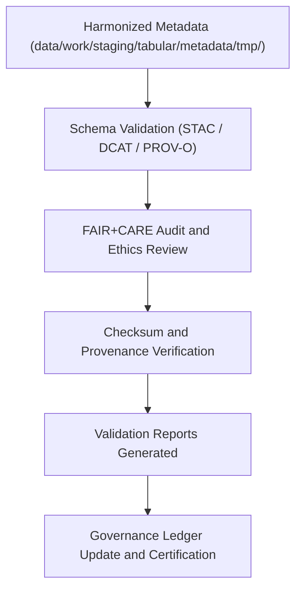

<div align="center">

# ✅ Kansas Frontier Matrix — **Tabular Metadata Validation Workspace**
`data/work/staging/tabular/metadata/validation/README.md`

**Purpose:** Dedicated environment for validating, auditing, and FAIR+CARE-certifying tabular dataset metadata before integration into the governance ledger and STAC/DCAT catalogs.  
Ensures metadata integrity, schema interoperability, and ethical compliance under KFM’s FAIR+CARE and MCP-DL v6.3 standards.

[](../../../../../../docs/standards/faircare-validation.md)
[](../../../../../../LICENSE)
[](../../../../../../docs/architecture/repo-focus.md)

</div>

---

## 📚 Overview

The `data/work/staging/tabular/metadata/validation/` directory serves as the **final quality control checkpoint** for tabular dataset metadata in the Kansas Frontier Matrix (KFM).  
This workspace verifies schema conformance, FAIR+CARE compliance, and provenance integrity prior to publication or archival.

### Core Functions:
- Validate metadata against STAC, DCAT, and PROV-O schemas.  
- Audit FAIR+CARE compliance for transparency and accessibility.  
- Verify checksum and governance linkage integrity.  
- Generate validation summaries for reproducibility and audit.  

All validation outputs are registered in the **KFM governance ledger**, ensuring full traceability and ethics certification.

---

## 🗂️ Directory Layout

```plaintext
data/work/staging/tabular/metadata/validation/
├── README.md                                # This file — documentation of metadata validation workspace
│
├── schema_validation_summary.json           # Metadata schema validation results (STAC/DCAT)
├── faircare_metadata_audit.json             # FAIR+CARE ethics and accessibility compliance review
├── stac_dcat_link_check.log                 # Cross-schema metadata link verification
├── metadata_qa_summary.md                   # Human-readable QA summary and governance notes
└── metadata.json                            # Validation session metadata and ledger linkage
```

---

## ⚙️ Metadata Validation Workflow



### Workflow Steps:
1. **Schema Validation:** Check structural compliance against STAC, DCAT, and PROV-O.  
2. **Ethics Review:** Run FAIR+CARE audits on openness, accessibility, and ethics.  
3. **Checksum Verification:** Validate metadata hashes for integrity assurance.  
4. **Reporting:** Generate validation and QA summaries for governance review.  
5. **Ledger Sync:** Record results to provenance ledger for certification traceability.

---

## 🧩 Example Validation Metadata Record

```json
{
  "id": "tabular_metadata_validation_climate_indices_v9.3.2",
  "source_metadata": "data/work/staging/tabular/metadata/tmp/metadata_merge_preview.json",
  "schemas_tested": ["STAC 1.0.0", "DCAT 3.0", "PROV-O"],
  "validation_status": "passed",
  "issues_detected": 0,
  "faircare_score": 98.7,
  "checksum_verified": true,
  "created": "2025-10-28T15:42:00Z",
  "validator": "@kfm-metadata-lab",
  "governance_ledger_ref": "data/reports/audit/data_provenance_ledger.json"
}
```

---

## 🧠 FAIR+CARE Metadata Audit Criteria

| Principle | Implementation |
|------------|----------------|
| **Findable** | Indexed metadata validated against STAC and DCAT registries. |
| **Accessible** | Stored in open JSON-LD format and linked to FAIR repositories. |
| **Interoperable** | Conforms to STAC/DCAT/PROV-O with harmonized fields. |
| **Reusable** | Includes licensing, provenance, and checksum metadata. |
| **Collective Benefit** | Promotes ethical stewardship and open-science collaboration. |
| **Authority to Control** | FAIR+CARE Council reviews and signs off certification. |
| **Responsibility** | Validators log all schema and ethics audits in governance ledger. |
| **Ethics** | Verifies descriptive metadata for equity and cultural sensitivity. |

FAIR+CARE validation results stored in:  
`data/reports/fair/data_care_assessment.json` and `data/reports/audit/data_provenance_ledger.json`.

---

## ⚙️ Validation Tools and Standards

| Tool | Function | Output |
|------|-----------|--------|
| **stac-validator** | Validates STAC collection and item metadata. | JSON |
| **jsonschema-cli** | Performs structural validation for DCAT/PROV-O metadata. | JSON |
| **faircare-validator** | Executes FAIR+CARE audit and ethical compliance scoring. | JSON |
| **prov-audit.py** | Verifies lineage and provenance relationships. | JSON |
| **checksum-verifier** | Confirms metadata integrity via SHA-256 hash comparison. | JSON |

---

## ⚖️ Governance & Provenance Integration

| Record | Description |
|---------|-------------|
| `metadata.json` | Captures validation runtime, schema tested, and checksum. |
| `data/reports/audit/data_provenance_ledger.json` | Logs metadata lineage and FAIR+CARE certification. |
| `data/reports/validation/schema_validation_summary.json` | Field-level validation results across schemas. |
| `releases/v9.3.2/manifest.zip` | Centralized checksum registry for validated metadata. |

All metadata validation operations automated via `metadata_validation_sync.yml`.

---

## 🧾 Retention Policy

| File Type | Retention Duration | Policy |
|------------|--------------------|--------|
| Schema Validation Reports | 180 days | Retained for governance audits. |
| FAIR+CARE Ethics Reports | 365 days | Archived permanently for oversight. |
| Link Check Logs | 90 days | Purged after metadata certification. |
| Metadata Summaries | Permanent | Stored for provenance traceability. |

Automation handled by `metadata_validation_cleanup.yml`.

---

## 🧾 Internal Use Citation

```text
Kansas Frontier Matrix (2025). Tabular Metadata Validation Workspace (v9.3.2).
Governed environment for validating tabular metadata schema integrity and FAIR+CARE ethical compliance under open-data standards.
Restricted to internal quality assurance and provenance workflows.
```

---

## 🧾 Version Notes

| Version | Date | Notes |
|----------|------|--------|
| v9.3.2 | 2025-10-28 | Introduced PROV-O lineage checks and FAIR+CARE scoring integration. |
| v9.2.0 | 2024-07-15 | Added STAC/DCAT field harmonization and checksum verification. |
| v9.0.0 | 2023-01-10 | Established tabular metadata validation workspace under FAIR+CARE framework. |

---

<div align="center">

**Kansas Frontier Matrix** · *Metadata Accuracy × FAIR+CARE Governance × Provenance Accountability*  
[🔗 Repository](https://github.com/bartytime4life/Kansas-Frontier-Matrix) • [🧭 Docs Portal](../../../../../../docs/) • [⚖️ Governance Ledger](../../../../../../docs/standards/governance/)

</div>

