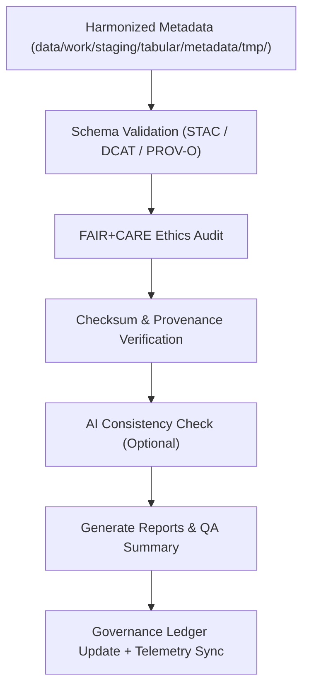

<div align="center">

# ✅ Kansas Frontier Matrix — **Tabular Metadata Validation Workspace**
`data/work/staging/tabular/metadata/validation/README.md`

**Purpose:** Final quality-control environment for validating, auditing, and FAIR+CARE-certifying tabular dataset metadata prior to catalog publication and governance registration.  
Ensures metadata integrity, schema interoperability, and ethical compliance under KFM’s FAIR+CARE and MCP-DL v6.3 standards.

[](../../../../../../docs/standards/faircare-validation.md)
[](../../../../../../LICENSE)
[](../../../../../../docs/architecture/repo-focus.md)

</div>

---

## 📚 Overview

The `data/work/staging/tabular/metadata/validation/` directory serves as the **final quality checkpoint** for tabular metadata in the Kansas Frontier Matrix (KFM).  
Here, harmonized metadata is validated against STAC/DCAT/PROV-O, audited for FAIR+CARE ethics, and synchronized with the governance ledger and telemetry systems.

### Core Functions
- Validate metadata structure and completeness (STAC 1.0 / DCAT 3.0 / PROV-O).  
- Audit FAIR+CARE compliance for openness, accessibility, and attribution.  
- Verify checksums, ledger linkages, and provenance integrity.  
- Emit human-readable QA summaries and machine-readable validation artifacts.  
- Register results in the provenance ledger and publish telemetry for dashboards.

---

## 🗂️ Directory Layout

```plaintext
data/work/staging/tabular/metadata/validation/
├── README.md                                # This file — metadata validation workspace documentation
│
├── schema_validation_summary.json           # Structural validation results (STAC/DCAT/PROV-O)
├── faircare_metadata_audit.json             # FAIR+CARE ethics & accessibility compliance review
├── stac_dcat_link_check.log                 # Cross-schema link verification and URL checks
├── ai_metadata_anomaly_report.json          # AI-driven anomaly and missing-field detection (optional)
├── metadata_qa_summary.md                   # Consolidated QA summary and governance notes
└── metadata.json                            # Validation session context, checksum, telemetry link
```

---

## ⚙️ Metadata Validation Workflow



### Workflow Steps
1. **Schema Validation:** Verify structural compliance against STAC/DCAT/PROV-O definitions.  
2. **Ethics Review:** Run FAIR+CARE audit for openness, accessibility, and attribution.  
3. **Checksum & Provenance:** Confirm metadata hashes and ledger references.  
4. **AI Consistency (Optional):** Detect anomalies, blank fields, or misalignments.  
5. **Reporting:** Produce JSON + Markdown artifacts for council review.  
6. **Ledger & Telemetry:** Sync outcomes to provenance ledger and telemetry store.

---

## 🧩 Example Validation Metadata Record

```json
{
  "id": "tabular_metadata_validation_climate_indices_v9.5.0",
  "source_metadata": "data/work/staging/tabular/metadata/tmp/metadata_merge_preview.json",
  "schemas_tested": ["STAC 1.0.0", "DCAT 3.0", "PROV-O"],
  "validation_status": "passed",
  "issues_detected": 0,
  "faircare_score": 98.9,
  "checksum_verified": true,
  "created": "2025-11-02T16:45:00Z",
  "validator": "@kfm-metadata-lab",
  "telemetry_link": "releases/v9.5.0/focus-telemetry.json",
  "governance_ledger_ref": "data/reports/audit/data_provenance_ledger.json"
}
```

---

## 🧠 FAIR+CARE Metadata Audit Criteria

| Principle | Implementation |
|------------|----------------|
| **Findable** | Indexed/validated metadata linked to STAC/DCAT registries and ledger IDs. |
| **Accessible** | Published as JSON-LD; QA reports accessible to governance reviewers. |
| **Interoperable** | Harmonized with STAC, DCAT, PROV-O; JSON Schema enforced. |
| **Reusable** | Licensing, provenance, and checksums present for reproducibility. |
| **Collective Benefit** | Enables ethical reuse through transparent governance. |
| **Authority to Control** | FAIR+CARE Council signs off final certification. |
| **Responsibility** | Validators document schema/ethics outcomes in the ledger. |
| **Ethics** | Reviews descriptive fields for equity, sensitivity, and accuracy. |

FAIR+CARE results stored in:  
`data/reports/fair/data_care_assessment.json` • `data/reports/audit/data_provenance_ledger.json`

---

## ⚙️ Validation Tools and Standards

| Tool | Function | Output |
|------|-----------|--------|
| **stac-validator** | Validates STAC item/collection compliance and links. | JSON |
| **jsonschema-cli** | Checks DCAT & PROV-O structure via JSON Schemas. | JSON |
| **faircare-validator** | Executes FAIR+CARE ethics scoring & accessibility checks. | JSON |
| **ai-metadata-auditor.py** | Detects anomalies (missing fields, drift) using AI. | JSON |
| **checksum-verifier** | Confirms SHA-256 hashes and manifest registration. | JSON |

---

## ⚖️ Governance & Provenance Integration

| Record | Description |
|---------|-------------|
| `metadata.json` | Captures validation runtime, schemas tested, checksum, and telemetry pointer. |
| `data/reports/audit/data_provenance_ledger.json` | Logs lineage and FAIR+CARE certification results. |
| `data/reports/validation/schema_validation_summary.json` | Stores cross-schema validation outcomes. |
| `releases/v9.5.0/manifest.zip` | Centralized checksum registry for validated metadata. |

All operations are automated by **`metadata_validation_sync.yml`** in CI/CD.

---

## 🧾 Retention Policy

| File Type | Retention Duration | Policy |
|------------|--------------------|--------|
| Schema Validation Reports | 180 days | Retained for governance audits. |
| FAIR+CARE Ethics Reports | 365 days | Archived permanently for oversight. |
| Link Check Logs | 90 days | Purged post-certification and catalog sync. |
| Metadata Summaries | Permanent | Stored for provenance and traceability. |

Cleanup tasks orchestrated by **`metadata_validation_cleanup.yml`**.

---

## 🧾 Internal Use Citation

```text
Kansas Frontier Matrix (2025). Tabular Metadata Validation Workspace (v9.5.0).
Governed environment for validating tabular metadata schema integrity, FAIR+CARE ethics, and catalog interoperability under open-data standards.
Restricted to internal QA and provenance workflows.
```

---

## 🧾 Version Notes

| Version | Date | Notes |
|----------|------|--------|
| v9.5.0 | 2025-11-02 | Added telemetry integration, AI anomaly checks, and enhanced governance sync. |
| v9.3.2 | 2025-10-28 | Introduced PROV-O lineage checks and FAIR+CARE scoring integration. |
| v9.2.0 | 2024-07-15 | Added STAC/DCAT field harmonization and checksum verification. |
| v9.0.0 | 2023-01-10 | Established tabular metadata validation workspace under FAIR+CARE framework. |

---

<div align="center">

**Kansas Frontier Matrix** · *Metadata Accuracy × FAIR+CARE Governance × Provenance Accountability × Telemetry Traceability*  
[🔗 Repository](https://github.com/bartytime4life/Kansas-Frontier-Matrix) • [🧭 Docs Portal](../../../../../../docs/) • [⚖️ Governance Ledger](../../../../../../docs/standards/governance/)

</div>
