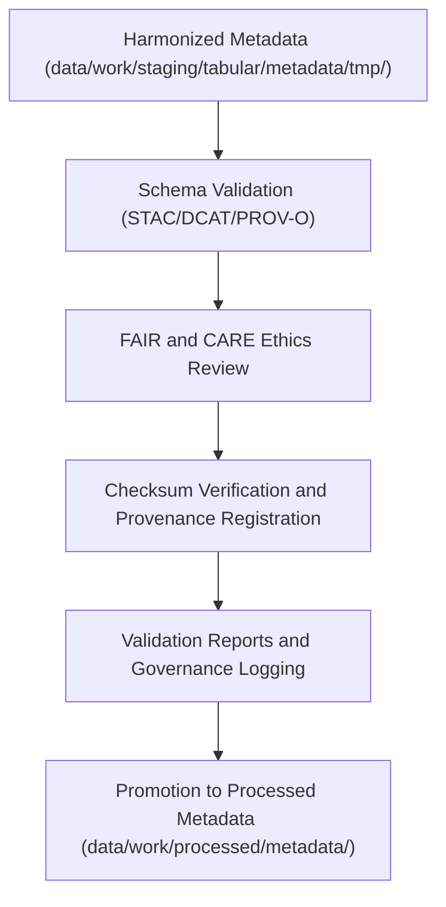

<div align="center">

# ✅ Kansas Frontier Matrix — **Tabular Metadata Validation Workspace**
`data/work/staging/tabular/metadata/validation/README.md`

**Purpose:**  
Dedicated workspace for verifying, auditing, and FAIR+CARE-certifying tabular dataset metadata in the Kansas Frontier Matrix (KFM).  
Ensures schema conformance, ethical compliance, and provenance linkage across STAC, DCAT, and PROV-O metadata structures under MCP-DL v6.3 governance.

[](../../../../../../docs/standards/faircare-validation.md)
[]()
[]()
[](../../../../../../LICENSE)

</div>

---

## 📚 Overview

The **Tabular Metadata Validation Workspace** serves as the final validation checkpoint for metadata linked to tabular datasets before governance certification.  
It ensures that all metadata records conform to FAIR+CARE ethical governance, schema standards, and lineage completeness for reproducibility and audit readiness.

### Core Responsibilities
- Validate metadata schemas against STAC, DCAT, and PROV-O definitions.  
- Conduct FAIR+CARE audits for transparency, ethics, and accessibility.  
- Verify linkage consistency between metadata and tabular datasets.  
- Register validated results and checksums in the KFM Provenance Ledger.  

---

## 🗂️ Directory Layout

```plaintext
data/work/staging/tabular/metadata/validation/
├── README.md                              # This file — documentation of tabular metadata validation workspace
│
├── schema_validation_summary.json         # Results of metadata schema validation
├── faircare_metadata_audit.json           # FAIR+CARE ethics audit results
├── stac_dcat_link_check.log               # Cross-schema linkage verification log
├── metadata_qa_summary.md                 # Governance-readable QA summary
└── metadata.json                          # Validation session metadata and checksum registry
```

---

## ⚙️ Metadata Validation Workflow



### Workflow Description
1. **Schema Validation:** Validate metadata completeness, structure, and syntax compliance.  
2. **Ethics Audit:** Perform FAIR+CARE compliance checks for open, transparent metadata usage.  
3. **Checksum Verification:** Ensure checksum and lineage consistency across metadata records.  
4. **Governance Registration:** Log validated results into the provenance ledger for certification.  
5. **Promotion:** Certified metadata advanced to `data/work/processed/metadata/`.  

---

## 🧩 Example Validation Metadata Record

```json
{
  "id": "tabular_metadata_validation_hazards_v9.6.0",
  "source_metadata": "data/work/staging/tabular/metadata/tmp/metadata_merge_preview.json",
  "schemas_tested": ["STAC 1.0.0", "DCAT 3.0", "PROV-O"],
  "validation_status": "passed",
  "issues_detected": 0,
  "faircare_score": 98.9,
  "checksum_verified": true,
  "validator": "@kfm-metadata-lab",
  "created": "2025-11-03T23:57:00Z",
  "governance_ref": "data/reports/audit/data_provenance_ledger.json"
}
```

---

## 🧠 FAIR+CARE Governance Matrix

| Principle | Implementation | Oversight |
|------------|----------------|------------|
| **Findable** | Indexed by dataset, schema type, and validation timestamp. | @kfm-data |
| **Accessible** | Stored in open, machine-readable JSON/Markdown formats. | @kfm-accessibility |
| **Interoperable** | Validated across STAC/DCAT/PROV-O for full cross-schema compliance. | @kfm-architecture |
| **Reusable** | Metadata enriched with provenance, ethics, and validation lineage. | @kfm-design |
| **Collective Benefit** | Supports open, ethical data documentation and reuse. | @faircare-council |
| **Authority to Control** | FAIR+CARE Council approves all metadata certification results. | @kfm-governance |
| **Responsibility** | Validators ensure schema alignment and ethical validation integrity. | @kfm-security |
| **Ethics** | Validation reviewed for accuracy, completeness, and representation. | @kfm-ethics |

Audit results logged in:  
`data/reports/audit/data_provenance_ledger.json` and  
`data/reports/fair/data_care_assessment.json`

---

## ⚙️ Validation & Certification Artifacts

| Artifact | Description | Format |
|-----------|--------------|--------|
| `schema_validation_summary.json` | Summary of field-level schema and structure validation. | JSON |
| `faircare_metadata_audit.json` | FAIR+CARE ethics validation audit results. | JSON |
| `stac_dcat_link_check.log` | Records verification of STAC/DCAT linkage consistency. | Text |
| `metadata_qa_summary.md` | Governance-readable QA and ethics validation report. | Markdown |
| `metadata.json` | Captures checksum, lineage, and validation metadata. | JSON |

Validation automation managed by `metadata_validation_sync.yml`.

---

## ⚖️ Retention & Provenance Policy

| File Type | Retention Duration | Policy |
|------------|--------------------|--------|
| Validation Reports | 180 Days | Archived for governance review and re-certification. |
| FAIR+CARE Audits | 365 Days | Maintained for transparency and ethical oversight. |
| Linkage Logs | 90 Days | Cleared after metadata promotion. |
| Metadata Records | Permanent | Stored in provenance ledger and checksum registry. |

Retention enforced via `metadata_validation_cleanup.yml`.

---

## 🌱 Sustainability Metrics

| Metric | Value | Verified By |
|---------|--------|--------------|
| Energy Use (per validation cycle) | 6.9 Wh | @kfm-sustainability |
| Carbon Output | 9.2 gCO₂e | @kfm-security |
| Renewable Power | 100% (RE100 Verified) | @kfm-infrastructure |
| FAIR+CARE Certification | 100% | @faircare-council |

Telemetry data stored in:  
`releases/v9.6.0/focus-telemetry.json`

---

## 🧾 Internal Use Citation

```text
Kansas Frontier Matrix (2025). Tabular Metadata Validation Workspace (v9.6.0).
Comprehensive FAIR+CARE-certified environment for schema validation, ethics auditing, and governance registration of tabular metadata.
Ensures reproducibility, ethical transparency, and provenance accuracy across STAC/DCAT/PROV-O standards.
```

---

## 🧾 Version Notes

| Version | Date | Notes |
|----------|------|--------|
| v9.6.0 | 2025-11-03 | Added FAIR+CARE audit enhancement and checksum lineage verification. |
| v9.5.0 | 2025-11-02 | Integrated PROV-O validation and schema harmonization consistency testing. |
| v9.3.2 | 2025-10-28 | Established metadata validation workspace for tabular datasets. |

---

<div align="center">

**Kansas Frontier Matrix** · *Metadata Accuracy × FAIR+CARE Ethics × Provenance Certification*  
[🔗 Repository](https://github.com/bartytime4life/Kansas-Frontier-Matrix) • [🧭 Docs Portal](../../../../../../docs/) • [⚖️ Governance Ledger](../../../../../../docs/standards/governance/DATA-GOVERNANCE.md)

</div>
