<div align="center">

# ✅ Kansas Frontier Matrix — **Tabular Metadata Validation Workspace**
`data/work/staging/tabular/metadata/validation/README.md`

**Purpose:**  
Governed environment for **FAIR+CARE validation, schema auditing, and ethical certification** of tabular dataset metadata within the Kansas Frontier Matrix (KFM).  
Ensures schema conformance, transparency, and reproducible governance under **MCP-DL v6.3**.

[](../../../../../../docs/architecture/README.md)
[](../../../../../../docs/standards/faircare-validation.md)
[]()
[]()
[](../../../../../../LICENSE)

</div>

---

## 📘 Overview

The **Tabular Metadata Validation Workspace** is the final checkpoint for verifying FAIR+CARE compliance, schema accuracy, and provenance completeness.  
Each validation run confirms **interoperability across STAC/DCAT/PROV-O**, checksum integrity, and ethical openness before processed publication.

### Core Responsibilities
- Validate metadata schemas against FAIR+CARE-aligned STAC/DCAT/PROV-O definitions.  
- Conduct ethical FAIR+CARE audits for transparency and reuse.  
- Verify linkage integrity and checksum accuracy.  
- Register validated outputs into the provenance ledger for certification.  

---

## 🗂️ Directory Layout

```plaintext
data/work/staging/tabular/metadata/validation/
├── README.md
├── schema_validation_summary.json
├── faircare_metadata_audit.json
├── stac_dcat_link_check.log
├── metadata_qa_summary.md
└── metadata.json
```

---

## ⚙️ Metadata Validation Workflow

```mermaid
flowchart TD
    A["Harmonized Metadata (metadata/tmp/)"] --> B["Schema Validation (STAC · DCAT · PROV-O)"]
    B --> C["FAIR + CARE Ethics Audit"]
    C --> D["Checksum Verification + Provenance Logging"]
    D --> E["Validation Reports + QA Summary"]
    E --> F["Governance Sync + Promotion → Processed Metadata"]
```



### Steps
1. **Schema Validation** — Confirm field and structure integrity across models.  
2. **Ethics Audit** — FAIR+CARE review for openness, representation, and accuracy.  
3. **Checksum Verification** — Validate integrity and ledger linkages.  
4. **Governance Logging** — Register results in the provenance ledger.  
5. **Promotion** — Advance certified metadata to processed layer.

---

## 🧩 Example Validation Record

```json
{
  "id": "tabular_metadata_validation_hazards_v9.7.0",
  "source_metadata": "data/work/staging/tabular/metadata/tmp/metadata_merge_preview.json",
  "schemas_tested": ["STAC 1.0.0", "DCAT 3.0", "PROV-O"],
  "validation_status": "passed",
  "issues_detected": 0,
  "faircare_score": 99.0,
  "checksum_verified": true,
  "validator": "@kfm-metadata-lab",
  "created": "2025-11-06T23:57:00Z",
  "governance_ref": "data/reports/audit/data_provenance_ledger.json"
}
```

---

## 🧠 FAIR+CARE Governance Matrix

| Principle | Implementation | Oversight |
|-----------|----------------|-----------|
| **Findable** | Indexed via dataset + schema version for global discovery. | `@kfm-data` |
| **Accessible** | Stored in JSON-LD + Markdown for audit transparency. | `@kfm-accessibility` |
| **Interoperable** | Validated against STAC/DCAT/PROV-O specifications. | `@kfm-architecture` |
| **Reusable** | Metadata enriched with provenance, ethics, and checksum. | `@kfm-design` |
| **Collective Benefit** | Promotes equitable access to metadata governance. | `@faircare-council` |
| **Authority to Control** | FAIR+CARE Council approves certification readiness. | `@kfm-governance` |
| **Responsibility** | Validators maintain schema + checksum lineage. | `@kfm-security` |
| **Ethics** | Metadata verified for representation and inclusivity. | `@kfm-ethics` |

**Audit refs:**  
`data/reports/audit/data_provenance_ledger.json` · `data/reports/fair/data_care_assessment.json`

---

## ⚙️ Validation Artifacts

| Artifact                         | Description                                     | Format |
|----------------------------------|-------------------------------------------------|--------|
| `schema_validation_summary.json` | Schema validation + cross-model compliance      | JSON   |
| `faircare_metadata_audit.json`   | FAIR+CARE ethics certification + scoring report | JSON   |
| `stac_dcat_link_check.log`       | STAC/DCAT linkage consistency log               | Text   |
| `metadata_qa_summary.md`         | Human-readable governance QA summary            | Markdown |
| `metadata.json`                  | Validation lineage + checksum + governance refs | JSON   |

**Automation:** `metadata_validation_sync.yml`

---

## ♻️ Retention & Sustainability

| Data Type          | Retention | Policy |
|-------------------|----------:|--------|
| Validation Reports | 180 Days  | Archived for audit + re-certification. |
| FAIR+CARE Audits   | 365 Days  | Retained for transparency review. |
| Governance Logs    | 365 Days  | Stored for lineage verification. |
| Metadata Records   | Permanent | Ledger-archived for reproducibility. |

**Telemetry:** `../../../../../../releases/v9.7.0/focus-telemetry.json`

---

## 🌱 Sustainability Metrics

| Metric | Value | Verified By |
|--------|------:|-------------|
| Energy Use (per validation cycle) | 6.8 Wh | `@kfm-sustainability` |
| Carbon Output | 9.0 gCO₂e | `@kfm-security` |
| Renewable Power | 100% (RE100 Verified) | `@kfm-infrastructure` |
| FAIR+CARE Validation | 100% | `@faircare-council` |

---

## 🧾 Internal Citation

```text
Kansas Frontier Matrix (2025). Tabular Metadata Validation Workspace (v9.7.0).
Comprehensive FAIR+CARE-certified validation environment for tabular metadata schema, ethics, and provenance certification under MCP-DL v6.3 governance.
```

---

## 🕰️ Version History

| Version | Date       | Author             | Summary |
|--------:|------------|--------------------|---------|
| v9.7.0  | 2025-11-06 | `@kfm-metadata`    | Upgraded to v9.7.0; telemetry/schema integration added. |
| v9.6.0  | 2025-11-03 | `@kfm-metadata`    | Added ethics audit and checksum lineage verification. |

---

<div align="center">

**Kansas Frontier Matrix**  
*Metadata Accuracy × FAIR+CARE Ethics × Provenance Certification*  
© 2025 Kansas Frontier Matrix — Internal · FAIR+CARE Certified · Diamond⁹ Ω / Crown∞Ω Ultimate Certified  

[Back to Tabular Metadata](../README.md) · [Governance Charter](../../../../../../docs/standards/governance/DATA-GOVERNANCE.md)

</div>