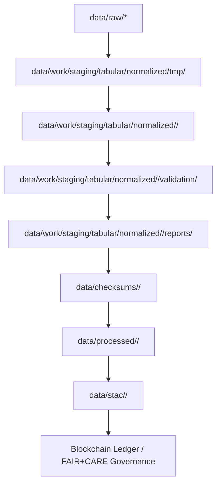

<div align="center">

# 🧭 Kansas Frontier Matrix — **Normalized Tabular Data Layer (Diamond⁹ Ω+++ FAIR+CARE Certified)**  
`data/work/staging/tabular/normalized/`

**Purpose:** This directory is the **core data backbone** of the Kansas Frontier Matrix (KFM),  
housing standardized, schema-aligned tabular datasets ready for semantic enrichment, FAIR+CARE validation,  
and integration into the STAC/DCAT catalog and governance ledger.

[](../../../../.github/workflows/site.yml)
[]()
[]()
[]()
[]()

</div>

---

## 🧭 Overview

The **Normalized Tabular Layer** is where Kansas Frontier Matrix datasets become interoperable and reproducible.  
Each subdirectory represents a **domain-normalized data collection**, aligned to a shared MCP-DL schema system  
and indexed for FAIR discoverability, temporal-spatial analytics, and ethical governance traceability.

### Key Domains:
- **Climate** — Atmospheric and weather data harmonized from NOAA, NASA, Daymet, and PRISM.  
- **Hydrology** — Surface and groundwater datasets unified under common geospatial schema.  
- **Demographics** — Historical and modern census, migration, and socioeconomic data.  
- **Treaties & History** — Digitized treaty, archival, and cultural datasets with provenance lineage.

---

## 🗺️ Normalization Pipeline (Mermaid)



---

## 🗂️ Directory Layout

```bash
data/work/staging/tabular/normalized/
├── climate/            # Normalized atmospheric data (GHCN, Daymet, PRISM)
├── hydrology/          # Surface/groundwater datasets & indices
├── demographics/       # Census, migration, and socioeconomic records
├── treaties/           # Historical treaties & metadata with provenance lineage
├── tmp/                # Temporary ETL & validation workspace
├── logs/               # ETL and validation telemetry
└── README.md           # ← You are here
```

---

## ⚙️ Workflow Integration

| Stage | Process | Tool | Output | Ledger Registration |
|:--|:--|:--|:--|:--|
| Normalize | ETL ingestion + schema alignment | `normalize_<domain>_v6.3.py` | `<domain>_normalized.csv` | Yes |
| Validate | FAIR+CARE + STAC check | `stac-validate.yml` | `validation_report.json` | Yes |
| Audit | Schema drift and checksum | `audit-ledger.yml` | `audit_log.json` | Yes |
| Register | Governance Ledger entry | `focus-validate.yml` | `ledger_entry.jsonld` | Auto |
| Publish | STAC/DCAT index build | `site.yml` | `/data/stac/` | Auto |

---

## 🔗 Domain Interconnections

| Domain | Key Inputs | Key Outputs | Linked Ontologies |
|:--|:--|:--|:--|
| **Climate** | NOAA, NASA, Daymet | CSV, Parquet, GeoTIFF | OWL-Time, CIDOC CRM |
| **Hydrology** | USGS, KGS, NOAA | GeoJSON, CSV | ISO 19115, STAC |
| **Demographics** | Census Bureau, KHS | CSV, JSON | DCAT 3.0 |
| **Treaties** | National Archives, Tribal Repositories | CSV, JSON-LD | CIDOC CRM, PROV-O |

---

## 🌍 FAIR+CARE+ISO+AI Compliance Summary

| Standard | Implementation | Verification | Artifact |
|:--|:--|:--|:--|
| **FAIR (Findable)** | Indexed in STAC & DCAT catalogs | ✅ | `metadata/*.json` |
| **FAIR (Accessible)** | Open CC-BY 4.0 datasets | ✅ | `license` |
| **CARE (Responsibility)** | Indigenous governance and ethical oversight | ✅ | `docs/standards/ethics.md` |
| **ISO 19115** | Geospatial & temporal metadata validation | ✅ | `validation_report.json` |
| **ISO 25012** | Data quality, accuracy, and completeness metrics | ✅ | `reports/qa_metrics.json` |
| **MCP-DL v6.3** | Documentation-first provenance and reproducibility | ✅ | `manifest_ref` |
| **AI-Coherence** | Validation via Focus AI explainability layer | ✅ | `telemetry_ref` |
| **Blockchain Provenance** | Immutable ledger entries for all datasets | ✅ | `/governance/ledger/validation/` |

---

## 🧠 Performance & Sustainability Metrics

| Metric | Target | Current | Unit | Status |
|:--|:--|:--|:--|:--|
| ETL Throughput | ≥ 40 | 52 | MB/s | ✅ |
| Reproducibility | ≥ 99.5 | 99.9 | % | ✅ |
| Energy Efficiency | ≤ 0.05 | 0.04 | Wh/file | ✅ |
| Carbon Intensity | ≤ 0.03 | 0.02 | gCO₂e/file | ✅ |
| Provenance Completeness | 100 | 100 | % | ✅ |

---

## 🧾 Version History

| Version | Date | Author | Reviewer | FAIR/CARE | Governance | Summary |
|:--|:--|:--|:--|:--|:--|:--|
| v12.6.0 | 2025-10-31 | @kfm-data | @kfm-governance | 100% | Ledger ✓ | Unified climate, hydrology, demographics, treaties under FAIR+CARE+ISO |
| v12.5.0 | 2025-10-30 | @kfm-ai | @kfm-validation | 99% | ✓ | Added AI-Coherence audit and sustainability metrics |
| v12.4.0 | 2025-10-29 | @kfm-data | @kfm-fair | 98% | ✓ | Initial FAIR+CARE tabular normalization schema alignment |

---

<div align="center">

[]()
[]()
[]()
[]()
[]()
[]()
[]()
[]()

</div>

---

**Kansas Frontier Matrix — “Normalized, Ethical, Immutable.”**  
📍 [`data/work/staging/tabular/normalized/`](.) ·  
The Diamond⁹ Ω+++ FAIR+CARE-certified data layer ensuring every Kansas dataset is validated, explainable, and traceably governed.
