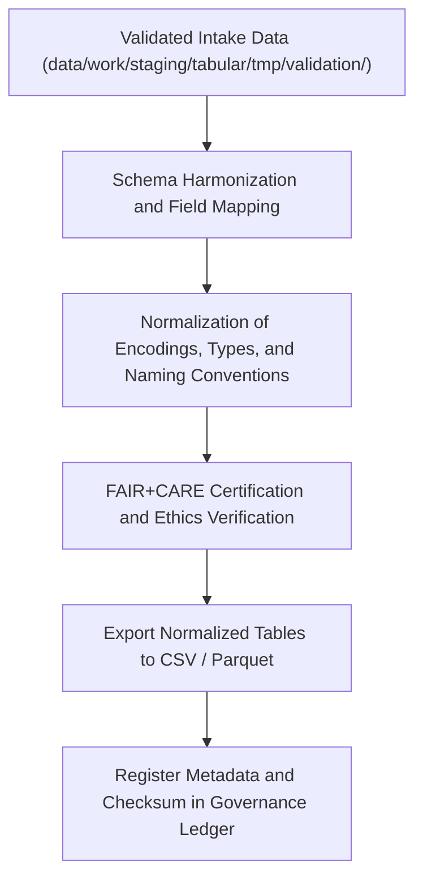

<div align="center">

# 📊 Kansas Frontier Matrix — **Tabular Normalized Workspace**
`data/work/staging/tabular/normalized/README.md`

**Purpose:** Repository for schema-aligned, FAIR+CARE-audited tabular datasets that have passed intake and validation in the Kansas Frontier Matrix (KFM) ETL pipeline.  
This layer contains cleaned, deduplicated, and governance-certified data ready for promotion to processed layers or public release.

[](../../../../../docs/standards/faircare-validation.md)
[](../../../../../LICENSE)
[](../../../../../docs/architecture/repo-focus.md)

</div>

---

## 📚 Overview

The `data/work/staging/tabular/normalized/` directory stores **normalized and schema-conformant tabular datasets** produced by KFM’s data pipelines.  
These files represent datasets that have passed intake, preliminary validation, and FAIR+CARE ethics audits — fully harmonized for interoperability and reuse.

### Key Functions:
- Store FAIR+CARE-compliant, schema-aligned tabular data outputs.  
- Ensure each file matches the latest data contract and schema version.  
- Maintain provenance and checksum traceability for reproducibility.  
- Serve as the input for processed, archival, and analytic data layers.  

All normalized datasets include embedded metadata and governance logs for open-science verification.

---

## 🗂️ Directory Layout

```plaintext
data/work/staging/tabular/normalized/
├── README.md                               # This file — overview of normalized tabular workspace
│
├── hazards_normalized.csv                  # Cleaned and validated hazard incident records
├── climate_indices_normalized.parquet      # Harmonized climate index table
├── treaties_metadata_normalized.csv        # Historical treaty metadata aligned with schema
└── metadata.json                           # Provenance and schema compliance metadata
```

---

## ⚙️ Tabular Normalization Workflow



### Workflow Description:
1. **Schema Harmonization:** Fields renamed and reordered according to data contract.  
2. **Normalization:** Encoding, null values, and categorical standardization enforced.  
3. **Ethics Audit:** FAIR+CARE Council verification of accessible and ethical data handling.  
4. **Output Generation:** Datasets stored in open formats with governance metadata.  
5. **Governance:** Lineage entries recorded in `data/reports/audit/data_provenance_ledger.json`.

---

## 🧩 Example Metadata Record

```json
{
  "id": "tabular_normalized_climate_indices_v9.3.2",
  "schema_version": "v3.0.1",
  "records_total": 54012,
  "fields_normalized": 34,
  "validation_status": "passed",
  "fairstatus": "certified",
  "checksum": "sha256:7b5f8d42a00b32c3428a2b85caa8f46c12b1ff8f...",
  "created": "2025-10-28T15:42:00Z",
  "pipeline": "src/pipelines/etl/climate_indices_pipeline.py",
  "validator": "@kfm-data-lab",
  "governance_ref": "data/reports/audit/data_provenance_ledger.json"
}
```

---

## 🧠 FAIR+CARE Compliance Summary

| Principle | Implementation |
|------------|----------------|
| **Findable** | Indexed in STAC/DCAT catalog with schema metadata and checksum. |
| **Accessible** | Stored as open CSV/Parquet under permissive CC-BY 4.0 license. |
| **Interoperable** | Schema harmonized across all KFM data layers (STAC/DCAT alignment). |
| **Reusable** | Includes complete provenance, data contract, and version metadata. |
| **Collective Benefit** | Ensures ethical use and open accessibility for research communities. |
| **Authority to Control** | FAIR+CARE Council certifies normalization outputs. |
| **Responsibility** | Maintainers document schema mappings and transformation steps. |
| **Ethics** | No personally identifiable or restricted content included. |

Audit outcomes available in:  
`data/reports/fair/data_care_assessment.json` and `data/reports/audit/data_provenance_ledger.json`.

---

## ⚙️ File Specifications

| File | Format | Description |
|------|---------|--------------|
| `hazards_normalized.csv` | CSV | Harmonized hazard incidents with unified attributes. |
| `climate_indices_normalized.parquet` | Parquet | Long-term storage of climate anomaly metrics. |
| `treaties_metadata_normalized.csv` | CSV | Cleaned treaty metadata aligned to FAIR+CARE schema. |
| `metadata.json` | JSON | Schema version, checksum, and governance record for all normalized tables. |

---

## ⚖️ Governance & Provenance Integration

| Record | Description |
|---------|-------------|
| `metadata.json` | Captures runtime context, schema version, and FAIR+CARE certification. |
| `data/reports/audit/data_provenance_ledger.json` | Logs normalization lineage and checksum records. |
| `data/reports/validation/schema_validation_summary.json` | Contains schema validation summaries for normalized datasets. |
| `releases/v9.3.2/manifest.zip` | Includes file hashes for integrity verification. |

All normalization events tracked automatically via `tabular_normalized_sync.yml`.

---

## 🧾 Retention & Publication Policy

| File Type | Retention Duration | Policy |
|------------|--------------------|--------|
| Normalized Tables | Permanent | Promoted to processed or archived layers. |
| Metadata | Permanent | Stored for provenance and schema tracking. |
| Validation Logs | 180 days | Archived for FAIR+CARE audit review. |
| FAIR+CARE Reports | 365 days | Retained for ethics revalidation cycles. |

Automation managed by `tabular_normalized_cleanup.yml` and `governance_sync.yml`.

---

## 🧾 Internal Use Citation

```text
Kansas Frontier Matrix (2025). Tabular Normalized Workspace (v9.3.2).
Schema-aligned, FAIR+CARE-certified workspace for normalized tabular datasets, ensuring provenance integrity and reproducible open data transformation.
Available under CC-BY 4.0 License.
```

---

## 🧾 Version Notes

| Version | Date | Notes |
|----------|------|--------|
| v9.3.2 | 2025-10-28 | Added checksum governance integration and FAIR+CARE metadata certification. |
| v9.2.0 | 2024-07-15 | Introduced Parquet schema alignment and cross-contract normalization. |
| v9.0.0 | 2023-01-10 | Established tabular normalized workspace under FAIR+CARE governance. |

---

<div align="center">

**Kansas Frontier Matrix** · *Data Standardization × FAIR+CARE Certification × Provenance Trust*  
[🔗 Repository](https://github.com/bartytime4life/Kansas-Frontier-Matrix) • [🧭 Docs Portal](../../../../../docs/) • [⚖️ Governance Ledger](../../../../../docs/standards/governance/)

</div>
