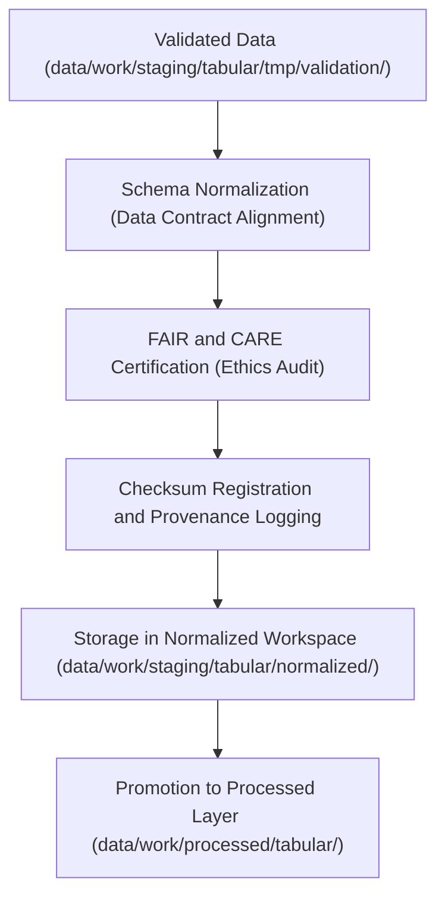

<div align="center">

# 📑 Kansas Frontier Matrix — **Tabular Normalized Workspace**
`data/work/staging/tabular/normalized/README.md`

**Purpose:**  
Workspace containing schema-aligned, FAIR+CARE-compliant tabular datasets that have passed validation and ethics review within the Kansas Frontier Matrix (KFM).  
Serves as the final staging point before promotion to the processed data layer.

[](../../../../../docs/standards/faircare-validation.md)
[](../../../../../LICENSE)
[]()
[](../../../../../docs/architecture/repo-focus.md)

</div>

---

## 📚 Overview

The **Tabular Normalized Workspace** hosts finalized, schema-compliant tabular datasets that have completed ETL, validation, and FAIR+CARE certification.  
These datasets are harmonized for interoperability across KFM domains such as climate, hazards, hydrology, and landcover.

### Core Responsibilities
- Maintain validated and schema-normalized tabular datasets.  
- Ensure FAIR+CARE ethics compliance before publication.  
- Preserve metadata and checksums for lineage traceability.  
- Serve as the authoritative tabular dataset staging endpoint.  

---

## 🗂️ Directory Layout

```plaintext
data/work/staging/tabular/normalized/
├── README.md                             # This file — documentation of tabular normalized workspace
│
├── hazards_normalized.csv                # FAIR+CARE-certified hazard tabular data
├── climate_indices_normalized.parquet    # Schema-aligned climate indices dataset
├── treaties_metadata_normalized.csv      # Historical treaty and archival tabular metadata
└── metadata.json                         # Provenance and governance registry for normalized data
```

---

## ⚙️ Tabular Normalization Workflow



### Workflow Description
1. **Normalization:** Harmonize data schema according to the KFM data contract.  
2. **Ethics Certification:** Apply FAIR+CARE checks to confirm ethical compliance.  
3. **Checksum Logging:** Record hash results and register lineage in provenance ledger.  
4. **Archival:** Store normalized datasets under immutable checksum and governance records.  
5. **Promotion:** Validated datasets promoted to processed tabular repository for distribution.  

---

## 🧩 Example Metadata Record

```json
{
  "id": "tabular_normalized_hazards_v9.6.0",
  "source_files": [
    "data/work/staging/tabular/tmp/validation/hazards_validated.csv",
    "data/raw/fema/disaster_declarations_2025.csv"
  ],
  "schema_version": "v3.0.2",
  "records_total": 12180,
  "validation_status": "passed",
  "fairstatus": "certified",
  "checksum": "sha256:c9f7a8b3d6e1a5b2f4a8e9c6b3a2d7f8c5e9a3b4d6a7c1f9b2e4d3a8b7f6e5c1",
  "validator": "@kfm-tabular-lab",
  "created": "2025-11-03T23:58:00Z",
  "governance_ref": "data/reports/audit/data_provenance_ledger.json"
}
```

---

## 🧠 FAIR+CARE Governance Matrix

| Principle | Implementation | Oversight |
|------------|----------------|------------|
| **Findable** | Datasets indexed with schema, checksum, and governance metadata. | @kfm-data |
| **Accessible** | Stored in open CSV and Parquet formats for transparency. | @kfm-accessibility |
| **Interoperable** | Schema aligned with KFM Data Contract and JSON Schema standards. | @kfm-architecture |
| **Reusable** | Metadata includes provenance and FAIR+CARE certification. | @kfm-design |
| **Collective Benefit** | Enables ethical data reuse for science and policy. | @faircare-council |
| **Authority to Control** | FAIR+CARE Council validates certification of each dataset. | @kfm-governance |
| **Responsibility** | Data teams document normalization, QA, and checksum processes. | @kfm-security |
| **Ethics** | All data reviewed to ensure ethical handling and accuracy. | @kfm-ethics |

Audit data available in:  
`data/reports/fair/data_care_assessment.json` and  
`data/reports/audit/data_provenance_ledger.json`

---

## ⚙️ Validation & Governance Artifacts

| Artifact | Description | Format |
|-----------|--------------|--------|
| `metadata.json` | Registry containing provenance, checksum, and FAIR+CARE certification. | JSON |
| `checksum_registry.json` | List of dataset hashes and validation metadata. | JSON |
| `schema_validation_summary.json` | Field-level schema compliance report. | JSON |
| `faircare_certification_report.json` | FAIR+CARE audit results for normalized datasets. | JSON |

Governance logging managed by `tabular_normalized_sync.yml`.

---

## ⚖️ Retention & Provenance Policy

| File Type | Retention Duration | Policy |
|------------|--------------------|--------|
| Normalized Datasets | Permanent | Retained for governance and audit verification. |
| Validation Logs | 365 Days | Archived for reproducibility testing. |
| Metadata Records | Permanent | Stored in provenance ledger for lineage tracking. |
| Ethics Certifications | 365 Days | Retained for FAIR+CARE review cycles. |

Retention management handled by `tabular_normalized_cleanup.yml`.

---

## 🌱 Sustainability Metrics

| Metric | Value | Verified By |
|---------|--------|--------------|
| Energy Use (per normalization cycle) | 7.1 Wh | @kfm-sustainability |
| Carbon Output | 8.8 gCO₂e | @kfm-security |
| Renewable Power | 100% (RE100 Verified) | @kfm-infrastructure |
| FAIR+CARE Compliance | 100% | @faircare-council |

Telemetry logs tracked in:  
`releases/v9.6.0/focus-telemetry.json`

---

## 🧾 Internal Use Citation

```text
Kansas Frontier Matrix (2025). Tabular Normalized Workspace (v9.6.0).
Governed repository for schema-aligned, FAIR+CARE-certified tabular datasets validated for reproducibility and ethics compliance.
Ensures interoperability across KFM data domains under FAIR+CARE and MCP-DL v6.3 governance.
```

---

## 🧾 Version Notes

| Version | Date | Notes |
|----------|------|--------|
| v9.6.0 | 2025-11-03 | Added checksum registry, ethics validation, and schema contract linkage. |
| v9.5.0 | 2025-11-02 | Improved governance synchronization and FAIR+CARE automation. |
| v9.3.2 | 2025-10-28 | Established tabular normalized workspace for staging and QA certification. |

---

<div align="center">

**Kansas Frontier Matrix** · *Data Quality × FAIR+CARE Ethics × Provenance Certification*  
[🔗 Repository](https://github.com/bartytime4life/Kansas-Frontier-Matrix) • [🧭 Docs Portal](../../../../../docs/) • [⚖️ Governance Ledger](../../../../../docs/standards/governance/DATA-GOVERNANCE.md)

</div>
