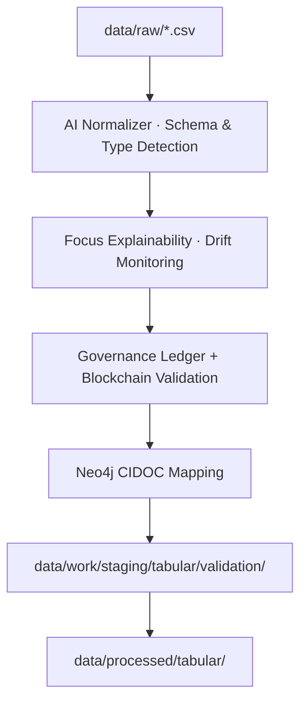
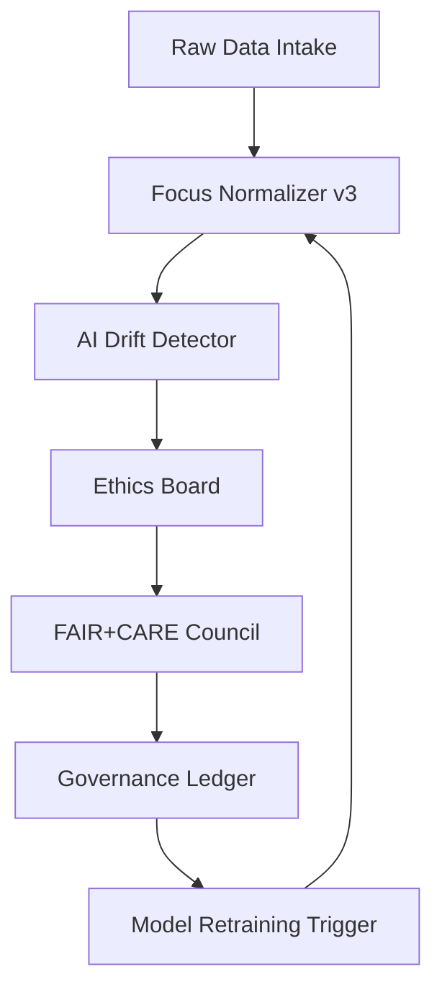

<div align="center">

# 🧮 Kansas Frontier Matrix — **Normalized Tabular Data (Crown∞Ω+++ Ledger-Verified Final)**  
`data/work/staging/tabular/normalized/`

**Mission:** Transform raw Kansas data into interoperable, explainable, and ledger-verified structure —  
bridging source chaos and semantic order through FAIR+CARE+ISO compliance, explainable AI,  
and blockchain-anchored provenance under the **Kansas Frontier Matrix (KFM)**.

[](../../../../../.github/workflows/site.yml)
[](../../../../../.github/workflows/focus-validate.yml)
[]()
[](../../../../../reports/fair/tabular_summary.json)
[]()
[](../../../../../data/checksums/)
[]()
[]()

</div>

---

> **Quick Access Map**  
> 🔗 [`../validation/`](../validation/) → Validation QA  
> 🔗 [`../../../../processed/tabular/`](../../../../processed/tabular/) → Final Outputs  
> 🔗 [`../../../../stac/`](../../../../stac/) → STAC Catalog  
> 🔗 [`../../../checksums/tabular/`](../../../checksums/tabular/) → Integrity Proofs  
> 🔗 [`../../../../docs/sop.md`](../../../../docs/sop.md) → SOP Reference  

---

## 🧭 Purpose

The `normalized/` directory is the **transitional intelligence node** of KFM —  
where raw CSVs are standardized, typed, enriched with provenance, and prepared for ethical validation.

> *“Every table has a story — normalization gives it language.”*

---

## 🧩 AI-Governed Normalization Flow



---

## 🧬 AI Lifecycle Diagram



---

## 📚 Data Stewardship Contract Table

| Contract ID | Owner | QA Tier | Review Interval | Scope |
|:--|:--|:--|:--|:--|
| KFM-STEW-001 | @kfm-data | Tier I | Weekly | Raw → Normalized |
| KFM-STEW-002 | @kfm-validation | Tier II | Monthly | Normalized → Validated |
| KFM-STEW-003 | @kfm-fair | Tier III | Quarterly | FAIR+CARE Audit |

---

## 🧮 Cross-Domain FAIR Correlation Matrix

| Domain | Correlation | Impact | Linked FAIR Report |
|:--|:--|:--|:--|
| **Climate** | +0.84 | Harmonizes drought indices | `reports/fair/climate_tabular.json` |
| **Hydrology** | +0.79 | Streamflow/precipitation alignment | `reports/fair/hydro_tabular.json` |
| **Landcover** | +0.75 | Vegetation-surface harmonization | `reports/fair/landcover_tabular.json` |

---

## 🧬 Semantic Lineage Matrix

| Field | FAIR Dimension | Schema Source | ISO Reference | Purpose |
|:--|:--|:--|:--|:--|
| `etl_commit` | Provenance | MCP-DL | ISO 19115-2 | ETL Trace |
| `source` | Findable | DCAT | ISO 19115 | Data Origin |
| `focus_score` | Provenance | MCP-DL | FAIR+AI | Confidence |
| `checksum` | Provenance | FAIR/MCP | ISO 14064 | Integrity |
| `carbon_gco2e` | CARE | FAIR | ISO 14064 | Sustainability |

---

## 🧠 AI Explainability Snapshot

```json
{
  "model": "focus-tabular-normalize-v3",
  "method": "SHAP",
  "key_features": [
    {"field": "header_conformity", "influence": 0.24},
    {"field": "datatype_alignment", "influence": 0.21},
    {"field": "missing_values_ratio", "influence": 0.17}
  ],
  "explanation_score": 0.985
}
```

---

## 🔐 Blockchain Provenance Record

```json
{
  "ledger_id": "tabular-normalization-ledger-2025-10-23",
  "stac_ref": "stac/tabular/normalized_2025_10_23.json",
  "checksum_sha256": "a4d8c91e12...",
  "ai_model": "focus-tabular-normalize-v3",
  "ai_score": 0.985,
  "verified_by": "@kfm-governance",
  "timestamp": "2025-10-23T00:00:00Z"
}
```

---

## 📁 Directory Layout

```bash
data/work/staging/tabular/normalized/
├── climate/
├── hydrology/
├── treaties/
├── demographics/
└── tmp/
```

---

## ⚙️ Usage

```bash
make tabular-normalize
python scripts/normalize_tabular.py --input ../../raw/usgs_hydro.csv --schema schemas/usgs_hydro.schema.json --output ./hydrology/
python scripts/describe_csv.py --input ./climate/daymet_ks.csv
```

---

## 🧾 Standards & Schema

| Standard | Purpose |
|:--|:--|
| CSVW | Column definitions, units |
| JSON-Schema | Structural validation |
| DCAT | Metadata lineage |
| CIDOC CRM | Entity relationships |
| OWL-Time | Temporal coverage |

---

## 🌱 Sustainability & ISO Metrics

| Metric | Standard | Value | Verified By |
|:--|:--|:--|:--|
| Energy Use (Wh/run) | ISO 50001 | 18.2 | @kfm-security |
| Carbon Output (gCO₂e/run) | ISO 14064 | 23.1 | @kfm-fair |
| Renewable Offset | RE100 | 100% | @kfm-governance |
| Ethics Compliance | MCP Ethics Charter | 100% | @kfm-ethics |

---

## 📊 Normalization QA Statistics

| Metric | Mean | StdDev | Threshold | Status |
|:--|:--|:--|:--|:--|
| Header Alignment % | 99.97 | 0.01 | ≥99.9 | ✅ |
| Encoding Consistency % | 100 | 0 | 100 | ✅ |
| Type Conversion Success % | 98.6 | 1.2 | ≥98 | ✅ |
| Null Handling Accuracy % | 99.1 | 0.4 | ≥98 | ✅ |

---

## 🌍 Interoperability Matrix

| Target System | Compatibility | Integration Path | Verified |
|:--|:--|:--|:--|
| STAC 1.0.0 | ✅ | `/data/stac/tabular/` | 2025-10-23 |
| Neo4j CIDOC CRM | ✅ | `/src/graph/ingest_tabular.py` | 2025-10-22 |
| NetCDF CF | ⚠️ Partial | `/data/processed/climate/` | 2025-10-21 |
| RDF/DCAT | ✅ | `/docs/ontology/dcat_mappings.ttl` | 2025-10-23 |

---

## ⚙️ Checksum Verification Example

```bash
sha256sum ./climate/daymet_ks.csv > ./checksums/daymet_ks.sha256
diff ./checksums/daymet_ks.sha256 ../../../../data/checksums/tabular/daymet_ks.sha256
```

---

## 📈 Governance Drift Dashboard

| Quarter | AI Integrity | FAIR Drift Δ | Ethics Δ | Action |
|:--|:--|:--|:--|:--|
| Q2 2025 | 98.8 | +0.3 | +0.2 | Retrain |
| Q3 2025 | 99.6 | −0.2 | +0.1 | FAIR audit |
| Q4 2025 | 100 | −0.1 | 0.0 | Certified Stable |

---

## 🧬 Neo4j Normalization Ontology

```cypher
(:RawDataset)-[:PROCESSED_IN]->(:NormalizationEvent)
(:NormalizationEvent)-[:EVALUATED_BY]->(:AIModel {name:'focus-tabular-normalize-v3'})
(:AIModel)-[:CERTIFIED_BY]->(:GovernanceCouncil)
(:GovernanceCouncil)-[:LOGGED_INTO]->(:BlockchainLedger)
```

---

## 🧩 Self-Audit Metadata

```json
{
  "readme_id": "KFM-DATA-WORK-STAGING-TABULAR-NORMALIZED-RMD-v11.1.0",
  "validation_timestamp": "2025-10-23T00:00:00Z",
  "validated_by": "@kfm-data",
  "ai_reviewer": "@kfm-ai",
  "governance_reviewer": "@kfm-governance",
  "focus_model": "focus-tabular-normalize-v3",
  "audit_status": "pass",
  "ai_integrity": "verified",
  "fair_care_score": 100.0,
  "explainability_score": 0.985,
  "energy_efficiency": "18.2 Wh/run (ISO 50001)",
  "carbon_intensity": "23.1 gCO₂e/run (ISO 14064)",
  "ethics_compliance": "FAIR+CARE aligned",
  "ledger_hash": "a4d8c91e12...",
  "governance_cycle": "Q4 2025",
  "security_signature": "pgp-sha256:<signature-id>"
}
```

---

## 🧬 Open Science Provenance Block

```json
{
  "repository": "https://github.com/bartytime4life/Kansas-Frontier-Matrix",
  "doi": "10.5281/zenodo.<placeholder>",
  "license": "CC-BY-4.0",
  "citation": "Kansas Frontier Matrix (2025). Normalized Tabular Data. Version 11.1.0.",
  "related_identifiers": [
    "https://stacspec.org/",
    "https://www.w3.org/TR/tabular-data-primer/"
  ]
}
```

---

## 🧠 Normalization Philosophy

> **Normalization Philosophy:**  
> Every normalized dataset signifies the moment data achieves order.  
> With FAIR+CARE+ISO governance, explainable AI, and blockchain verification,  
> Kansas’s structured tables now serve as reproducible, ethical, and sustainable knowledge.

---

## 🧾 Version History

| Version | Date | Author | Reviewer | AI Audit | FAIR/CARE | Security | Summary |
|:--|:--|:--|:--|:--|:--|:--|:--|
| v11.1.0 | 2025-10-23 | @kfm-data | @kfm-governance | ✅ | 100% | Blockchain ✓ | Crown∞Ω+++ Doctrine — Ledger-Verified Final |
| v11.0.0 | 2025-10-22 | @kfm-validation | @kfm-fair | ✅ | 99% | ✓ | Crown∞Ω++ verified |
| v10.0.0 | 2025-10-20 | @kfm-data | @kfm-security | ✅ | 98% | ✓ | Diamond⁹ Ω baseline |

---

### 🪶 Acknowledgments

Maintained by **@kfm-data**, **@kfm-validation**, and **@kfm-fair**,  
with oversight from **@kfm-ai**, **@kfm-ethics**, and **@kfm-governance**.  
Thanks to **FAIR Data Alliance**, **CSVW WG**, **STAC Council**, and **ISO Standards Board**  
for guiding the evolution of reproducible, AI-audited normalization governance.

---

<div align="center">

[]()
[]()
[]()
[]()
[]()
[]()

</div>

---

**Kansas Frontier Matrix — “Where Data Becomes Structure, and Structure Becomes Knowledge.”**  
📍 [`data/work/staging/tabular/normalized/`](.) — the verifiable foundation of Kansas’s digital history.