<div align="center">

# 📑 Kansas Frontier Matrix — **Tabular Normalized Workspace**
`data/work/staging/tabular/normalized/README.md`

**Purpose:**  
Governed repository of **schema-aligned, FAIR+CARE-certified tabular datasets** that have passed ethics validation within the Kansas Frontier Matrix (KFM).  
Represents the final pre-publication staging environment for certified tabular data under reproducible FAIR+CARE governance.

[](../../../../../docs/architecture/README.md)
[](../../../../../docs/standards/faircare-validation.md)
[]()
[](../../../../../LICENSE)

</div>

---

## 📘 Overview

The **Tabular Normalized Workspace** consolidates validated, schema-compliant tabular data ready for processing or publication.  
Each dataset undergoes FAIR+CARE auditing, checksum certification, and schema verification to ensure interoperability and governance accountability.

### Core Responsibilities
- Maintain harmonized, ethics-certified tabular datasets.  
- Ensure compliance with FAIR+CARE and KFM Data Contract schemas.  
- Preserve checksum, metadata lineage, and provenance continuity.  
- Serve as the canonical endpoint before processed data promotion.  

---

## 🗂️ Directory Layout

```plaintext
data/work/staging/tabular/normalized/
├── README.md
├── hazards_normalized.csv
├── climate_indices_normalized.parquet
├── treaties_metadata_normalized.csv
└── metadata.json
```

---

## ⚙️ Normalization Workflow

```mermaid
flowchart TD
    A["Validated Tabular Data (tmp/validation/)"] --> B["Schema Normalization (Data Contract Alignment)"]
    B --> C["FAIR + CARE Ethics Certification"]
    C --> D["Checksum & Provenance Registration"]
    D --> E["Storage in Normalized Workspace"]
    E --> F["Promotion → Processed Layer (processed/tabular/)"]
```



### Steps
1. **Schema Alignment:** Harmonize schema to conform to KFM data contract (v3).  
2. **FAIR+CARE Certification:** Audit ethical compliance and accessibility.  
3. **Checksum Logging:** Verify file integrity, register provenance records.  
4. **Governance Sync:** Log checksums to ledger and manifest.  
5. **Promotion:** Final datasets approved for public processed layer.

---

## 🧩 Example Metadata Record

```json
{
  "id": "tabular_normalized_hazards_v9.7.0",
  "source_files": [
    "data/work/staging/tabular/tmp/validation/hazards_validated.csv",
    "data/raw/fema/disaster_declarations_2025.csv"
  ],
  "schema_version": "v3.0.2",
  "records_total": 12180,
  "validation_status": "passed",
  "fairstatus": "certified",
  "checksum_sha256": "sha256:c9f7a8b3d6e1a5b2f4a8e9c6b3a2d7f8c5e9a3b4d6a7c1f9b2e4d3a8b7f6e5c1",
  "validator": "@kfm-tabular-lab",
  "created": "2025-11-06T23:58:00Z",
  "governance_ref": "data/reports/audit/data_provenance_ledger.json"
}
```

---

## 🧠 FAIR+CARE Governance Matrix

| Principle | Implementation | Oversight |
|-----------|----------------|-----------|
| **Findable** | Indexed with schema, checksum, and lineage metadata. | `@kfm-data` |
| **Accessible** | Open CSV/Parquet formats for reproducibility. | `@kfm-accessibility` |
| **Interoperable** | Schema aligned to FAIR+CARE + KFM contract (v3). | `@kfm-architecture` |
| **Reusable** | Metadata enriched with checksum and FAIR+CARE certification. | `@kfm-design` |
| **Collective Benefit** | Enables equitable, ethical reuse across research and policy. | `@faircare-council` |
| **Authority to Control** | FAIR+CARE Council validates dataset readiness. | `@kfm-governance` |
| **Responsibility** | Data teams maintain QA logs and lineage reports. | `@kfm-security` |
| **Ethics** | Data reviewed for accuracy and sensitivity. | `@kfm-ethics` |

**Audit refs:**  
`data/reports/audit/data_provenance_ledger.json` · `data/reports/fair/data_care_assessment.json`

---

## ⚙️ Validation & Governance Artifacts

| Artifact | Description | Format |
|-----------|--------------|--------|
| `metadata.json` | Provenance, checksum, and certification record. | JSON |
| `checksum_registry.json` | Dataset hash registry and lineage summary. | JSON |
| `schema_validation_summary.json` | Schema conformance report. | JSON |
| `faircare_certification_report.json` | FAIR+CARE audit summary. | JSON |

**Automation:** `tabular_normalized_sync.yml`

---

## ♻️ Retention & Sustainability Policy

| File Type | Retention | Policy |
|------------|----------:|--------|
| Normalized Datasets | Permanent | Canonical FAIR+CARE-certified artifacts. |
| Validation Logs | 365 Days | Retained for reproducibility. |
| Metadata Records | Permanent | Stored in provenance ledger. |
| Ethics Reports | 365 Days | Archived for FAIR+CARE re-review. |

**Telemetry:** `../../../../../releases/v9.7.0/focus-telemetry.json`

---

## 🌱 Sustainability Metrics

| Metric | Value | Verified By |
|--------|------:|-------------|
| Energy Use (per normalization cycle) | 7.2 Wh | `@kfm-sustainability` |
| Carbon Output | 8.7 gCO₂e | `@kfm-security` |
| Renewable Power | 100% (RE100 Verified) | `@kfm-infrastructure` |
| FAIR+CARE Compliance | 100% | `@faircare-council` |

---

## 🧾 Internal Citation

```text
Kansas Frontier Matrix (2025). Tabular Normalized Workspace (v9.7.0).
FAIR+CARE-certified schema-aligned staging environment for validated tabular datasets.
Ensures ethics, reproducibility, and governance integrity under MCP-DL v6.3 certification framework.
```

---

## 🕰️ Version History

| Version | Date       | Author           | Summary |
|--------:|------------|------------------|---------|
| v9.7.0  | 2025-11-06 | `@kfm-tabular`   | Upgraded to v9.7.0; added telemetry schema + sustainability updates. |
| v9.6.0  | 2025-11-03 | `@kfm-tabular`   | Introduced checksum registry + FAIR+CARE certification artifacts. |

---

<div align="center">

**Kansas Frontier Matrix**  
*Data Quality × FAIR+CARE Ethics × Provenance Certification*  
© 2025 Kansas Frontier Matrix — Internal · FAIR+CARE Certified · Diamond⁹ Ω / Crown∞Ω Ultimate Certified  

[Back to Tabular Staging](../README.md) · [Governance Charter](../../../../../docs/standards/governance/DATA-GOVERNANCE.md)

</div>