<div align="center">

# 📑 Kansas Frontier Matrix — **Tabular Normalized Workspace**
`data/work/staging/tabular/normalized/README.md`

**Purpose:**  
Governed repository for **schema-aligned, FAIR+CARE-certified tabular datasets** that have passed all validation and ethics review within the Kansas Frontier Matrix (KFM).  
Serves as the **final canonical checkpoint** for pre-publication tabular data under reproducible, energy-audited governance pipelines.

[](../../../../../docs/architecture/README.md)
[](../../../../../docs/standards/faircare-validation.md)
[]()
[](../../../../../LICENSE)

</div>

---

## 📘 Overview
The **Tabular Normalized Workspace** consolidates validated tabular datasets that conform to KFM’s data contract and ethical standards.  
This workspace ensures **structural consistency**, **checksum integrity**, and **FAIR+CARE compliance** across all data categories prior to promotion to the public processed layer.

**New in v10.0.0:**
- Integrated **telemetry v2** energy and CO₂ tracking for normalization tasks.  
- Expanded **metadata lineage linking (JSON-LD)** for Focus Mode dashboards.  
- Enhanced **abandonment candidate references** from validation layer.  

---

## 🗂️ Directory Layout
```plaintext
data/work/staging/tabular/normalized/
├── README.md
├── hazards_normalized_v10.0.0.csv
├── climate_indices_normalized_v10.0.0.parquet
├── treaties_metadata_normalized_v10.0.0.csv
└── metadata.json
```

---

## ⚙️ Normalization Workflow

```mermaid
flowchart TD
  A["Validated Tabular (tmp/validation)"] --> B["Schema Normalization (Data Contract Alignment)"]
  B --> C["FAIR+CARE Ethics & Accessibility Audit"]
  C --> D["Checksum & Provenance Registration"]
  D --> E["Governance Sync + Telemetry Log"]
  E --> F["Promotion → Processed Tabular Layer"]
```


### Step Summary
1. **Schema Alignment** → Harmonize data with KFM Data Contract v3 structure.  
2. **Ethical Validation** → Conduct FAIR+CARE accessibility and privacy audits.  
3. **Checksum Registration** → Compute hashes and register to governance ledger.  
4. **Telemetry Logging** → Record energy and CO₂ metrics per file operation.  
5. **Certification & Promotion** → Transfer certified data to processed/public layers.

---

## 🧩 Example Metadata Record
```json
{
  "id": "tabular_normalized_climate_indices_v10.0.0",
  "source_files": [
    "data/work/staging/tabular/tmp/validation/climate_indices_validated.csv",
    "data/raw/noaa/precipitation_timeseries_2025.csv"
  ],
  "schema_version": "v3.2.0",
  "records_total": 56284,
  "validation_status": "passed",
  "fairstatus": "certified",
  "checksum_sha256": "sha256:da41a7f9b83c6e2a9c5f1a8d7e9b4c3f6a8e1d9a2c4b7f3e8c6f9a1d7b2c5e9a",
  "energy_wh": 7.4,
  "carbon_gco2e": 9.2,
  "validator": "@kfm-tabular-lab",
  "created": "2025-11-09T00:02:00Z",
  "governance_ref": "data/reports/audit/data_provenance_ledger.json"
}
```

---

## 🧠 FAIR+CARE Governance Matrix
| Principle | Implementation | Oversight |
|------------|----------------|------------|
| **Findable** | Indexed via STAC/DCAT catalogs, checksum + lineage references. | `@kfm-data` |
| **Accessible** | CSV and Parquet outputs accessible under governance license. | `@kfm-accessibility` |
| **Interoperable** | Schema aligned with Data Contract v3 + DCAT 3.0. | `@kfm-architecture` |
| **Reusable** | Metadata, ethics certification, and lineage embedded in records. | `@kfm-design` |
| **Collective Benefit** | Equitable data governance supporting sustainable research. | `@faircare-council` |
| **Authority to Control** | FAIR+CARE Council certifies release readiness. | `@kfm-governance` |
| **Responsibility** | ETL team maintains validation and sustainability telemetry. | `@kfm-security` |
| **Ethics** | Ethical data review required for promotion. | `@kfm-ethics` |

**Audit Logs:**  
`data/reports/audit/data_provenance_ledger.json`  
`data/reports/fair/data_care_assessment.json`

---

## ⚙️ Validation & Certification Artifacts
| Artifact | Description | Format |
|-----------|-------------|--------|
| `metadata.json` | Provenance, checksum, and FAIR+CARE lineage. | JSON |
| `checksum_registry.json` | Hash registry and integrity ledger mapping. | JSON |
| `schema_validation_summary.json` | Validation output for schema compliance. | JSON |
| `faircare_certification_report.json` | FAIR+CARE ethics and accessibility results. | JSON |

**Automation Workflow:** `tabular_normalized_sync.yml`

---

## ♻️ Retention & Lifecycle Policy
| File Type | Retention | Policy |
|------------|-----------:|--------|
| Normalized Datasets | Permanent | Canonical FAIR+CARE-certified artifacts. |
| Validation Logs | 365 Days | Retained for audit reproducibility. |
| Metadata Records | Permanent | Immutable, stored in ledger. |
| FAIR+CARE Reports | 730 Days | Retained for long-term certification. |

Telemetry archived under:  
`../../../../../releases/v10.0.0/focus-telemetry.json`

---

## 🌱 Sustainability Metrics (v10.0.0)
| Metric | Value | Verified By |
|--------|------:|-------------|
| Energy per normalization | 7.4 Wh | `@kfm-sustainability` |
| Carbon Output | 9.2 gCO₂e | `@kfm-security` |
| Renewable Power | 100% (RE100 Certified) | `@kfm-infrastructure` |
| FAIR+CARE Compliance | 100% | `@faircare-council` |

---

## 🧾 Internal Citation
```text
Kansas Frontier Matrix (2025). Tabular Normalized Workspace (v10.0.0).
FAIR+CARE-certified, schema-aligned staging repository for normalized tabular data.  
Integrates telemetry v2, JSON-LD lineage, and sustainable FAIR+CARE governance for open data readiness.
```

---

## 🕰️ Version History
| Version | Date | Author | Summary |
|----------|------|--------|----------|
| v10.0.0 | 2025-11-09 | `@kfm-tabular` | Upgraded to v10; telemetry v2 integration, lineage expansion, and energy audit metrics. |
| v9.7.0 | 2025-11-06 | `@kfm-tabular` | Telemetry schema added; sustainability audit alignment. |

---

<div align="center">

**Kansas Frontier Matrix**  
*Data Quality × FAIR+CARE Ethics × Provenance Certification*  
© 2025 Kansas Frontier Matrix — Internal · FAIR+CARE Certified · Diamond⁹ Ω / Crown∞Ω Ultimate Certified  

[Back to Tabular Staging](../README.md) · [Governance Charter](../../../../../docs/standards/governance/DATA-GOVERNANCE.md)

</div>