<div align="center">

# 📊 Kansas Frontier Matrix — **Tabular Normalized Staging Layer**
`data/work/staging/tabular/normalized/README.md`

**Purpose:** Hosts schema-validated, FAIR+CARE-audited tabular datasets that have completed ETL ingestion, pre-certification, and governance QA under the Kansas Frontier Matrix (KFM).  
This is the **final normalized staging layer** for structured tabular data, preparing datasets for promotion to `data/work/processed/tabular/` and inclusion in open-access KFM catalogs.

[](../../../../../docs/standards/faircare-validation.md)
[](../../../../../LICENSE)
[](../../../../../docs/architecture/repo-focus.md)

</div>

---

## 📚 Overview

The `data/work/staging/tabular/normalized/` directory serves as the **governed data workspace** for finalizing, auditing, and certifying tabular datasets within the KFM pipeline.  
Every dataset here has passed schema validation, FAIR+CARE pre-certification, checksum verification, and ethical review.  
It represents the final structured layer before archival or distribution in processed repositories.

### Core Functions
- Store normalized, schema-aligned CSV and Parquet tabular datasets.  
- Integrate FAIR+CARE-certified governance metadata and audit reports.  
- Ensure complete lineage, provenance, and reproducibility traceability.  
- Emit telemetry for quality metrics, schema drift detection, and ETL runtime statistics.  

All datasets here are immutable, checksum-verified, and logged in the KFM Governance Ledger.

---

## 🗂️ Directory Layout

```plaintext
data/work/staging/tabular/normalized/
├── README.md
│
├── hazards_normalized.csv                 # Validated hazard data (FEMA + NOAA harmonized)
├── climate_indices_normalized.parquet     # Climate datasets ready for certification
├── treaties_metadata_normalized.csv       # Structured archival treaty metadata
└── metadata.json                          # Provenance, FAIR+CARE certification, and telemetry linkage
```

---

## ⚙️ Normalization Workflow

```mermaid
flowchart TD
    A["Validated Tabular TMP (data/work/staging/tabular/tmp/validation/)"] --> B["Schema Enforcement & Data Contract QA"]
    B --> C["FAIR+CARE Pre-Certification Ethics Review"]
    C --> D["Checksum, Provenance & Telemetry Sync"]
    D --> E["Promotion → Processed Layer (data/work/processed/tabular/)"]
```



### Workflow Description
1. **Schema Enforcement:** Final alignment of data structures to `data_contract_ref`.  
2. **Ethics Review:** FAIR+CARE pre-certification audit ensures data is ethically curated.  
3. **Governance & Telemetry Sync:** Checksum hashes, schema metrics, and audit results logged.  
4. **Promotion:** Once verified, datasets are marked for release to the processed layer.  

---

## 🧩 Example Normalized Metadata Record

```json
{
  "id": "tabular_normalized_climate_indices_v9.5.0",
  "source_pipeline": "src/pipelines/etl/climate_indices_pipeline.py",
  "records_total": 56321,
  "fields": 24,
  "schema_version": "v3.2.0",
  "fairstatus": "certified",
  "checksum": "sha256:a8124b5ce5e1f7b2f03ef4ccf5f3c06db1128d94...",
  "created": "2025-11-02T16:25:00Z",
  "telemetry_link": "releases/v9.5.0/focus-telemetry.json",
  "validator": "@kfm-data-lab",
  "governance_ref": "data/reports/audit/data_provenance_ledger.json",
  "quality_score": 99.3,
  "drift_detected": false
}
```

---

## 🧠 FAIR+CARE Governance in Normalized Data

| Principle | Implementation |
|------------|----------------|
| **Findable** | Indexed by schema ID, checksum, version, and telemetry reference. |
| **Accessible** | Distributed in open CSV/Parquet formats with FAIR+CARE metadata. |
| **Interoperable** | Schema fully aligned with DCAT/DCAT-AP and JSON Schema standards. |
| **Reusable** | Provenance, audit trails, and checksum validation ensure reuse integrity. |
| **Collective Benefit** | Promotes ethical open science through transparent governance. |
| **Authority to Control** | FAIR+CARE Council reviews schema before final promotion. |
| **Responsibility** | Validators document audit, QA, and checksum verification. |
| **Ethics** | Curated under FAIR+CARE ethics, ensuring no sensitive or private data. |

Compliance and certification metadata stored in:  
`data/reports/fair/data_care_assessment.json` • `data/reports/audit/data_provenance_ledger.json`

---

## ⚙️ Validation & QA Reports

| Report | Description | Format |
|---------|-------------|--------|
| `schema_validation_summary.json` | Detailed schema conformance and data type QA. | JSON |
| `faircare_audit_report.json` | FAIR+CARE ethics certification and validation metrics. | JSON |
| `quality_metrics.json` | AI-assisted data quality and schema drift metrics. | JSON |
| `qa_summary.md` | Human-readable summary of data quality results. | Markdown |

All reports synchronized via **`tabular_normalized_sync.yml`** and recorded in telemetry.

---

## ⚖️ Governance & Provenance Integration

| Record | Description |
|---------|-------------|
| `metadata.json` | Captures checksum, schema version, validator ID, and telemetry reference. |
| `data/reports/audit/data_provenance_ledger.json` | Stores lineage and FAIR+CARE governance certification. |
| `data/reports/validation/schema_validation_summary.json` | QA summary for each normalized dataset. |
| `releases/v9.5.0/manifest.zip` | Global checksum registry for reproducibility verification. |

Governance and telemetry synchronization handled via **`tabular_normalized_sync.yml`**.

---

## 🧾 Retention Policy

| Data Type | Retention Duration | Policy |
|------------|--------------------|--------|
| Normalized Datasets | 180 days | Retained until processed promotion. |
| Validation Reports | 90 days | Archived with governance metadata. |
| Metadata | Permanent | Stored in governance ledger for certification history. |
| QA Logs | 60 days | Archived for reproducibility and drift analysis. |

Cleanup and archival managed by **`tabular_normalized_cleanup.yml`**.

---

## 🧾 Internal Use Citation

```text
Kansas Frontier Matrix (2025). Tabular Normalized Staging Layer (v9.5.0).
Certified schema-aligned tabular datasets ready for processing and FAIR+CARE publication under full governance traceability.
Maintained as part of the Kansas Frontier Matrix open-data ethics and provenance framework.
```

---

## 🧾 Version Notes

| Version | Date | Notes |
|----------|------|--------|
| v9.5.0 | 2025-11-02 | Added AI quality telemetry, drift detection, and enhanced schema versioning. |
| v9.4.0 | 2025-11-02 | Introduced telemetry tracking and expanded FAIR+CARE pre-certification checks. |
| v9.3.2 | 2025-10-28 | Finalized FAIR+CARE audit workflow for normalized tabular data. |
| v9.2.0 | 2024-07-15 | Integrated improved checksum tracking and manifest synchronization. |
| v9.0.0 | 2023-01-10 | Established normalized staging workspace for certified tabular datasets. |

---

<div align="center">

**Kansas Frontier Matrix** · *Data Quality × FAIR+CARE Certification × Provenance Governance × Telemetry Intelligence*  
[🔗 Repository](https://github.com/bartytime4life/Kansas-Frontier-Matrix) • [🧭 Docs Portal](../../../../../docs/) • [⚖️ Governance Ledger](../../../../../docs/standards/governance/)

</div>
