<div align="center">

# 🌦️ Kansas Frontier Matrix — **Normalized Climate Data**  
`data/work/staging/tabular/normalized/climate/`

**“Tracing Kansas climate across time, terrain, and history.”**

[](../../../../../../.github/workflows/site.yml)
[](../../../../../../.github/workflows/stac-validate.yml)
[]()
[]()
[](../../../../../../LICENSE)

</div>

---

## 🧭 Overview

The **Normalized Climate Data Layer** unifies all climate and weather datasets processed by the **KFM ETL pipeline** into harmonized, schema-driven tabular structures suitable for time-series analysis and geospatial integration.  
This repository aligns climate observations, hydrological indices, and atmospheric summaries into **FAIR+CARE-compliant datasets** enriched with **CIDOC CRM** and **OWL-Time** semantic references for temporal reasoning.

### Includes:
- **NOAA NCEI GHCN-Daily** — Station-based daily temperature, precipitation, and snow data.  
- **NASA Daymet v4** — Gridded daily meteorological summaries (1 km resolution).  
- **NOAA Climate Normals (1991–2020)** — 30-year baseline climatological averages.  
- **Kansas Mesonet / NCDC Drought Metrics** — SPI & PDSI indices for drought characterization.  

Each dataset is **versioned**, **checksummed**, and linked to **provenance metadata** for deterministic reproducibility.

---

## ⚙️ Workflow Integration

```mermaid
flowchart TD
  A["data/raw/climate/*.csv / *.nc / *.geojson"] --> B["ETL Processor: normalize_climate_v6.3"]
  B --> C["TMP Layer: data/work/staging/tabular/normalized/climate/"]
  C --> D["Validation Workspace: schema_reports + qa_metrics"]
  D --> E["Provenance Registration + Checksum"]
  E --> F["data/processed/climate/ → STAC Catalog & Visualization"]
```



**Automation:**  
Run via `make climate-normalize`, or execute manually with:

```bash
python scripts/normalize_climate.py \
  --input ../../../raw/climate/noaa_ghcn_daily.csv \
  --schema ../../../validation/schemas/climate.schema.json \
  --output ./noaa_ghcn_daily.csv
```

Outputs include normalized CSVs, JSON metadata, and QA logs under `/validation/`.

---

## 🗂️ Directory Layout

```bash
data/work/staging/tabular/normalized/climate/
├── noaa_ghcn_daily.csv           # Station-based daily observations
├── daymet_daily_summary.csv      # NASA Daymet gridded weather data
├── climate_normals_1991_2020.csv # NOAA 30-year climate baselines
├── drought_indices.csv           # SPI & PDSI indices
├── metadata/                     # Schema and provenance JSON metadata
├── tmp/                          # Temporary ETL cache (excluded from Git)
└── README.md                     # ← You are here
```

---

## 🧩 Schema Alignment & Standards

| Standard | Function | Reference |
|-----------|-----------|-----------|
| **CSVW** | Column datatypes, units, and controlled vocabularies. | schemas/climate.schema.json |
| **STAC 1.0** | SpatioTemporal Asset Catalog for discoverability. | data/stac/climate_collection.json |
| **DCAT 3.0** | FAIR dataset cataloging. | data/catalogs/climate_datasets.json |
| **OWL-Time** | Temporal interval and instant modeling. | ontology/time.ttl |
| **CIDOC CRM** | Semantic linkage of climate phenomena to historical entities. | ontology/cidoc-crm.ttl |

All normalized tables share these core fields:

| Column | Description | Example |
|--------|--------------|----------|
| `station_id` | Unique climate station or grid cell identifier | "USW00003928" |
| `date` | ISO-8601 UTC date | "1987-07-14" |
| `tmin_c` / `tmax_c` | Min/Max temperature (°C) | -4.2 / 17.8 |
| `precip_mm` | Daily precipitation (mm) | 12.5 |
| `snow_mm` | Daily snowfall (mm) | 0.0 |
| `source` | Data origin or API source | "NOAA GHCN" |
| `etl_commit` | Git commit hash for reproducibility | "1af72b1" |
| `ingested_at` | Timestamp of normalization | "2025-10-25T10:00:00Z" |

---

## 🔍 Provenance & Integrity

Each dataset has corresponding **`.meta.json`**, **`.sha256`**, and **`.prov.jsonld`** files documenting:
- Input source paths and licenses.  
- Normalization process metadata (tool version, commit SHA).  
- Validation results and checksum integrity.  
- FAIR+CARE compliance audit results.

### Example Provenance Record

```json
{
  "@context": "https://www.w3.org/ns/prov#",
  "@id": "urn:kfm:dataset:noaa_ghcn_daily",
  "prov:wasDerivedFrom": "data/raw/climate/noaa_ghcn_daily.csv",
  "prov:wasGeneratedBy": "normalize_climate_v6.3",
  "prov:wasAttributedTo": "@kfm-data-engineering",
  "prov:generatedAtTime": "2025-10-25T09:30:00Z",
  "prov:value": "Normalized NOAA GHCN daily station observations (FAIR+CARE compliant)",
  "checksum": "sha256:9bfcae8837b6e14f5e44e322...a8e89a"
}
```

---

## 📈 Validation & QA Metrics

**File:** `validation_report.json`

```json
{
  "validated_at": "2025-10-25T10:15:00Z",
  "datasets_validated": 4,
  "validator": "@kfm-validation",
  "schema_version": "climate_schema_v6.3",
  "records_checked": 581032,
  "checksum_verified": true,
  "spatial_integrity": 0.992,
  "temporal_integrity": 0.984,
  "ontology_alignment": "PASS",
  "faircare_compliance": "PASS",
  "qa_score": 0.982
}
```

---

## 📊 Quality Assurance Targets

| Metric | Description | Target |
|--------|--------------|---------|
| Schema Conformance | % of files passing schema validation | ≥ 97% |
| Spatial Consistency | % CRS-aligned geospatial records | ≥ 99% |
| Temporal Alignment | % of valid ISO timestamps | ≥ 98% |
| FAIR+CARE Compliance | % datasets ethically and openly documented | ≥ 95% |
| Provenance Completeness | % of datasets with PROV-O chain | 100% |

---

## 🔒 Governance & Ledger Integration

All normalized climate data are registered within:
- `/governance/ledger/validation/YYYY/MM/climate_datasets.jsonld`
- `/data/checksums/archive/climate_2025_Q4.sha256`
- `/data/stac/climate_collection.json`

### Example Governance Entry

```json
{
  "@context": "https://www.w3.org/ns/prov#",
  "@id": "urn:kfm:ledger:dataset:climate:noaa_ghcn_daily",
  "prov:wasGeneratedBy": "normalize_climate_v6.3",
  "prov:wasAttributedTo": "@kfm-validation",
  "prov:used": ["data/raw/climate/noaa_ghcn_daily.csv"],
  "prov:value": "Climate normalization validated and ledger-registered.",
  "prov:generatedAtTime": "2025-10-25T10:20:00Z"
}
```

---

## ⚖️ FAIR+CARE & ISO Compliance

| Standard | Implementation | Artifact |
|-----------|----------------|-----------|
| **FAIR F1-F4** | Metadata indexed via DCAT/STAC and unique dataset URNs. | metadata/*.json |
| **CARE Principles** | Ethical representation of environmental and Indigenous data contexts. | validation_report.json |
| **ISO 19115** | Geospatial coverage & temporal metadata standardized. | climate_normals_1991_2020.csv |
| **ISO 25012** | Ensures accuracy, integrity, and completeness via checksum & audit logs. | *.sha256 |
| **MCP-DL v6.3** | Documentation-first, provenance-enforced data governance. | provenance/*.jsonld |

---

## 🧾 Version History

| Version | Date | Author | Reviewer | Notes |
|----------|------|---------|-----------|--------|
| v2.1.0 | 2025-10-25 | @kfm-data-engineering | @kfm-governance | Aligned with FAIR+CARE and ISO standards; added governance ledger integration. |
| v2.0.0 | 2025-10-24 | @kfm-validation | @kfm-data-engineering | Introduced validation schema, provenance chain, and checksum manifests. |
| v1.0.0 | 2025-10-23 | @kfm-validation | — | Initial normalized climate data directory documentation. |

---

<div align="center">

[]()
[]()
[]()
[]()
[]()

</div>
