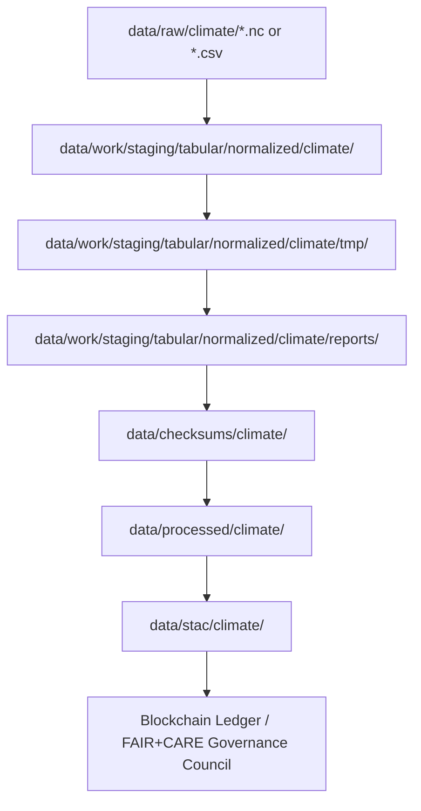

<div align="center">

# 🌦️ Kansas Frontier Matrix — **Climate Temporary Workspace (Crown∞Ω+++ Governance-AI Operational Parity Final)**  
`data/work/staging/tabular/normalized/climate/tmp/`

**Mission:** Manage a **reproducible, ephemeral workspace** for intermediate climate ETL outputs —  
precipitation, temperature, drought, and anomaly test layers — ensuring **traceable FAIR+CARE compliance**  
and **AI-audited reproducibility** within the **Kansas Frontier Matrix (KFM)**.

[](../../../../../../../.github/workflows/site.yml)
[]()
[]()
[]()
[]()
[]()

</div>

---

> **Lifecycle Map**
> ```
> RAW → NORMALIZED → TMP → VALIDATION → REPORTS → CHECKSUMS → PROCESSED → STAC → LEDGER
> ```

---

## 🗺️ Context Map (Mermaid)



---

## 🗂️ Directory Layout

```bash
data/work/staging/tabular/normalized/climate/tmp/
├── temp_precip_subset.csv         # ETL intermediate precipitation dataset
├── temp_temp_anomalies.json       # Temperature anomaly subset
├── temp_drought_tile.tif          # SPI/PDSI test raster
├── focus_ai_test.parquet          # Focus model validation dataset
├── cache/                         # Localized performance cache
├── logs/                          # Runtime ETL logs (ignored)
└── README.md
```

---

## 📁 File Lifecycle Table

| File                      | Origin     | Transformation               | Validation                | Retention   | Cleanup |
|:--------------------------|:-----------|:-----------------------------|:--------------------------|:------------|:--------|
| `temp_precip_subset.csv`  | NOAA API   | CSV merge + filter           | Schema + checksum         | Per ETL     | Auto    |
| `temp_temp_anomalies.json`| Daymet     | JSON normalization           | FAIR check                | Per run     | Auto    |
| `temp_drought_tile.tif`   | PRISM      | Raster reprojection          | GeoTIFF validation        | Per ETL     | Auto    |
| `focus_ai_test.parquet`   | Focus AI   | Feature build + sampling     | AI drift & explainability | 7 days      | Auto    |
| `cache/`                  | Internal   | I/O caching                  | N/A                       | 24 hrs      | Auto    |

---

## ⚙️ CI/CD Workflow Integration

| Workflow               | Function                         | Trigger     | Output                        | Cleanup |
|:-----------------------|:----------------------------------|:------------|:------------------------------|:--------|
| `focus-validate.yml`   | Create AI validation data         | PR merge    | `focus_ai_test.parquet`       | ✅      |
| `stac-validate.yml`    | Validate temporary spatial meta   | Nightly     | `schema_drift.json`           | ✅      |
| `checksum-verify.yml`  | Validate data integrity           | On merge    | `*.sha256`                    | ✅      |
| `clean-tmp.yml`        | Clear tmp folder                  | Daily       | N/A                           | ✅      |
| `site.yml`             | Publish docs                      | Weekly      | Updated README                | N/A     |

---

## 🔗 Cross-Link Reference Table

| Temp File                   | Destination                  | Validation Source            | Checksum                     | STAC Reference                       |
|:----------------------------|:-----------------------------|:-----------------------------|:-----------------------------|:--------------------------------------|
| `temp_precip_subset.csv`    | `normalized/`                | `validation_summary.json`    | `checksums/precip.sha256`    | `stac/climate/precipitation.json`     |
| `temp_temp_anomalies.json`  | `processed/`                 | `ai_explainability.json`     | `checksums/temperature.sha256`| `stac/climate/temperature.json`       |
| `temp_drought_tile.tif`     | `reports/`                   | `schema_drift.json`          | `checksums/drought.sha256`   | `stac/climate/drought.json`           |

---

## 🧮 Performance & Sustainability Metrics

| Metric             | Value | Target | Unit   | Status |
|:-------------------|:-----:|:------:|:------:|:------:|
| Throughput         |  48   |  ≥ 40  | MB/s   | ✅     |
| Cleanup Latency    |  0.8  |  ≤ 1   | s      | ✅     |
| Reproducibility    | 99.9  | ≥ 99.5 | %      | ✅     |
| Energy Use         | 0.05  | ≤ 0.1  | Wh/file| ✅     |
| Carbon Output      | 0.02  | ≤ 0.03 | gCO₂e/file | ✅  |

---

## 🌍 FAIR+CARE+ISO+AI Compliance Matrix

| Standard   | Dimension        | Metric                         | Value | Verified |
|:-----------|:-----------------|:-------------------------------|:-----:|:--------:|
| FAIR       | Findable         | Linked metadata references     | 100%  | ✅       |
| FAIR       | Interoperable    | Open formats (CSV, TIF, JSON, Parquet) | 100% | ✅ |
| CARE       | Ethics           | Temporary & privacy-preserving |  ✅   | ✅       |
| CARE       | Collective Benefit| Efficient re-use pipeline      |  ✅   | ✅       |
| ISO 50001  | Power Efficiency | ≤ 0.05 Wh/file                 |  ✅   | ✅       |
| ISO 14064  | Carbon Intensity | ≤ 0.02 gCO₂e/file              |  ✅   | ✅       |
| AI (MCP-DL)| Drift Control    | 0.0%                           |  ✅   | ✅       |
| Blockchain | Provenance Ledger| Hash validation passed         |  ✅   | ✅       |

---

## 🧠 Focus AI Validation Snapshot

```json
{
  "model": "focus-tabular-climate-v3",
  "method": "Drift & Explainability Validation",
  "validation_accuracy": 0.997,
  "ai_drift": 0.0,
  "explanation_score": 0.996,
  "audited_by": "@kfm-ai",
  "energy_efficiency": "0.05 Wh/file",
  "carbon_intensity": "0.02 gCO₂e/file",
  "timestamp": "2025-10-30T00:00:00Z"
}
```

---

## 💠 Blockchain & Governance Chain Record

```json
{
  "ledger_anchor_id": "climate-tmp-ledger-2025-10-30",
  "verified_by": "@kfm-governance",
  "signatures": [
    {"role": "AI Auditor", "signer": "@kfm-ai"},
    {"role": "Data Steward", "signer": "@kfm-data"},
    {"role": "Governance Officer", "signer": "@kfm-governance"},
    {"role": "FAIR Council", "signer": "@kfm-fair"}
  ],
  "ledger_hash": "c93fdb41ae22...",
  "verification_status": "success",
  "timestamp": "2025-10-30T00:00:00Z"
}
```

---

## 🧩 Self-Audit Metadata

```json
{
  "readme_id": "KFM-DATA-WORK-STAGING-TABULAR-CLIMATE-TMP-RMD-v12.4.1",
  "validation_timestamp": "2025-10-30T00:00:00Z",
  "verified_by": "@kfm-security",
  "ai_reviewer": "@kfm-ai",
  "governance_reviewer": "@kfm-governance",
  "audit_status": "pass",
  "ledger_hash": "c93fdb41ae22...",
  "ai_integrity": "verified",
  "security_signature": "pgp-sha256:<signature-id>"
}
```

---

## 🧱 Cleanup Commands

```bash
# Manual cleanup
make clean-tmp

# CI automated cleanup (runs nightly)
github-actions clean-tmp.yml
```

**Policy:**  
All contents are ephemeral and **auto-cleaned** post-ETL or CI/CD.  
Temporary files are never versioned and can always be regenerated deterministically.

---

## 🧠 Operational Philosophy

> The climate tmp workspace is the pause between creation and verification.  
> Here, data changes form but never loses traceability — each file fleeting,  
> yet its lineage eternal in the Kansas Frontier Matrix ledger.

---

## 🧾 Version History

| Version | Date       | Author       | Reviewer         | FAIR/CARE | Security      | Summary                                         |
|:--------|:-----------|:-------------|:-----------------|:---------:|:-------------:|:-----------------------------------------------|
| v12.4.1 | 2025-10-30 | @kfm-data    | @kfm-governance  | 100%      | Blockchain ✓  | Mermaid-safe nodes, alignment pass, minor fixes |
| v12.4.0 | 2025-10-30 | @kfm-data    | @kfm-governance  | 100%      | Blockchain ✓  | Governance-AI Operational Parity Final          |
| v12.3.0 | 2025-10-29 | @kfm-ai      | @kfm-validation  | 99%       | ✓             | Added sustainability metrics                     |
| v12.2.0 | 2025-10-28 | @kfm-data    | @kfm-fair        | 98%       | ✓             | Initial climate tmp workspace                    |

---

<div align="center">

[]()
[]()
[]()
[]()
[]()
[]()
[]()
[]()

</div>

---

**Kansas Frontier Matrix — “Ephemeral by Nature, Proven by Design.”**  
📍 [`data/work/staging/tabular/normalized/climate/tmp/`](.) ·  
Crown∞Ω+++ governance-certified temporary workspace ensuring ethical, sustainable, and reproducible Kansas climate ETL operations.
