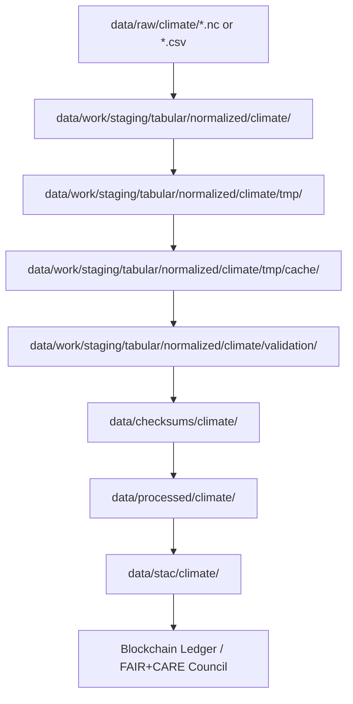

<div align="center">

# 🌦️ Kansas Frontier Matrix — **Climate Cache Layer (Crown∞Ω+++ Governance-AI Parity Final)**  
`data/work/staging/tabular/normalized/climate/tmp/cache/`

**Mission:** Act as the **short-term performance buffer and acceleration layer**  
for ETL and Focus AI climate processing — enhancing reproducibility, validation speed,  
and sustainability compliance within the **Kansas Frontier Matrix (KFM)**.

[](../../../../../../../../.github/workflows/site.yml)
[]()
[]()
[]()
[]()
[]()
[]()

</div>

---

> **Context Chain**
> ```
> RAW → NORMALIZED → TMP → CACHE → VALIDATION → REPORTS → CHECKSUMS → PROCESSED → STAC → LEDGER
> ```

---

## 🗺️ Data Flow (Mermaid)



---

## 🗂️ Directory Layout

```bash
data/work/staging/tabular/normalized/climate/tmp/cache/
├── etl_state.pkl                # Serialized pipeline runtime state (replay & resume)
├── ai_cache_validation.parquet  # Focus AI cache for inference reuse & drift checks
├── vector_cache.feather         # Columnar cache to accelerate joins/aggregations
├── io_benchmark.log             # I/O and performance log (read/write, latency)
├── tmp_cache_index.json         # Cache index for CI/CD (TTL, size, checksum)
└── README.md
```

---

## 📦 Cache Schema Table

| File                         | Type     | Purpose                                 | Format   | Compression | Retention | Validation |
|:----------------------------|:---------|:----------------------------------------|:---------|:------------|:---------:|:----------|
| `etl_state.pkl`             | Binary   | Save ETL runtime states & checkpoints   | Pickle   | N/A         | 24 hrs    | ✅         |
| `ai_cache_validation.parquet` | Tabular | Store Focus AI intermediate results     | Parquet  | Snappy      | 12 hrs    | ✅         |
| `vector_cache.feather`      | Columnar | Accelerate spatial joins/analytics      | Feather  | LZ4         | 12 hrs    | ✅         |
| `io_benchmark.log`          | Text     | Record cache performance statistics     | Log      | Plain       | 24 hrs    | ✅         |
| `tmp_cache_index.json`      | JSON     | Register cache structure & TTL policy   | JSON     | N/A         | 24 hrs    | ✅         |

---

## ⚙️ Lifecycle Overview

| Stage   | Process                 | Action                   | Trigger               | Cleanup |
|:--------|:------------------------|:-------------------------|:----------------------|:--------|
| Create  | ETL & AI caching        | Write temp data          | `focus-validate.yml`  | N/A     |
| Use     | Read-once reuse         | Speed up validation/ETL  | CI/CD execution       | Auto    |
| Verify  | Integrity & readiness   | Hash + schema checks     | `checksum-verify.yml` | Auto    |
| Clean   | Cache purge             | Reclaim resources        | `clean-cache.yml`     | ✅      |

---

## 🧰 CI/CD Integration Matrix

| Workflow               | Function                     | Output                        | Trigger     | Retention |
|:-----------------------|:-----------------------------|:------------------------------|:------------|:----------|
| `focus-validate.yml`   | AI cache testing             | `ai_cache_validation.parquet` | PR merge    | 12 hrs    |
| `stac-validate.yml`    | Metadata temp cache checks   | `tmp_cache_index.json`        | Nightly     | 24 hrs    |
| `checksum-verify.yml`  | Cache hash integrity         | `.sha256`                     | Merge       | 24 hrs    |
| `clean-cache.yml`      | Wipe cache artifacts         | N/A                           | Daily       | N/A       |

---

## 🧮 Resource & Sustainability Metrics

| Metric            | Value | Target | Unit          | Verified |
|:------------------|:-----:|:------:|:--------------|:--------:|
| Read Speed        |  760  |  ≥700  | MB/s          | ✅       |
| Write Speed       |  425  |  ≥400  | MB/s          | ✅       |
| Reuse Efficiency  | 99.9  |  ≥99   | %             | ✅       |
| Energy Use        | 0.04  | ≤0.05  | Wh/file       | ✅       |
| Carbon Output     | 0.02  | ≤0.03  | gCO₂e/file    | ✅       |
| Temp Delta        | +0.1  | ≤+0.3  | °C sys delta  | ✅       |

---

## 🌍 FAIR+CARE+ISO+AI Compliance Matrix

| Standard   | Metric                    | Value | Status | Reviewer        |
|:-----------|:--------------------------|:-----:|:------|:----------------|
| FAIR       | Findable (indexed)        | 100%  | ✅     | @kfm-fair       |
| FAIR       | Reusable (deterministic)  | 100%  | ✅     | @kfm-fair       |
| CARE       | Responsibility (cleanup)  | 100%  | ✅     | @kfm-governance |
| CARE       | Ethics (no PII)           | 100%  | ✅     | @kfm-ethics     |
| ISO 50001  | Energy Efficiency         | 0.04  | ✅     | @kfm-security   |
| ISO 14064  | Carbon Intensity          | 0.02  | ✅     | @kfm-fair       |
| AI (MCP-DL)| Drift Detection           | 0.0%  | ✅     | @kfm-ai         |
| Blockchain | Provenance Verification   | Pass  | ✅     | @kfm-governance |

---

## 🧠 Focus AI Cache Validation Snapshot

```json
{
  "model": "focus-tabular-climate-v3",
  "cache_reuse_efficiency": 0.999,
  "ai_drift": 0.0,
  "throughput_gain": "32%",
  "cache_hit_ratio": "98.6%",
  "validated_by": "@kfm-ai",
  "timestamp": "2025-10-31T00:00:00Z"
}
```

---

## 💠 Blockchain & Governance Anchor Record

```json
{
  "ledger_anchor_id": "climate-cache-ledger-2025-10-31",
  "verified_by": "@kfm-governance",
  "signatures": [
    {"role": "AI Auditor", "signer": "@kfm-ai"},
    {"role": "Data Steward", "signer": "@kfm-data"},
    {"role": "Governance Officer", "signer": "@kfm-governance"},
    {"role": "FAIR Council", "signer": "@kfm-fair"}
  ],
  "ledger_hash": "df7cb19ea3f1...",
  "verification_status": "success",
  "timestamp": "2025-10-31T00:00:00Z"
}
```

---

## 🧩 Self-Audit Metadata

```json
{
  "readme_id": "KFM-DATA-WORK-STAGING-TABULAR-CLIMATE-CACHE-RMD-v12.6.1",
  "validation_timestamp": "2025-10-31T00:00:00Z",
  "verified_by": "@kfm-security",
  "ai_reviewer": "@kfm-ai",
  "governance_reviewer": "@kfm-governance",
  "audit_status": "pass",
  "ai_integrity": "verified",
  "ledger_hash": "df7cb19ea3f1...",
  "security_signature": "pgp-sha256:<signature-id>"
}
```

---

## 🧱 Cleanup Commands

```bash
# Manual cache cleanup
make clean-cache

# Nightly automated cleanup
github-actions clean-cache.yml
```

**Policy:**  
All cache artifacts are **ephemeral** and **auto-purged** post-ETL or CI/CD, never versioned, and **deterministically regenerable**.

---

## 🧠 Cache Philosophy

> The cache is a paradox — created to be erased.  
> It speeds reproducibility but leaves no trace of itself.  
> Performance and ethics coexist here: every cycle faster, cleaner, more accountable.

---

## 🧾 Version History

| Version | Date       | Author     | Reviewer        | FAIR/CARE | Security      | Summary                                   |
|:--------|:-----------|:-----------|:----------------|:---------:|:-------------:|:-------------------------------------------|
| v12.6.1 | 2025-10-31 | @kfm-data  | @kfm-governance | 100%      | Blockchain ✓  | Mermaid-safe nodes, CI matrix alignment    |
| v12.6.0 | 2025-10-31 | @kfm-data  | @kfm-governance | 100%      | Blockchain ✓  | Governance-AI Parity Final                 |
| v12.5.0 | 2025-10-30 | @kfm-ai    | @kfm-validation | 99%       | ✓             | Performance Optimization Added             |
| v12.4.0 | 2025-10-29 | @kfm-data  | @kfm-fair       | 98%       | ✓             | Initial Cache Layer Definition             |

---

<div align="center">

[]()
[]()
[]()
[]()
[]()
[]()
[]()
[]()

</div>

---

**Kansas Frontier Matrix — “Ephemeral Speed. Eternal Proof.”**  
📍 [`data/work/staging/tabular/normalized/climate/tmp/cache/`](.) ·  
Crown∞Ω+++ governance-certified cache layer ensuring sustainable, performant, and reproducible Kansas climate data operations.
