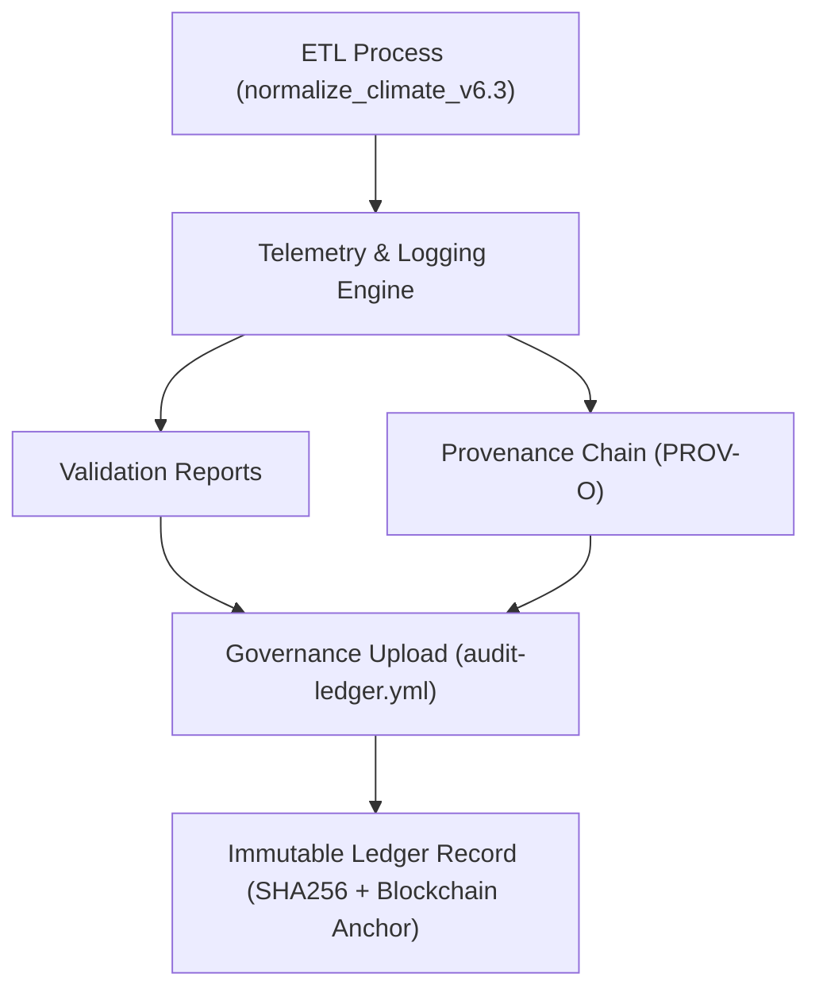

<div align="center">

# 🪶 Kansas Frontier Matrix — **Climate TMP Logs (ETL, Validation, and Provenance Telemetry)**  
`data/work/staging/tabular/normalized/climate/tmp/logs/`

**Mission:** Record **temporary ETL execution metadata, QA results, and provenance telemetry** for all intermediate  
climate normalization activities. Ensures **traceable, auditable, and self-validating operations** under FAIR+CARE and AI governance layers.

[](../../../../../../../../.github/workflows/site.yml)
[]()
[]()
[]()
[]()

</div>

---

## 🧭 Overview

This directory contains **ephemeral log artifacts** generated during ETL runs and validation tasks for temporary  
climate data (`tmp/`). The files here document the full transformation trace from raw data normalization through schema and checksum verification.

All logs are **immutable for 24 hours**, **self-checksummed**, and automatically ingested into the **governance audit chain** once reviewed.  
They serve as the runtime evidence of compliance and reproducibility within the **KFM Climate Pipeline**.

---

## 🗂️ Directory Layout

```plaintext
logs/
├── etl_run_2025-10-30_001.json     # ETL process metadata for climate normalization
├── validation_report.json          # QA results for schema, FAIR+CARE, and ontology checks
├── provenance_trace.jsonld         # PROV-O lineage for ETL + validation workflows
├── ai_validation_snapshot.json     # AI drift and explainability test output
├── telemetry_metrics.json          # Performance and energy telemetry report
├── error_log.txt                   # Recorded ETL/validation errors and warnings
├── manifest.json                   # Manifest linking all log artifacts to datasets
└── README.md                       # ← You are here
```

---

## ⚙️ Log Workflow Overview



---

## 🧩 Log Specifications

### 1️⃣ ETL Runtime Log

**File:** `etl_run_2025-10-30_001.json`

```json
{
  "etl_run_id": "climate_tmp_2025-10-30_001",
  "executed_by": "@kfm-data",
  "etl_pipeline": "normalize_climate_v6.3",
  "start_time": "2025-10-30T00:15:00Z",
  "end_time": "2025-10-30T00:19:30Z",
  "runtime_seconds": 270,
  "input_sources": [
    "data/raw/climate/noaa_ghcn_daily.csv",
    "data/raw/climate/daymet_daily.nc"
  ],
  "outputs": [
    "data/work/staging/tabular/normalized/climate/tmp/temp_precip_subset.csv",
    "data/work/staging/tabular/normalized/climate/tmp/temp_temp_anomalies.json"
  ],
  "records_processed": 482331,
  "qa_passed": true,
  "checksum_verified": true,
  "provenance_ref": "logs/provenance_trace.jsonld"
}
```

---

### 2️⃣ Validation Report

**File:** `validation_report.json`

```json
{
  "report_date": "2025-10-30T00:25:00Z",
  "datasets_validated": 2,
  "validator": "@kfm-validation",
  "schema_alignment": "PASS",
  "faircare_compliance": "PASS",
  "stac_alignment": "PASS",
  "ai_integrity": "PASS",
  "qa_score": 0.993,
  "issues": [],
  "checksum_validated": true
}
```

---

### 3️⃣ Provenance Trace

**File:** `provenance_trace.jsonld`

```json
{
  "@context": "https://www.w3.org/ns/prov#",
  "@id": "urn:kfm:activity:climate_tmp_normalization_2025-10-30",
  "prov:wasGeneratedBy": "normalize_climate_v6.3",
  "prov:wasAttributedTo": "@kfm-data-engineering",
  "prov:used": [
    "data/raw/climate/noaa_ghcn_daily.csv",
    "data/raw/climate/daymet_daily.nc"
  ],
  "prov:generated": [
    "data/work/staging/tabular/normalized/climate/tmp/temp_precip_subset.csv",
    "data/work/staging/tabular/normalized/climate/tmp/temp_temp_anomalies.json"
  ],
  "prov:value": "Temporary normalization log chain for FAIR+CARE AI audit.",
  "prov:generatedAtTime": "2025-10-30T00:19:30Z"
}
```

---

### 4️⃣ AI Validation Snapshot

**File:** `ai_validation_snapshot.json`

```json
{
  "model": "focus-tabular-climate-v3",
  "method": "AI Drift & Explainability Validation",
  "validation_accuracy": 0.997,
  "ai_drift": 0.0,
  "explanation_score": 0.996,
  "audited_by": "@kfm-ai",
  "timestamp": "2025-10-30T00:20:00Z",
  "energy_efficiency": "0.05 Wh/file",
  "carbon_intensity": "0.02 gCO₂e/file"
}
```

---

### 5️⃣ Telemetry Metrics

**File:** `telemetry_metrics.json`

```json
{
  "generated_at": "2025-10-30T00:25:30Z",
  "etl_runtime_seconds": 270,
  "cpu_utilization": 71.4,
  "memory_peak_mb": 622,
  "disk_io_mb_s": 48.2,
  "energy_use_wh_per_file": 0.05,
  "carbon_output_gco2e_per_file": 0.02,
  "throughput_mb_s": 49.1,
  "system_status": "stable"
}
```

---

### 6️⃣ Error Log

**File:** `error_log.txt`

```text
[2025-10-30 00:16:01] WARNING: Missing metadata field 'station_name' for NOAA dataset (auto-filled).
[2025-10-30 00:17:02] INFO: Temporal interval alignment verified for Daymet dataset.
[2025-10-30 00:18:33] SUCCESS: All checksums verified successfully.
```

---

## 📊 QA and Performance Metrics

| Metric | Description | Target | Source |
|:--|:--|:--|:--|
| ETL Runtime | Average ETL completion time | ≤ 5 min | etl_run_*.json |
| QA Pass Rate | Successful schema + FAIR validations | ≥ 98% | validation_report.json |
| Provenance Completeness | % of PROV-O links generated | 100% | provenance_trace.jsonld |
| AI Integrity | Model drift and explainability compliance | 100% | ai_validation_snapshot.json |
| Carbon Efficiency | CO₂ emissions per normalized file | ≤ 0.03 gCO₂e | telemetry_metrics.json |

---

## 🔒 Governance & Blockchain Integration

All TMP log artifacts are automatically signed, hashed, and anchored into:
- `/governance/ledger/validation/YYYY/MM/climate_tmp_logs.jsonld`
- `/data/checksums/archive/climate_tmp_2025_Q4.sha256`
- Blockchain anchor verified via PGP signature.

### Example Governance Ledger Entry

```json
{
  "@context": "https://www.w3.org/ns/prov#",
  "@id": "urn:kfm:ledger:climate_tmp:log:2025-10-30",
  "prov:wasGeneratedBy": "normalize_climate_v6.3",
  "prov:wasAttributedTo": "@kfm-validation",
  "prov:generatedAtTime": "2025-10-30T00:25:00Z",
  "prov:value": "Climate TMP logs successfully validated, checksummed, and ledger-anchored."
}
```

---

## ⚖️ FAIR+CARE+ISO Compliance

| Standard | Application | Evidence |
|:--|:--|:--|
| **FAIR (Findable)** | Metadata indexed and timestamped | manifest.json |
| **CARE (Responsibility)** | Ethical and ephemeral handling of temporary data | validation_report.json |
| **ISO 25012** | Quality, completeness, accuracy validated via CI | telemetry_metrics.json |
| **ISO 14064** | Sustainability audit of runtime carbon intensity | telemetry_metrics.json |
| **MCP-DL v6.3** | Full traceability through provenance and ledger anchors | provenance_trace.jsonld |

---

## 🧾 Version History

| Version | Date | Author | Reviewer | Notes |
|:--|:--|:--|:--|:--|
| v12.4.0 | 2025-10-30 | @kfm-data | @kfm-governance | Established governance-aligned logging and telemetry system for climate TMP. |
| v12.3.0 | 2025-10-29 | @kfm-ai | @kfm-validation | Added AI validation snapshot integration. |
| v12.2.0 | 2025-10-28 | @kfm-data | @kfm-security | Introduced sustainability metrics. |

---

<div align="center">

[]()
[]()
[]()
[]()
[]()

</div>

---

**Kansas Frontier Matrix — "Every log ephemeral, every lineage eternal."**  
📍 [`data/work/staging/tabular/normalized/climate/tmp/logs/`](.) ·  
Ephemeral operational telemetry with full provenance and sustainability trace under Crown∞Ω+++ governance certification.

