<div align="center">

# 👥 Kansas Frontier Matrix — **Demographics Data Layer (Normalized Tabular Repository)**  
`data/work/staging/tabular/normalized/demographics/README.md`

**Purpose:** Serve as the **centralized repository of normalized demographic data** — including population, census, migration, occupational, and educational records — used by the **Kansas Frontier Matrix (KFM)** system for temporal and spatial analyses.  
This layer aligns population statistics and historical census data under FAIR+CARE and ISO data standards to ensure **traceability, comparability, and reproducibility**.

[](../../../../../docs/architecture/repo-focus.md)
[]()
[]()
[]()
[]()

</div>

---

## 🗂️ Directory Layout

```plaintext
demographics/
├── population_by_county.csv            # Historical and modern population data by Kansas county
├── census_occupation.csv               # Occupational distribution by region and year
├── migration_trends.csv                # Migration inflow/outflow and ethnic composition over time
├── education_statistics.csv            # Literacy, schooling, and educational attainment data
├── demographics_metadata.json          # Schema metadata aligned with DCAT 3.0
├── provenance.jsonld                   # PROV-O provenance record for dataset lineage
├── validation_report.json              # Schema and QA validation metrics
├── checksums.sha256                    # Data integrity hash manifest
└── README.md                           # ← You are here
```

---

## 🧭 Overview

The **Demographics Data Layer** integrates population-related datasets spanning the 19th–21st centuries for Kansas and adjacent regions.  
It harmonizes diverse sources (e.g., U.S. Census Bureau, Kansas Historical Society, and state archives) into a unified, schema-driven structure suitable for temporal, geospatial, and socioeconomic modeling.

All data conforms to:
- **FAIR+CARE Principles** (Findable, Accessible, Interoperable, Reusable & Collective Benefit, Authority, Responsibility, Ethics)  
- **DCAT 3.0 & ISO 19115** metadata standards for dataset discoverability  
- **MCP-DL v6.3** documentation-first governance  
- **CIDOC CRM / PROV-O** provenance structures for reproducibility  

---

## ⚙️ Data Processing Workflow

```mermaid
flowchart TD
    A["Raw Census Data (CSV / XLS / PDF)"] --> B["ETL Pipeline: normalize_demographics_v6.3"]
    B --> C["TMP Stage (data/work/staging/tabular/normalized/tmp/normalization_buffer/)"]
    C --> D["Validation Scratch (schema_reports + ontology_checks)"]
    D --> E["Provenance Registration (entities + activities)"]
    E --> F["Promotion → Normalized Demographics Layer (Current Directory)"]
    F --> G["Governance Ledger Registration + Checksums Verification"]
```



---

## 🧩 Schema Specification

### Core Fields — `population_by_county.csv`

| Field | Description | Type | Example |
|--------|-------------|------|----------|
| `county_name` | County name (canonical form) | string | "Douglas County" |
| `year` | Census year | integer | 1880 |
| `population_total` | Total population | integer | 15042 |
| `population_native` | Native-born population | integer | 13500 |
| `population_foreign` | Foreign-born population | integer | 1542 |
| `population_indigenous` | Indigenous/tribal population (if recorded) | integer | 104 |
| `source_ref` | Provenance reference to source dataset | string | "USCensus_1880_Douglas" |

---

### Extended Fields — `census_occupation.csv`

| Field | Description | Type | Example |
|--------|-------------|------|----------|
| `year` | Census year | integer | 1900 |
| `occupation_category` | Occupation classification | string | "Agriculture" |
| `total_workers` | Count of workers in category | integer | 15432 |
| `percent_of_workforce` | Percentage of total labor force | float | 47.5 |
| `source_ref` | Source dataset identifier | string | "USCensus_1900_Agriculture" |

---

## 🧮 Example Provenance Record

**File:** `provenance.jsonld`

```json
{
  "@context": "https://www.w3.org/ns/prov#",
  "@id": "urn:kfm:dataset:demographics:population_by_county",
  "prov:type": "Dataset",
  "prov:wasDerivedFrom": [
    "data/raw/demographics/US_Census_1880.csv",
    "data/raw/demographics/Kansas_State_1910.xlsx"
  ],
  "prov:wasGeneratedBy": "normalize_demographics_v6.3",
  "prov:wasAttributedTo": "@kfm-data-engineering",
  "prov:generatedAtTime": "2025-10-25T12:45:00Z",
  "prov:value": "Normalized county-level demographic data harmonized to FAIR+CARE schema."
}
```

---

## 🔍 Data Validation Metrics

**File:** `validation_report.json`

```json
{
  "validation_date": "2025-10-25T13:00:00Z",
  "validator": "@kfm-validation",
  "datasets_validated": 4,
  "schema_version": "demographics_schema_v6.3",
  "records_validated": 24200,
  "missing_values": 17,
  "checksum_verified": true,
  "dcat_alignment": "PASS",
  "ontology_alignment": "PASS",
  "faircare_compliance": "PASS",
  "validation_score": 0.982
}
```

---

## 📈 QA Metrics Summary

| Metric | Description | Target | Source |
|--------|--------------|---------|---------|
| Schema Validation Pass Rate | % of files passing schema rules | ≥ 97% | validation_report.json |
| FAIR+CARE Compliance | % datasets passing accessibility & ethics audit | ≥ 95% | validation_report.json |
| Provenance Completeness | % datasets with lineage tracking | 100% | provenance.jsonld |
| Checksum Verification | % of validated data hashes passing | 100% | checksums.sha256 |
| Temporal Coverage | Years represented across datasets | 1850–2025 | population_by_county.csv |

---

## 🔒 Governance & Ledger Integration

All normalized demographic datasets are registered within:
- `/governance/ledger/validation/YYYY/MM/demographics_ledger.jsonld`
- `/data/checksums/archive/demographics_2025_Q4.sha256`
- `/data/work/staging/tabular/normalized/demographics/provenance.jsonld`

**Example Governance Entry:**

```json
{
  "@context": "https://www.w3.org/ns/prov#",
  "@id": "urn:kfm:ledger:dataset:demographics_2025-10-25",
  "prov:wasGeneratedBy": "normalize_demographics_v6.3",
  "prov:wasAttributedTo": "@kfm-validation",
  "prov:value": "Demographic datasets validated and ledger-registered.",
  "prov:used": [
    "data/work/staging/tabular/normalized/demographics/population_by_county.csv",
    "data/work/staging/tabular/normalized/demographics/census_occupation.csv"
  ],
  "prov:generatedAtTime": "2025-10-25T13:10:00Z"
}
```

---

## ⚖️ FAIR+CARE & ISO Compliance Summary

| Standard | Implementation | Verified Artifact |
|-----------|----------------|-------------------|
| **FAIR (Findable)** | Metadata indexed via DCAT catalog with persistent identifiers. | demographics_metadata.json |
| **FAIR (Accessible)** | Open data under CC-BY license with STAC catalog export. | provenance.jsonld |
| **CARE (Ethics)** | Ethical handling of Indigenous population data via governance review. | validation_report.json |
| **ISO 19115** | Spatial-temporal metadata conformity validated. | demographics_metadata.json |
| **ISO 25012** | Data accuracy, consistency, and completeness ensured. | checksums.sha256 |
| **MCP-DL v6.3** | Documentation-first governance model applied to demographic datasets. | manifest_ref |

---

## 🧾 Version History

| Version | Date | Author | Reviewer | Notes |
|----------|------|---------|-----------|--------|
| v2.0.0 | 2025-10-25 | @kfm-data-engineering | @kfm-governance | Added DCAT schema mapping, QA metrics, and ledger integration. |
| v1.1.0 | 2025-10-24 | @kfm-validation | @kfm-data-engineering | Introduced FAIR+CARE compliance validation and provenance logging. |
| v1.0.0 | 2025-10-23 | @kfm-validation | — | Initial normalized demographics directory and schema setup. |

---

<div align="center">

[]()
[]()
[]()
[]()
[]()

</div>
