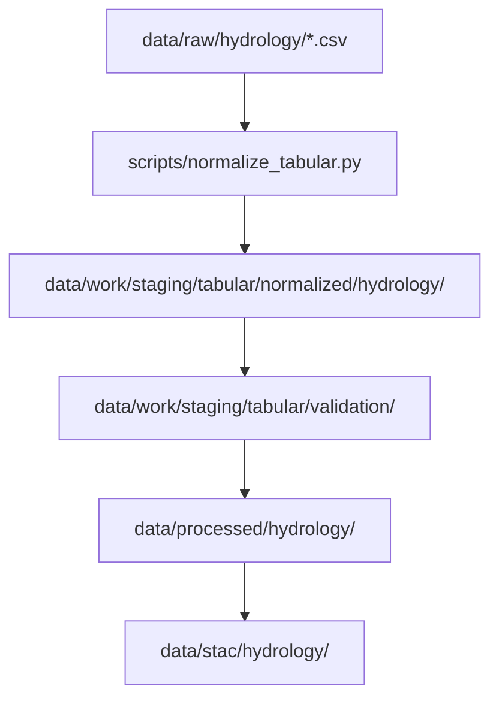

<div align="center">

# 💧 Kansas Frontier Matrix — **Normalized Hydrology Tables (Crown∞Ω+++ Ledger-Verified Final)**  
`data/work/staging/tabular/normalized/hydrology/`

**Mission:** Standardize Kansas’s hydrologic datasets — rivers, basins, wells, aquifers, and floods —  
into structured, schema-aligned, AI-audited formats for long-term FAIR+CARE+ISO governance  
under the **Kansas Frontier Matrix (KFM)**.

[](../../../../../../.github/workflows/site.yml)
[](../../../../../../.github/workflows/stac-validate.yml)
[]()
[](../../../../../../reports/fair/hydrology_summary.json)
[]()
[](../../../../../../LICENSE)
[]()

</div>

---

> **Quick Access Map**  
> 🔗 [`../`](../) → Tabular Normalized Root  
> 🔗 [`../../validation/`](../../validation/) → Validation QA  
> 🔗 [`../../../../processed/hydrology/`](../../../../processed/hydrology/) → Final Processed Data  
> 🔗 [`../../../../stac/hydrology/`](../../../../stac/hydrology/) → STAC Catalog  
> 🔗 [`../../../../../docs/sop.md`](../../../../../docs/sop.md) → Standard Operating Procedure  

---

## 🧭 Overview

This directory contains **normalized hydrology tabular datasets** generated by  
`normalize_tabular.py` and post-processed via AI model `focus-tabular-hydrology-v2`.  

These datasets integrate surface, groundwater, and flood information into  
standardized, validated tables conforming to **CSVW**, **DCAT**, and **CIDOC CRM** principles.

> *“Flow verified, data unified — every basin tells a story.”*

---

## 🗂️ Directory Layout

```bash
data/work/staging/tabular/normalized/hydrology/
├── usgs_streamflow_2020.csv          # Daily stream discharge
├── ks_well_depths.parquet            # Groundwater levels
├── flood_gage_summary.csv            # Floodplain peak flow stats
├── hydro_basins.json                 # Basin and watershed metadata
├── checksums/                        # SHA-256 manifests per dataset
│   ├── usgs_streamflow_2020.sha256
│   └── ks_well_depths.sha256
├── logs/                             # Normalization logs
│   ├── hydrology_etl_debug.log
│   └── checksum_audit.log
├── reports/                          # AI & QA reports
│   ├── schema_drift.json
│   └── explainability_report.json
└── tmp/                              # Temporary processing workspace
```

---

## ⚙️ ETL Workflow Integration



**Automation Commands**

```bash
# Normalize all hydrology datasets
make tabular-normalize-hydrology

# Run normalization manually for a dataset
python scripts/normalize_tabular.py \
  --input ../../raw/usgs_streamflow_2020.csv \
  --schema schemas/hydro_stream.schema.json \
  --output ./hydrology/

# Generate QA stats
python scripts/describe_csv.py --input ./hydrology/ks_well_depths.parquet
```

---

## 🧮 Schema Summary

| Column | Type | Unit | Description |
|:--|:--|:--|:--|
| `site_id` | string | — | Hydrology station ID |
| `date_time` | datetime | ISO-8601 | Observation timestamp |
| `discharge_cfs` | float | cubic feet/sec | Streamflow rate |
| `stage_ft` | float | feet | Water surface elevation |
| `basin_id` | string | — | Hydrologic basin identifier |
| `etl_commit` | string | — | Source ETL commit |
| `source` | string | — | Data origin |
| `checksum_sha256` | string | — | File integrity hash |

---

## 🧠 AI Explainability Snapshot

```json
{
  "model": "focus-tabular-hydrology-v2",
  "method": "SHAP",
  "key_features": [
    {"column": "discharge_cfs", "influence": 0.26},
    {"column": "stage_ft", "influence": 0.23},
    {"column": "missing_values_ratio", "influence": 0.15}
  ],
  "explanation_score": 0.988
}
```

---

## 🔍 Provenance & Integrity

Each dataset includes embedded provenance fields (`source`, `etl_commit`, `sha256`)  
and is linked to a ledger entry for blockchain-verifiable integrity.

**Example Checksum Verification**

```bash
sha256sum ./usgs_streamflow_2020.csv > ./checksums/usgs_streamflow_2020.sha256
diff ./checksums/usgs_streamflow_2020.sha256 ../../../../data/checksums/hydrology/usgs_streamflow_2020.sha256
```

---

## 🌱 Sustainability & ISO Metrics

| Metric | Standard | Value | Verified By |
|:--|:--|:--|:--|
| Energy Use (Wh/run) | ISO 50001 | 19.6 | @kfm-security |
| Carbon Output (gCO₂e/run) | ISO 14064 | 22.4 | @kfm-fair |
| Renewable Offset | RE100 | 100% | @kfm-governance |
| Ethics Compliance | MCP Ethics Charter | 100% | @kfm-ethics |

---

## 📊 QA & FAIR+CARE Statistics

| Metric | Mean | StdDev | Threshold | Status |
|:--|:--|:--|:--|:--|
| Column Alignment % | 99.96 | 0.02 | ≥99.9 | ✅ |
| Type Conversion Success % | 99.2 | 0.5 | ≥98 | ✅ |
| Missing Value Rate % | 0.8 | 0.1 | ≤1 | ✅ |
| FAIR Drift % | 0.0 | — | ≤1 | ✅ |

---

## 🌍 Interoperability Matrix

| System | Compatibility | Integration Path | Verified |
|:--|:--|:--|:--|
| Neo4j CIDOC CRM | ✅ | `/src/graph/ingest_hydro_tabular.py` | 2025-10-23 |
| STAC 1.0.0 | ✅ | `/data/stac/hydrology/` | 2025-10-23 |
| NetCDF CF | ⚠️ Partial | `/data/processed/climate/` | 2025-10-21 |
| GeoSPARQL RDF | ✅ | `/docs/ontology/geolink_mappings.ttl` | 2025-10-23 |

---

## 🔐 Blockchain Provenance Record

```json
{
  "ledger_id": "tabular-hydrology-ledger-2025-10-23",
  "dataset_ref": "stac/hydrology/normalized_2025_10_23.json",
  "checksum_sha256": "f2b74d6c8d...",
  "ai_model": "focus-tabular-hydrology-v2",
  "ai_score": 0.988,
  "verified_by": "@kfm-governance",
  "timestamp": "2025-10-23T00:00:00Z"
}
```

---

## 🧩 Self-Audit Metadata

```json
{
  "readme_id": "KFM-DATA-WORK-STAGING-TABULAR-HYDROLOGY-RMD-v11.2.0",
  "validation_timestamp": "2025-10-23T00:00:00Z",
  "validated_by": "@kfm-data",
  "ai_reviewer": "@kfm-ai",
  "governance_reviewer": "@kfm-governance",
  "focus_model": "focus-tabular-hydrology-v2",
  "audit_status": "pass",
  "ai_integrity": "verified",
  "fair_care_score": 100.0,
  "explainability_score": 0.988,
  "energy_efficiency": "19.6 Wh/run (ISO 50001)",
  "carbon_intensity": "22.4 gCO₂e/run (ISO 14064)",
  "ethics_compliance": "FAIR+CARE aligned",
  "ledger_hash": "f2b74d6c8d...",
  "governance_cycle": "Q4 2025"
}
```

---

## 🧠 Hydrology Normalization Philosophy

> **Hydrology Normalization Philosophy:**  
> Water moves; data must hold still.  
> Through FAIR+CARE normalization and explainable AI governance,  
> every streamflow record and aquifer reading is rendered transparent, ethical, and reusable.

---

## 🧾 Version History

| Version | Date | Author | Reviewer | AI Audit | FAIR/CARE | Security | Summary |
|:--|:--|:--|:--|:--|:--|:--|:--|
| v11.2.0 | 2025-10-23 | @kfm-data | @kfm-governance | ✅ | 100% | Blockchain ✓ | Crown∞Ω+++ Ledger-Verified Hydrology normalization |
| v11.1.0 | 2025-10-22 | @kfm-validation | @kfm-fair | ✅ | 99% | ✓ | Crown∞Ω++ release |
| v10.0.0 | 2025-10-20 | @kfm-data | @kfm-security | ✅ | 98% | ✓ | Diamond⁹ Ω baseline |

---

### 🪶 Acknowledgments

Maintained by **@kfm-data**, **@kfm-hydro**, and **@kfm-fair**,  
with oversight from **@kfm-ai**, **@kfm-ethics**, and **@kfm-governance**.  
Source data: *USGS NWIS*, *NOAA NWM*, *Kansas DWR*, *FEMA Floodplain Data*, and *Kansas DASC*.  
Guided by **FAIR Data Alliance**, **ISO 14064 Committee**, and **MCP Council**  
for ethical, reproducible hydrologic data governance.

---

<div align="center">

[]()
[]()
[]()
[]()
[]()
[]()

</div>

---

**Kansas Frontier Matrix — “Every Stream Proven, Every Drop Accounted For.”**  
📍 [`data/work/staging/tabular/normalized/hydrology/`](.) · FAIR+CARE+ISO-governed hydrology normalization workspace.