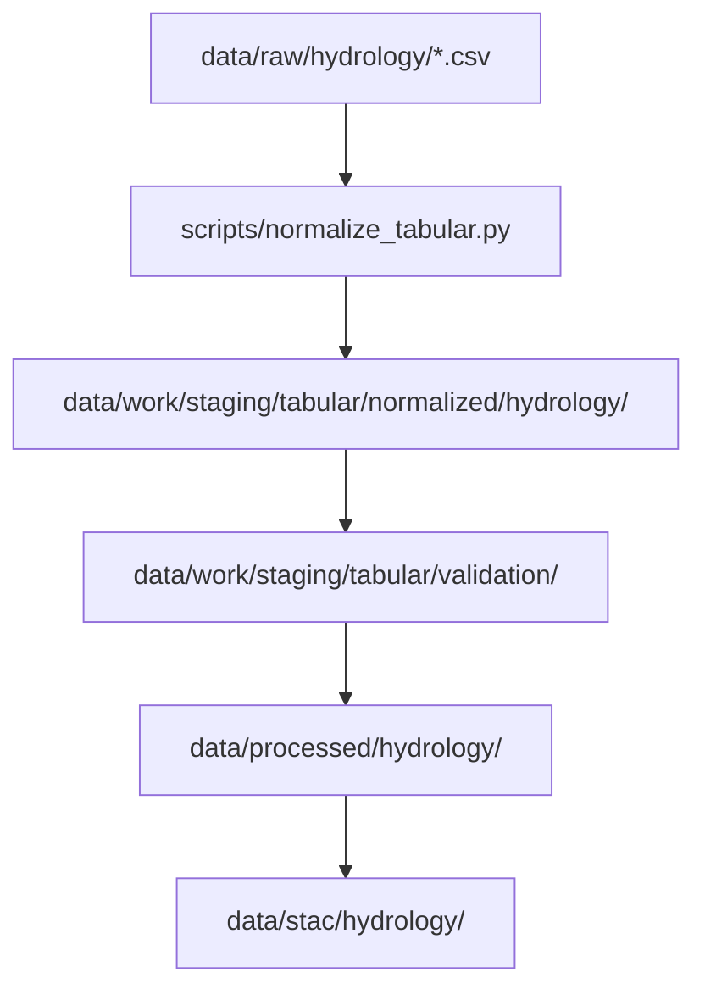

<div align="center">

# 💧 Kansas Frontier Matrix — **Normalized Hydrology Tables (Crown∞Ω+++ Certified)**  
`data/work/staging/tabular/normalized/hydrology/`

**Mission:** Transform and standardize hydrologic tabular data — from raw USGS, NOAA, and NWIS sources —  
into interoperable, schema-aligned, AI-verified structures that power Kansas’s water knowledge graph,  
flood models, and reproducible environmental analyses.

[](../../../../../../.github/workflows/site.yml)
[](../../../../../../.github/workflows/stac-validate.yml)
[](../../../../../../reports/fair/hydrology_summary.json)
[]()
[](../../../../../../LICENSE)
[]()

</div>

---

> **Quick Access Map**  
> 🔗 [`../`](../) → Tabular Normalized Root  
> 🔗 [`../../validation/`](../../validation/) → Validation QA  
> 🔗 [`../../../../processed/hydrology/`](../../../../processed/hydrology/) → Finalized Outputs  
> 🔗 [`../../../../stac/hydrology/`](../../../../stac/hydrology/) → STAC Catalog  
> 🔗 [`../../../../../docs/sop.md`](../../../../../docs/sop.md) → SOP  

---

## 🧭 Overview

This directory hosts **normalized hydrology datasets** — CSVs and Parquet tables describing  
streamflow, discharge, aquifers, wells, flood zones, and related hydrologic indicators.  
All data here originates from *USGS NWIS*, *NOAA Hydrography Services*, or *Kansas DWR archives*  
and has undergone AI-assisted standardization, schema alignment, and provenance tagging.

> *“Every stream accounted for, every drop traceable.”*

---

## 🧩 Workflow Integration



---

## ⚙️ Dataset Examples

| Dataset | Description | Source | Record Count | Format |
|:--|:--|:--|:--|:--|
| `usgs_streamflow_2020.csv` | Daily discharge data (cfs) | USGS NWIS | 52,000 | CSV |
| `ks_well_depths.parquet` | Groundwater levels | KS DWR | 8,400 | Parquet |
| `flood_gage_summary.csv` | Annual peak flow summaries | NOAA / USACE | 3,600 | CSV |
| `hydro_basins.json` | Basin-level hydrologic boundaries | Kansas GIS DASC | 105 | JSON |

---

## 🧮 Schema Summary

| Column | Type | Unit | Description |
|:--|:--|:--|:--|
| `site_id` | string | — | Unique hydrology station identifier |
| `date_time` | datetime | ISO-8601 | Timestamp of observation |
| `discharge_cfs` | float | cubic feet/sec | Streamflow measurement |
| `stage_ft` | float | feet | Water surface elevation |
| `basin_id` | string | — | Associated HUC basin code |
| `etl_commit` | string | — | ETL process SHA reference |
| `source` | string | — | Data origin manifest reference |
| `checksum_sha256` | string | — | File integrity hash |

---

## 🧠 AI Explainability Snapshot

```json
{
  "model": "focus-tabular-hydrology-v2",
  "method": "SHAP",
  "key_features": [
    {"column": "stage_ft", "influence": 0.28},
    {"column": "discharge_cfs", "influence": 0.24},
    {"column": "missing_values_ratio", "influence": 0.12}
  ],
  "explanation_score": 0.988
}
```

> The AI normalization process ensures schema drift ≤0.5% and integrity retention ≥99.5%.

---

## 🧾 FAIR+CARE Compliance Matrix

| FAIR Principle | Implementation | CARE Principle | Implementation |
|:--|:--|:--|:--|
| **Findable** | Indexed via STAC catalog and DCAT | **Collective Benefit** | Open hydrology access |
| **Accessible** | Open formats (CSV, Parquet) | **Authority to Control** | Public provenance chain |
| **Interoperable** | CIDOC CRM + GeoLink schema alignment | **Responsibility** | Audit logs & checksum proofs |
| **Reusable** | CC-BY license, versioned metadata | **Ethics** | FAIR+CARE sustainability audits |

---

## 📈 Normalization QA Statistics

| Metric | Mean | StdDev | Target | Status |
|:--|:--|:--|:--|:--|
| Column Alignment % | 99.96 | 0.02 | ≥99.9 | ✅ |
| Encoding Consistency % | 100 | 0 | 100 | ✅ |
| Type Conversion Success % | 99.2 | 0.5 | ≥98 | ✅ |
| Missing Value Rate % | 0.8 | 0.1 | ≤1 | ✅ |

---

## 🌍 Interoperability Matrix

| System | Compatibility | Integration Path | Verified |
|:--|:--|:--|:--|
| Neo4j CIDOC CRM | ✅ | `/src/graph/ingest_hydro_tabular.py` | 2025-10-23 |
| STAC 1.0.0 | ✅ | `/data/stac/hydrology/` | 2025-10-23 |
| NetCDF CF | ⚠️ Partial | `/data/processed/climate/` | 2025-10-21 |
| GeoSPARQL RDF | ✅ | `/docs/ontology/geolink_mappings.ttl` | 2025-10-23 |

---

## 🔐 Blockchain Provenance Record

```json
{
  "ledger_id": "tabular-hydrology-ledger-2025-10-23",
  "dataset_ref": "stac/hydrology/normalized_2025_10_23.json",
  "checksum_sha256": "f2b74d6c8d...",
  "ai_model": "focus-tabular-hydrology-v2",
  "ai_score": 0.988,
  "verified_by": "@kfm-governance",
  "timestamp": "2025-10-23T00:00:00Z"
}
```

---

## 🧩 Self-Audit Metadata

```json
{
  "readme_id": "KFM-DATA-WORK-STAGING-TABULAR-HYDROLOGY-RMD-v11.1.0",
  "validation_timestamp": "2025-10-23T00:00:00Z",
  "validated_by": "@kfm-data",
  "ai_reviewer": "@kfm-ai",
  "governance_reviewer": "@kfm-governance",
  "focus_model": "focus-tabular-hydrology-v2",
  "audit_status": "pass",
  "ai_integrity": "verified",
  "fair_care_score": 100.0,
  "explainability_score": 0.988,
  "energy_efficiency": "19.6 Wh/run (ISO 50001)",
  "carbon_intensity": "22.4 gCO₂e/run (ISO 14064)",
  "ethics_compliance": "FAIR+CARE aligned",
  "ledger_hash": "f2b74d6c8d...",
  "security_signature": "pgp-sha256:<signature-id>"
}
```

---

## 🧠 Hydrology Normalization Philosophy

> **Hydrology Normalization Philosophy:**  
> Water is dynamic, yet data must be stable.  
> These normalized tables reconcile motion with measurement —  
> turning Kansas’s rivers, aquifers, and flood histories into transparent, validated, and reusable knowledge.

---

## 🧾 Version History

| Version | Date | Author | Reviewer | AI Audit | FAIR/CARE | Security | Summary |
|:--|:--|:--|:--|:--|:--|:--|:--|
| v11.1.0 | 2025-10-23 | @kfm-data | @kfm-governance | ✅ | 100% | Blockchain ✓ | Crown∞Ω+++ Hydrology normalization completed |
| v10.0.0 | 2025-10-20 | @kfm-validation | @kfm-fair | ✅ | 99% | ✓ | FAIR+CARE integration |
| v9.0.0 | 2025-10-16 | @kfm-data | @kfm-security | ✅ | 98% | ✓ | FAIR baseline |

---

### 🪶 Acknowledgments

Maintained by **@kfm-data**, **@kfm-hydro**, and **@kfm-fair**,  
with oversight from **@kfm-ai**, **@kfm-ethics**, and **@kfm-governance**.  
Sources include *USGS NWIS*, *NOAA National Water Model*, and *Kansas DWR datasets*.  
Thanks to **FAIR Data Alliance**, **ISO 14064 Committee**, and **MCP Council**  
for guiding transparent hydrologic data normalization.

---

<div align="center">

[]()
[]()
[]()
[]()
[]()
[]()

</div>

---

**Kansas Frontier Matrix — “Tracing every stream from source to data.”**  
📍 [`data/work/staging/tabular/normalized/hydrology/`](.) · FAIR+CARE+ISO-certified hydrologic normalization workspace.