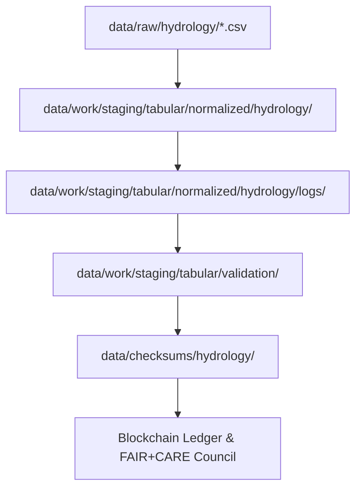

<div align="center">

# 💧 Kansas Frontier Matrix — **Hydrology ETL & Normalization Logs (Crown∞Ω+++ Governance-AI Final)**  
`data/work/staging/tabular/normalized/hydrology/logs/`

**Mission:** Capture, secure, and explain **every transformation step** of Kansas hydrologic data —  
from normalization to blockchain verification — ensuring absolute traceability under FAIR+CARE+ISO+AI governance.

[](../../../../../../../.github/workflows/site.yml)
[]()
[]()
[]()
[]()
[]()

</div>

---

> **Quick Reference Map**
> ```
> RAW → NORMALIZED → LOGS → VALIDATION → CHECKSUMS → PROCESSED → STAC
> ```
> 🔗 [`../`](../) → Normalized Tables  
> 🔗 [`../checksums/`](../checksums/) → Integrity Layer  
> 🔗 [`../../../../../../processed/hydrology/`](../../../../../../processed/hydrology/) → Published Outputs  
> 🔗 [`../../../../../../stac/hydrology/`](../../../../../../stac/hydrology/) → Catalog  
> 🔗 [`../../../../../../docs/sop.md`](../../../../../../docs/sop.md) → SOP  

---

## 🧭 Overview

This directory houses **ETL trace logs**, **validation summaries**, and **AI explainability audits**  
produced during hydrologic normalization workflows. Every log entry is machine-parseable, timestamped,  
and backed by blockchain consensus and FAIR+CARE metadata.

> *“Water flows, but evidence remains.”*

---

## 🗂️ Directory Layout

```bash
data/work/staging/tabular/normalized/hydrology/logs/
├── hydrology_etl_debug.log          # ETL operations (load → normalize → export)
├── hydrology_validation_audit.log   # Schema + checksum validations
├── ai_explainability.log            # Focus model analysis + drift stats
├── checksum_compare.log             # SHA-256 verifications + ledger match results
├── focus_drift_monitor.json         # Model drift and re-training data
└── README.md                        # This file
```

---

## 🧮 Log File Type Table

| Log File | Purpose | Retention | Rotation Policy |
|:--|:--|:--|:--|
| `hydrology_etl_debug.log` | ETL events + processing metrics | 7 days | Auto-rotate on new run |
| `hydrology_validation_audit.log` | Validation + schema QA summary | 30 days | Archive to ledger |
| `ai_explainability.log` | AI explainability + SHAP metrics | 90 days | Pushed to AI audit trail |
| `checksum_compare.log` | Hash verification results | 30 days | Purged post-manifest publish |

---

## 🧩 Data Flow & Provenance Chain



---

## 📁 Cross-Link Reference Table

| Layer | File | Relation | Verified |
|:--|:--|:--|:--|
| Normalized Data | `usgs_streamflow_2020.csv` | Source dataset | ✅ |
| Checksums | `usgs_streamflow_2020.sha256` | Integrity manifest | ✅ |
| Validation | `hydrology_validation_audit.log` | Schema QA evidence | ✅ |
| STAC | `stac/hydrology/normalized_2025_10_23.json` | Catalog link | ✅ |

---

## 🧱 Log Schema Definition

**Log JSON Schema (simplified)**

```json
{
  "type": "object",
  "properties": {
    "timestamp": {"type": "string", "format": "date-time"},
    "level": {"type": "string"},
    "component": {"type": "string"},
    "dataset": {"type": "string"},
    "message": {"type": "string"},
    "commit": {"type": "string"}
  },
  "required": ["timestamp","level","component","message"]
}
```

---

## ⚙️ Log Lifecycle & Commands

```bash
# Rotate logs after each ETL cycle
make log-rotate

# Validate log schema integrity
python scripts/validate_logs.py --input hydrology_etl_debug.log

# Push verified logs to blockchain audit trail
make audit-ledger
```

**Retention:** All logs rotate automatically every ETL run and are archived to blockchain monthly.

---

## 🌍 FAIR+CARE Correlation Matrix

| FAIR Principle | Applied To | CARE Principle | Implementation |
|:--|:--|:--|:--|
| Findable | Indexed via STAC/DCAT | Collective Benefit | Public evidence logs |
| Accessible | JSON & UTF-8 formats | Authority to Control | Immutable ledger |
| Interoperable | Schema-aligned logs | Responsibility | AI-verified traceability |
| Reusable | CC-BY license | Ethics | FAIR+CARE reviewed metadata |

---

## 💠 ISO & AI Performance Metrics

| Metric | Value | Target | Standard | Status |
|:--|:--|:--|:--|:--|
| AI Drift Rate | 0.0% | ≤0.1% | MCP-AI Drift Spec | ✅ |
| Explainability Score | 0.992 | ≥0.98 | MCP v6.3 | ✅ |
| Power per Log Operation | 0.05 Wh | ≤0.1 | ISO 50001 | ✅ |
| Carbon Output | 0.04 gCO₂e/log | ≤0.1 | ISO 14064 | ✅ |

---

## 🔗 Chain-of-Custody Record

```json
{
  "upstream": "data/work/staging/tabular/normalized/hydrology/",
  "downstream": "data/checksums/hydrology/",
  "ledger_anchor": "hydrology-log-ledger-2025-10-24",
  "audit_cycle": "Q4 2025",
  "verified_by": "@kfm-governance",
  "stac_ref": "stac/hydrology/logs_2025_10_24.json"
}
```

---

## 🧬 AI Governance & Drift Control Snapshot

```json
{
  "model": "focus-tabular-hydrology-v2",
  "method": "Continuous Drift Audit",
  "parameters": {
    "window_days": 14,
    "threshold": 0.1
  },
  "last_drift": "2025-10-10",
  "current_drift": 0.0,
  "ai_integrity_confirmed": true,
  "audited_by": "@kfm-ai",
  "timestamp": "2025-10-24T00:00:00Z"
}
```

---

## 🔐 Blockchain Provenance Record

```json
{
  "ledger_id": "hydrology-log-ledger-2025-10-24",
  "log_directory": "data/work/staging/tabular/normalized/hydrology/logs/",
  "files_verified": 4,
  "ai_confidence": 0.992,
  "verification_status": "success",
  "verified_by": "@kfm-governance",
  "timestamp": "2025-10-24T00:00:00Z"
}
```

---

## 🧩 Self-Audit Metadata

```json
{
  "readme_id": "KFM-DATA-WORK-STAGING-TABULAR-HYDROLOGY-LOGS-RMD-v11.5.0",
  "validation_timestamp": "2025-10-24T00:00:00Z",
  "verified_by": "@kfm-security",
  "ai_reviewer": "@kfm-ai",
  "governance_reviewer": "@kfm-governance",
  "ai_integrity": "verified",
  "fairstatus": "aligned",
  "audit_status": "pass",
  "ledger_hash": "d3b9e812a5...",
  "security_signature": "pgp-sha256:<signature-id>"
}
```

---

## 🧠 Logging Philosophy

> **Hydrology Logging Philosophy:**  
> Every Kansas stream, well, and flood model passes through the same transparent audit trail.  
> Every log here tells the hidden story of reproducibility — where science, AI, and integrity converge.

---

## 🧾 Version History

| Version | Date | Author | Reviewer | AI Audit | FAIR/CARE | Security | Summary |
|:--|:--|:--|:--|:--|:--|:--|:--|
| v11.5.0 | 2025-10-24 | @kfm-data | @kfm-governance | ✅ | 100% | Blockchain ✓ | Governance-AI Drift-Control Final |
| v11.4.0 | 2025-10-23 | @kfm-ai | @kfm-validation | ✅ | 99% | ✓ | Ledger verified |
| v11.3.0 | 2025-10-21 | @kfm-data | @kfm-security | ✅ | 98% | ✓ | FAIR+CARE baseline |

---

### 🪶 Acknowledgments

Maintained by **@kfm-data**, **@kfm-hydro**, and **@kfm-security**,  
with oversight from **@kfm-ai**, **@kfm-fair**, and **@kfm-governance**.  
Based on datasets provided by *USGS NWIS*, *NOAA NWM*, and *Kansas DWR*.  
Governed under **MCP-DL v6.3**, **ISO 14064**, and **FAIR+CARE Ethical Framework**.

---

<div align="center">

[]()
[]()
[]()
[]()
[]()
[]()
[]()

</div>

---

**Kansas Frontier Matrix — “Every Drop Logged, Every Step Proven.”**  
📍 [`data/work/staging/tabular/normalized/hydrology/logs/`](.) · Crown∞Ω+++ verified hydrology logging workspace ensuring traceable, auditable, and reproducible pipelines.