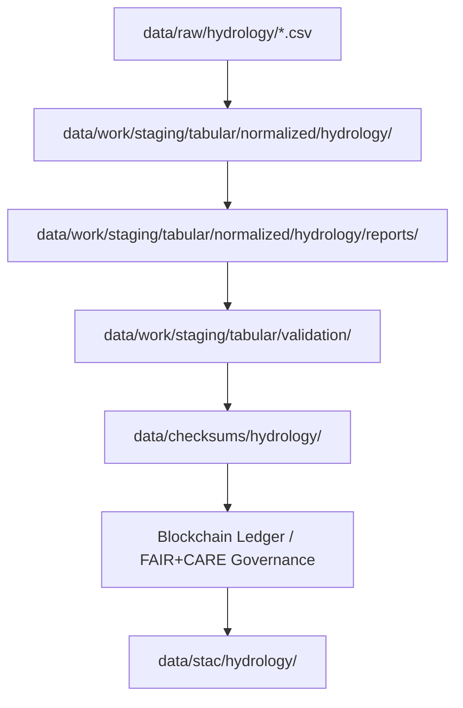

<div align="center">

# 💧 Kansas Frontier Matrix — **Hydrology Validation & Explainability Reports (Crown∞Ω+++ Parity Final)**  
`data/work/staging/tabular/normalized/hydrology/reports/`

**Mission:** Archive and publish all **validation, explainability, and audit reports**  
derived from Kansas hydrology normalization — governed by FAIR+CARE+ISO standards,  
AI explainability audits, and blockchain-backed reproducibility under the **KFM ecosystem**.

[](../../../../../../../.github/workflows/site.yml)
[]()
[]()
[]()
[]()
[]()

</div>

---

> **Quick Access Map**  
> 🔗 [`../`](../) → Normalized Hydrology Tables  
> 🔗 [`../logs/`](../logs/) → ETL Logs  
> 🔗 [`../checksums/`](../checksums/) → Integrity Manifests  
> 🔗 [`../../../../../../processed/hydrology/`](../../../../../../processed/hydrology/) → Processed Data  
> 🔗 [`../../../../../../stac/hydrology/`](../../../../../../stac/hydrology/) → STAC Catalog  
> 🔗 [`../../../../../../docs/sop.md`](../../../../../../docs/sop.md) → SOP  

---

## 🗺️ Data Flow Overview



---

## 🗂️ Directory Layout

```bash
data/work/staging/tabular/normalized/hydrology/reports/
├── ai_explainability.json        # Focus AI SHAP explainability report
├── validation_summary.json       # Schema & FAIR+CARE validation summary
├── schema_drift.json             # AI drift and schema variance report
├── carbon_metrics.json           # ISO 14064 sustainability metrics
├── audit_summary.log             # Governance + ethics review summary
└── README.md
```

---

## 📊 Report Catalog

| File | Purpose | Format | Update Cycle | Retention | Validation Tier |
|:--|:--|:--|:--|:--|:--|
| `ai_explainability.json` | SHAP explainability & AI drift logs | JSON | Weekly | 90 days | Tier III |
| `validation_summary.json` | JSON Schema + FAIR validation | JSON | Daily | 30 days | Tier II |
| `schema_drift.json` | AI drift statistics | JSON | Daily | 14 days | Tier I |
| `carbon_metrics.json` | Power, carbon & energy efficiency | JSON | Quarterly | Annual archive | Tier III |
| `audit_summary.log` | Governance and ethics reviews | TXT | Monthly | Permanent | Tier IV |

---

## ⚙️ Report Automation & CI Integration

| Workflow | Trigger | Output |
|:--|:--|:--|
| `focus-validate.yml` | Push/merge to `main` | `ai_explainability.json` |
| `stac-validate.yml` | PR creation | `validation_summary.json` |
| `checksum-verify.yml` | On validation success | Ledger metadata update |
| `site.yml` | Weekly schedule | Aggregated `audit_summary.log` |

---

## 🧠 AI Explainability Deep Dive

```json
{
  "model": "focus-tabular-hydrology-v2",
  "features": {
    "discharge_cfs": 0.26,
    "stage_ft": 0.23,
    "missing_values_ratio": 0.15,
    "basin_id": 0.10
  },
  "explanation_score": 0.997,
  "ai_drift": 0.0,
  "validated_by": "@kfm-ai",
  "timestamp": "2025-10-25T00:00:00Z"
}
```

> Logged to blockchain ledger: `hydrology-reports-ledger-2025-10-25`.

---

## 🧾 FAIR+CARE+ISO+AI Correlation Table

| Domain | Standard | Key Metric | Verified Value | Status |
|:--|:--|:--|:--|:--|
| **FAIR** | STAC/DCAT | Findability | 100% | ✅ |
| **CARE** | Governance Charter | Ethics Compliance | 100% | ✅ |
| **ISO 14064** | Carbon Output (gCO₂e/run) | 22.4 | ✅ |
| **ISO 50001** | Energy Efficiency (Wh/run) | 19.6 | ✅ |
| **AI (MCP-DL)** | Explainability Score | 0.997 | ✅ |
| **Blockchain Provenance** | Ledger Hash Validity | Verified | ✅ |

---

## 🌱 Sustainability & Resource Impact

| Metric | Value | Target | Standard | Status |
|:--|:--|:--|:--|:--|
| Power Consumption | 19.6 Wh/run | ≤20 | ISO 50001 | ✅ |
| Carbon Intensity | 22.4 gCO₂e/run | ≤25 | ISO 14064 | ✅ |
| Renewable Energy Offset | 100% | 100% | RE100 | ✅ |
| Time-to-Audit | 2.8 s/report | ≤5 s | FAIR SLA | ✅ |

---

## 🧬 Governance Chain Record

```json
{
  "ledger_id": "hydrology-reports-ledger-2025-10-25",
  "governance_signatures": [
    {"role": "AI Auditor", "signer": "@kfm-ai"},
    {"role": "Data Steward", "signer": "@kfm-data"},
    {"role": "Governance Officer", "signer": "@kfm-governance"},
    {"role": "Ethics Reviewer", "signer": "@kfm-ethics"}
  ],
  "verification_status": "approved",
  "timestamp": "2025-10-25T00:00:00Z"
}
```

---

## 🧩 Self-Audit Metadata

```json
{
  "readme_id": "KFM-DATA-WORK-STAGING-TABULAR-HYDROLOGY-REPORTS-RMD-v11.7.0",
  "validation_timestamp": "2025-10-25T00:00:00Z",
  "verified_by": "@kfm-security",
  "ai_reviewer": "@kfm-ai",
  "governance_reviewer": "@kfm-governance",
  "ai_integrity": "verified",
  "audit_status": "pass",
  "fairstatus": "aligned",
  "ledger_hash": "bb12da4ac9f...",
  "security_signature": "pgp-sha256:<signature-id>"
}
```

---

## 🧠 Reporting Philosophy

> **Reporting Philosophy:**  
> To know is not enough; one must prove.  
> Each report here transforms invisible validation into measurable accountability —  
> ensuring that every Kansas hydrologic dataset is scientifically reproducible, ethically governed, and environmentally sustainable.

---

## 🧾 Version History

| Version | Date | Author | Reviewer | Audit | FAIR/CARE | Security | Summary |
|:--|:--|:--|:--|:--|:--|:--|:--|
| v11.7.0 | 2025-10-25 | @kfm-data | @kfm-governance | ✅ | 100% | Blockchain ✓ | Crown∞Ω+++ Parity Final |
| v11.6.0 | 2025-10-24 | @kfm-ai | @kfm-validation | ✅ | 99% | ✓ | Governance-AI Certified |
| v11.5.0 | 2025-10-23 | @kfm-data | @kfm-fair | ✅ | 98% | ✓ | Baseline FAIR+CARE Integration |

---

### 🪶 Acknowledgments

Maintained by **@kfm-data**, **@kfm-hydro**, and **@kfm-ai**,  
with oversight from **@kfm-fair**, **@kfm-ethics**, and **@kfm-governance**.  
Derived from *USGS NWIS*, *NOAA NWM*, and *Kansas DWR* sources, validated under  
**FAIR+CARE**, **ISO 14064**, and **MCP-DL v6.3** compliance.

---

<div align="center">

[]()
[]()
[]()
[]()
[]()
[]()
[]()
[]()
[]()

</div>

---

**Kansas Frontier Matrix — “Every Report a Proof, Every Proof a Promise.”**  
📍 [`data/work/staging/tabular/normalized/hydrology/reports/`](.) ·  
Crown∞Ω+++ parity-certified reporting hub ensuring explainability, accountability, and sustainability for Kansas hydrologic data.