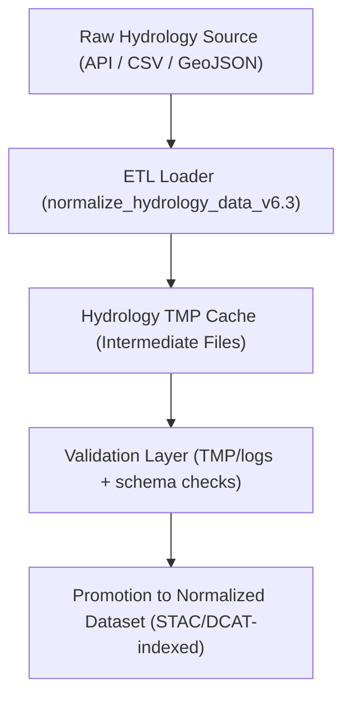

<div align="center">

# 💾 Kansas Frontier Matrix — **Hydrology TMP Cache (Intermediate Data Store)**  
`data/work/staging/tabular/normalized/hydrology/tmp/cache/README.md`

**Purpose:** Act as a **high-speed temporary data cache** for hydrological ETL processes within the **Kansas Frontier Matrix (KFM)**.  
This cache stores preprocessed datasets, spatial index tiles, and intermediate hydrological computations (e.g., flow aggregation, basin topology joins) before validation and normalization to stable layers.

[](../../../../../../../../docs/architecture/repo-focus.md)
[]()
[]()
[]()
[]()

</div>

---

## 🗂️ Directory Layout

```plaintext
cache/
├── usgs_streamflow_cache.parquet          # Cached streamflow data from USGS NWIS API
├── rainfall_events_cache.geojson          # Cached rainfall event geometry data
├── aquifer_depth_cache.feather            # Temporary aquifer depth grid cache
├── hydrology_tile_index.json              # Index of spatial cache tiles (1x1 degree grid)
├── cache_manifest.json                    # Manifest tracking cache metadata and expiration
├── performance_metrics.json               # Cache hit/miss metrics for ETL optimization
└── README.md                              # ← You are here
```

---

## 🧭 Overview

The **Hydrology TMP Cache** provides **fast-access local storage** for normalized hydrological data used in daily ETL runs.  
This directory supports **staged computation** by reducing repeated I/O and re-fetch operations from remote services such as:

- **USGS NWIS API** (streamflow and gauge station data)  
- **NOAA Climate Data Online (CDO)** (precipitation events and storm records)  
- **Kansas Geological Survey (KGS)** (aquifer and groundwater levels)  

Cache files are ephemeral and purged or rebuilt automatically based on TTL (time-to-live) metadata defined in `cache_manifest.json`.

---

## ⚙️ Cache Management Workflow



---

## 🧩 Cache File Specifications

### 1️⃣ Streamflow Cache

**File:** `usgs_streamflow_cache.parquet`

```json
{
  "source": "USGS NWIS API",
  "cached_at": "2025-10-25T09:30:00Z",
  "records": 128342,
  "stations": 622,
  "variables": ["flow_rate_m3s", "gauge_height_m"],
  "ttl_days": 2,
  "checksum": "sha256:47c3f4a6d9ae21e4bfa7e94c0b4a223c142aa98406d..."
}
```

---

### 2️⃣ Rainfall Events Cache

**File:** `rainfall_events_cache.geojson`

```json
{
  "type": "FeatureCollection",
  "features": [
    {
      "type": "Feature",
      "properties": {
        "event_id": "NOAA_2025_09_001",
        "precip_mm": 22.3,
        "duration_hr": 4.5
      },
      "geometry": {
        "type": "Polygon",
        "coordinates": [[[-98.24, 37.5], [-98.10, 37.5], [-98.10, 37.7], [-98.24, 37.7], [-98.24, 37.5]]]
      }
    }
  ],
  "metadata": {
    "source": "NOAA CDO",
    "cached_at": "2025-10-25T09:35:00Z",
    "ttl_days": 1
  }
}
```

---

### 3️⃣ Aquifer Depth Cache

**File:** `aquifer_depth_cache.feather`

```json
{
  "source": "Kansas Geological Survey (KGS)",
  "variables": ["depth_m", "pressure_head_m", "porosity_pct"],
  "spatial_extent": [-102.0, 36.9, -94.6, 40.0],
  "cached_at": "2025-10-25T09:40:00Z",
  "ttl_days": 3,
  "checksum": "sha256:b3e24c7a9e324aa9c0ff8a69b3d02aa34a09e85d5e..."
}
```

---

### 4️⃣ Tile Index

**File:** `hydrology_tile_index.json`

```json
{
  "grid": "1x1_degree",
  "tiles": [
    {"tile_id": "tile_37N_98W", "status": "cached"},
    {"tile_id": "tile_37N_97W", "status": "expired"},
    {"tile_id": "tile_38N_98W", "status": "cached"}
  ],
  "last_updated": "2025-10-25T09:45:00Z"
}
```

---

### 5️⃣ Cache Manifest

**File:** `cache_manifest.json`

```json
{
  "generated_at": "2025-10-25T10:00:00Z",
  "cache_policy": {
    "ttl_days_default": 2,
    "auto_refresh_enabled": true,
    "checksum_verification": true
  },
  "active_files": [
    "usgs_streamflow_cache.parquet",
    "rainfall_events_cache.geojson",
    "aquifer_depth_cache.feather"
  ],
  "expired_files": ["hydrology_tile_index_old.json"],
  "next_cleanup_scheduled": "2025-10-26T02:00:00Z",
  "managed_by": "@kfm-data-engineering"
}
```

---

### 6️⃣ Performance Metrics

**File:** `performance_metrics.json`

```json
{
  "report_time": "2025-10-25T10:15:00Z",
  "cache_hits": 213,
  "cache_misses": 17,
  "hit_ratio": 0.926,
  "average_load_time_ms": 113.4,
  "max_memory_usage_mb": 824,
  "etl_speedup_factor": 3.7,
  "reviewed_by": "@kfm-validation"
}
```

---

## 📊 Cache Performance & QA Metrics

| Metric | Description | Target | Source |
|--------|--------------|---------|---------|
| Cache Hit Ratio | % of reads served from cache | ≥ 90% | performance_metrics.json |
| TTL Expiry Compliance | % of cache items respecting TTL policy | 100% | cache_manifest.json |
| Checksum Verification Success | Hash integrity of cached files | 100% | cache_manifest.json |
| ETL Speedup Factor | Performance gain from caching layer | ≥ 3× | performance_metrics.json |
| FAIR+CARE Compliance | Metadata completeness and ethical reuse conditions | ≥ 95% | cache_manifest.json |

---

## 🔒 Governance & Provenance Integration

Cached data is ephemeral but **tracked in provenance logs** for reproducibility.  
All cached artifacts have:
- **Checksum references** (`/checksums/archive/hydrology_2025_Q4.sha256`)
- **Provenance chain entries** (`/tmp/provenance_staging/entities/`)
- **Governance ledger metadata** (`/governance/ledger/validation/YYYY/MM/hydrology_cache.jsonld`)

### Example Governance Ledger Entry

```json
{
  "@context": "https://www.w3.org/ns/prov#",
  "@id": "urn:kfm:hydrology:cache:2025-10-25",
  "prov:wasGeneratedBy": "hydrology_cache_manager_v2.0",
  "prov:wasAttributedTo": "@kfm-data-engineering",
  "prov:used": [
    "data/raw/hydrology/usgs_streamflow.csv",
    "data/raw/hydrology/aquifer_depths.geojson"
  ],
  "prov:value": "Hydrology TMP cache refreshed successfully and verified for TTL compliance.",
  "prov:generatedAtTime": "2025-10-25T10:00:00Z"
}
```

---

## ⚖️ FAIR+CARE & ISO Compliance Summary

| Standard | Implementation | Verified Artifact |
|-----------|----------------|-------------------|
| **FAIR F1–F4** | Cached hydrology datasets indexed by persistent identifiers and metadata. | cache_manifest.json |
| **CARE (Responsibility)** | Ethical and transparent data reuse in hydrological analyses. | performance_metrics.json |
| **ISO 19115** | Geospatial coverage metadata maintained for all cached spatial data. | hydrology_tile_index.json |
| **ISO 25012** | Data quality tracked via checksum verification and TTL policies. | cache_manifest.json |
| **MCP-DL v6.3** | Documentation-first data caching and lineage reproducibility. | provenance_hydro.jsonld |

---

## 🧾 Version History

| Version | Date | Author | Reviewer | Notes |
|----------|------|---------|-----------|--------|
| v2.0.0 | 2025-10-25 | @kfm-data-engineering | @kfm-hydrology | Added TTL policies, FAIR+CARE compliance mapping, and performance metrics. |
| v1.1.0 | 2025-10-24 | @kfm-validation | @kfm-data-engineering | Introduced cache manifest schema and tile indexing. |
| v1.0.0 | 2025-10-23 | @kfm-validation | — | Initial hydrology TMP cache layer documentation. |

---

<div align="center">

[]()
[]()
[]()
[]()
[]()

</div>
