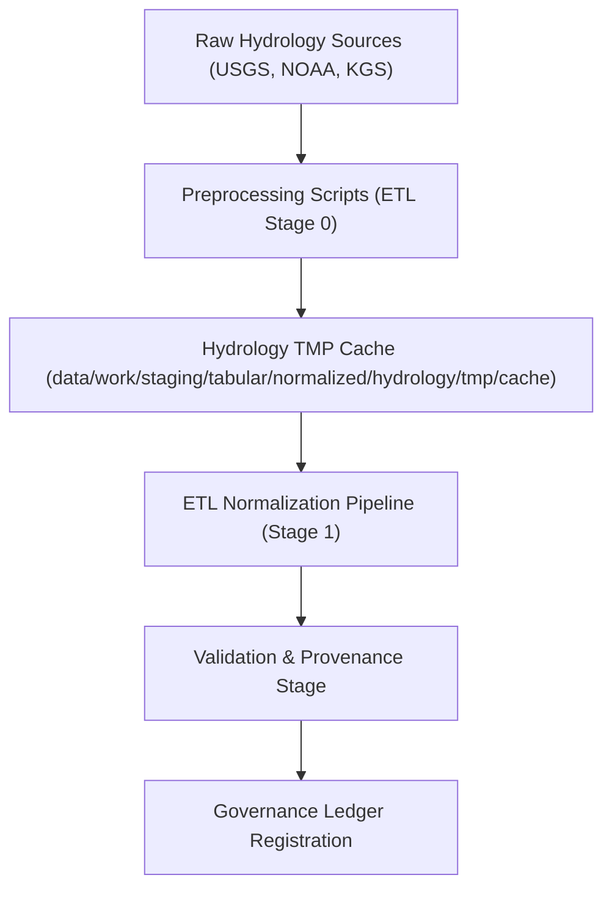

<div align="center">

# 💾 Kansas Frontier Matrix — **Hydrology TMP Cache (Preprocessed Data & Lookup Assets)**  
`data/work/staging/tabular/normalized/hydrology/tmp/cache/README.md`

**Purpose:** Serve as the **temporary hydrological data cache** for preprocessed, cleaned, and geospatially aligned datasets prior to full ETL normalization.  
This layer accelerates repetitive hydrology workflows — e.g., streamflow extraction, aquifer depth interpolation, rainfall raster resampling — within the **Kansas Frontier Matrix (KFM)** ETL environment.

[](../../../../../../../../docs/architecture/repo-focus.md)
[]()
[]()
[]()
[]()

</div>

---

## 🗂️ Directory Layout

```plaintext
cache/
├── usgs_streamflow_cache.csv           # Cached streamflow station data (cleaned)
├── noaa_rainfall_cache.csv             # Processed rainfall records (daily aggregates)
├── kgs_aquifer_depth_cache.geojson     # Spatial cache of aquifer and groundwater data
├── hydro_lookup_tables.json            # Lookup dictionaries (station codes, hydrologic units)
├── crs_reference_cache.json            # Cached coordinate reference system transforms
├── qa_summary.json                     # Cache integrity validation report
├── manifest.json                       # Index of cached datasets and validity period
└── README.md                           # ← You are here
```

---

## 🧭 Overview

The **TMP Cache Layer** acts as an **accelerator and consistency buffer** for hydrology ETL workflows.  
It minimizes redundant computation by storing cleaned, formatted, and cross-referenced hydrological datasets between ETL runs.

### Objectives
- Enable **fast reloads** of intermediate hydrology data for iterative processing.  
- Maintain **geospatial consistency** across all temporary datasets (EPSG:4326 baseline).  
- Ensure **checksum-verified integrity** before reuse.  
- Support **FAIR data principles** — cached data are fully traceable and documented.  

This cache is automatically rebuilt **every 24 hours** or whenever raw hydrology sources (USGS, NOAA, KGS) update.

---

## ⚙️ Hydrology Cache Workflow



---

## 🧩 Core Cached Assets

### 1️⃣ Streamflow Cache

**File:** `usgs_streamflow_cache.csv`

```csv
station_id,station_name,latitude,longitude,mean_discharge_cfs,last_updated
06866500,Arkansas River near Great Bend,38.34,-98.77,382,2025-10-25
07137500,Kansas River at Wamego,39.21,-96.29,512,2025-10-25
```

- Source: USGS NWIS API  
- Transformation: Unit normalization, coordinate validation, duplicate removal  
- Used by: `normalize_hydrology_data_v6.3`

---

### 2️⃣ NOAA Rainfall Cache

**File:** `noaa_rainfall_cache.csv`

```csv
station_id,date,total_precip_mm,avg_temp_c,source,last_updated
KS001,2025-10-24,8.2,13.5,NOAA,2025-10-25
