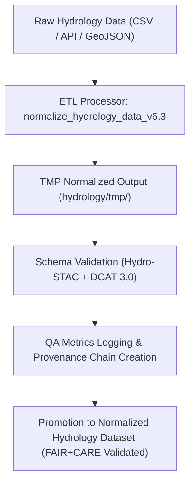

<div align="center">

# 💧 Kansas Frontier Matrix — **Hydrology TMP Logs (ETL, Validation & Provenance Records)**  
`data/work/staging/tabular/normalized/hydrology/tmp/logs/README.md`

**Purpose:** Maintain **temporary ETL runtime logs, QA reports, and provenance metadata** generated during the processing of hydrological datasets within the **Kansas Frontier Matrix (KFM)**.  
This directory captures water-related normalization and validation operations (streams, rivers, aquifers, discharge stations) that are pre-validated before archival or promotion to stable normalized hydrology layers.

[](../../../../../../../../docs/architecture/repo-focus.md)
[]()
[]()
[]()
[]()

</div>

---

## 🗂️ Directory Layout

```plaintext
logs/
├── etl_run_2025-10-25_hydro.json          # ETL metadata for hydrology normalization batch
├── validation_report_hydro.json            # Schema and ontology validation output
├── provenance_hydro.jsonld                 # PROV-O lineage for ETL + QA transformations
├── qa_metrics.json                         # Hydrology-specific QA telemetry
├── error_log.txt                           # Runtime warnings and schema mismatch notes
├── manifest.json                           # Manifest linking hydrology TMP artifacts
└── README.md                               # ← You are here
```

---

## 🧭 Overview

This directory represents the **transient ETL tracepoint** for hydrology-related normalization runs under  
`data/work/staging/tabular/normalized/hydrology/tmp/`.  

It captures:
- Daily ingestion and cleaning of **streamflow and water-quality data** (USGS NWIS, NOAA, KGS).  
- Schema and spatial-temporal validation for hydrological features (`flow_rate`, `gauge_height`, `station_id`, etc.).  
- Provenance linking of input sources to normalized outputs under **PROV-O** and **CIDOC CRM** ontologies.  
- QA metrics tracking field normalization, temporal integrity, and FAIR compliance.

All logs here are **ephemeral**, cleaned weekly after ledger registration.

---

## ⚙️ ETL Workflow (Hydrology TMP Stage)



---

## 🧩 Log File Examples

### 1️⃣ ETL Runtime Metadata

**File:** `etl_run_2025-10-25_hydro.json`

```json
{
  "etl_run_id": "hydro_2025-10-25_001",
  "executed_by": "@kfm-data-engineering",
  "etl_pipeline": "normalize_hydrology_data_v6.3",
  "start_time": "2025-10-25T09:00:00Z",
  "end_time": "2025-10-25T09:12:45Z",
  "runtime_seconds": 765,
  "datasets_processed": [
    "USGS_Streamflow_Stations",
    "Kansas_Aquifer_Depth",
    "NOAA_Rainfall_Events"
  ],
  "transformations_applied": [
    "Coordinate normalization",
    "Streamflow unit conversion (cfs → m³/s)",
    "Time standardization (UTC)",
    "Station metadata enrichment"
  ],
  "qa_passed": true,
  "checksum_verified": true,
  "provenance_ref": "data/work/staging/tabular/normalized/hydrology/tmp/logs/provenance_hydro.jsonld"
}
```

---

### 2️⃣ Validation Report

**File:** `validation_report_hydro.json`

```json
{
  "generated_at": "2025-10-25T09:20:00Z",
  "schema": "hydrology_dataset_schema_v6.3",
  "datasets_validated": 3,
  "stac_pass_rate": 0.982,
  "ontology_alignment": {
    "CIDOC_CRM": "E53_Place (Station Sites)",
    "OWL-Time": "Hydrograph Temporal Extents"
  },
  "errors": [
    {"dataset": "USGS_Streamflow_Stations", "issue": "Missing provider metadata", "severity": "minor"}
  ],
  "reviewed_by": "@kfm-validation"
}
```

---

### 3️⃣ Provenance Record

**File:** `provenance_hydro.jsonld`

```json
{
  "@context": "https://www.w3.org/ns/prov#",
  "@id": "urn:kfm:activity:normalize_hydrology_data_v6.3",
  "prov:used": [
    "data/raw/hydrology/usgs_streamflow.csv",
    "data/raw/hydrology/aquifer_depths.geojson"
  ],
  "prov:wasAssociatedWith": "@kfm-data-engineering",
  "prov:generated": "data/work/staging/tabular/normalized/hydrology/tmp/normalized_hydro.geojson",
  "prov:generatedAtTime": "2025-10-25T09:12:45Z",
  "prov:value": "Hydrological dataset normalized and validated for FAIR+CARE compliance."
}
```

---

### 4️⃣ QA Metrics

**File:** `qa_metrics.json`

```json
{
  "report_date": "2025-10-25",
  "datasets_processed": 3,
  "avg_field_normalization_rate": 0.987,
  "missing_values": 2,
  "spatial_accuracy": 0.996,
  "temporal_alignment": 0.981,
  "ontology_alignment_score": 0.973,
  "critical_errors": 0,
  "qa_pass_rate": 0.995,
  "reviewed_by": "@kfm-validation"
}
```

---

### 5️⃣ Error Log

**File:** `error_log.txt`

```text
[2025-10-25 09:05:42] WARNING: Missing metadata field 'source_agency' for NOAA rainfall event records.
[2025-10-25 09:06:10] ERROR: Temporal overlap detected between station 06866500 (Arkansas River) and aquifer dataset; reconciliation deferred.
[2025-10-25 09:10:05] INFO: CRS alignment complete (EPSG:4326 verified across all hydrology layers).
```

---

## 📊 QA Metrics Overview

| Metric | Description | Target | Source |
|--------|--------------|---------|---------|
| Hydrological Record Integrity | % of valid flow/gauge readings post-normalization | ≥ 98% | validation_report_hydro.json |
| Temporal Consistency | Time-series continuity across overlapping stations | ≥ 95% | qa_metrics.json |
| Geospatial Accuracy | CRS alignment and coordinate precision | ≥ 99% | validation_report_hydro.json |
| Ontology Alignment (CIDOC CRM / OWL-Time) | Semantic consistency in hydrology context | ≥ 95% | provenance_hydro.jsonld |
| FAIR+CARE Compliance | Ethical and transparent data stewardship | ≥ 90% | manifest.json |

---

## 🔒 Governance & Provenance Integration

Hydrology TMP logs are registered in the **Governance Ledger** once validation passes.  
Each run’s provenance is linked to:

- `/governance/ledger/validation/YYYY/MM/hydrology_validation.jsonld`
- `/data/work/staging/tabular/normalized/hydrology/reports/validation/`
- `/checksums/archive/hydrology_2025_Q4.sha256`

### Example Governance Ledger Entry

```json
{
  "@context": "https://www.w3.org/ns/prov#",
  "@id": "urn:kfm:ledger:hydrology:etl:2025-10-25",
  "prov:wasGeneratedBy": "normalize_hydrology_data_v6.3",
  "prov:wasAttributedTo": "@kfm-data-engineering",
  "prov:generatedAtTime": "2025-10-25T09:20:00Z",
  "prov:value": "Hydrology TMP ETL process successfully validated and logged for ledger registration.",
  "prov:used": [
    "data/raw/hydrology/usgs_streamflow.csv",
    "data/raw/hydrology/aquifer_depths.geojson"
  ]
}
```

---

## ⚖️ FAIR+CARE & ISO Compliance

| Standard | Implementation | Reference Artifact |
|-----------|----------------|--------------------|
| **FAIR F1-F4** | STAC/DCAT metadata validated for all hydrology TMP datasets. | validation_report_hydro.json |
| **CARE (Responsibility)** | Ethical data use review ensures stewardship of hydrological resources. | governance_review |
| **ISO 19115** | Geospatial and temporal metadata compliance for hydrological datasets. | provenance_hydro.jsonld |
| **ISO 25012** | Data accuracy, completeness, and traceability validation. | qa_metrics.json |
| **MCP-DL v6.3** | Documentation-first lineage tracking for reproducible hydrology ETL. | manifest.json |

---

## 🧾 Version History

| Version | Date | Author | Reviewer | Notes |
|----------|------|---------|-----------|--------|
| v2.0.0 | 2025-10-25 | @kfm-data-engineering | @kfm-hydrology | Added provenance linkage, FAIR+CARE audit, and QA metrics integration. |
| v1.1.0 | 2025-10-24 | @kfm-validation | @kfm-data-engineering | Introduced validation reports and schema diagnostics. |
| v1.0.0 | 2025-10-23 | @kfm-validation | — | Initial creation of hydrology TMP log documentation. |

---

<div align="center">

[]()
[]()
[]()
[]()
[]()

</div>
