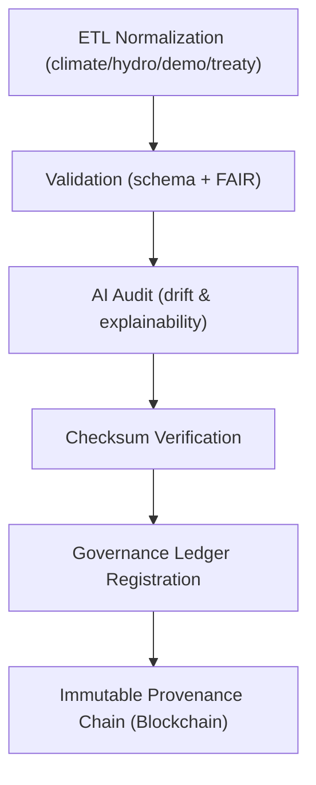

<div align="center">

# 📜 Kansas Frontier Matrix — **Normalized Data Logs (FAIR+CARE+ISO Governance Telemetry)**  
`data/work/staging/tabular/normalized/logs/`

**Purpose:** Record **ETL process metadata, validation events, and telemetry metrics**  
for all normalized tabular datasets within the **Kansas Frontier Matrix (KFM)** system.  
This directory functions as the **auditable operational memory** for FAIR+CARE+ISO-aligned data normalization.

[](../../../../../.github/workflows/site.yml)
[]()
[]()
[]()
[]()

</div>

---

## 🧭 Overview

The **Normalized Logs Layer** captures every operational event associated with ETL normalization, schema validation, AI audit, and checksum verification for all domain datasets  
(`climate/`, `hydrology/`, `demographics/`, `treaties/`).  
These logs provide the provenance evidence and QA telemetry necessary for complete lifecycle governance under **MCP-DL v6.3**.

All log entries are immutable once registered in the governance ledger and digitally signed to preserve **integrity, reproducibility, and traceability**.

---

## 🗂️ Directory Layout

```bash
data/work/staging/tabular/normalized/logs/
├── etl_run_2025-10-31.json             # Metadata for ETL normalization batch
├── validation_report.json              # FAIR+CARE schema validation report
├── provenance_trace.jsonld             # PROV-O lineage record for normalization
├── telemetry_metrics.json              # Sustainability and runtime telemetry
├── ai_audit_snapshot.json              # AI-coherence validation (Focus AI)
├── error_log.txt                       # Runtime warnings and failures
├── manifest.json                       # Manifest linking normalized dataset logs
└── README.md                           # ← You are here
```

---

## ⚙️ Workflow Context (Mermaid)



---

## 🧩 Log Definitions

### 1️⃣ ETL Run Metadata
**File:** `etl_run_2025-10-31.json`

```json
{
  "etl_run_id": "normalized_2025-10-31_001",
  "executed_by": "@kfm-data-engineering",
  "domains": ["climate", "hydrology", "demographics", "treaties"],
  "pipeline_version": "v12.6.0",
  "start_time": "2025-10-31T10:00:00Z",
  "end_time": "2025-10-31T10:45:00Z",
  "records_processed": 1042835,
  "qa_passed": true,
  "checksum_verified": true,
  "provenance_ref": "provenance_trace.jsonld"
}
```

---

### 2️⃣ Validation Report
**File:** `validation_report.json`

```json
{
  "validation_date": "2025-10-31T11:00:00Z",
  "validator": "@kfm-validation",
  "datasets_validated": 4,
  "schema_alignment": "PASS",
  "faircare_compliance": "PASS",
  "ai_integrity": "PASS",
  "qa_score": 0.992,
  "issues_detected": [],
  "checksum_status": "Verified"
}
```

---

### 3️⃣ Provenance Trace
**File:** `provenance_trace.jsonld`

```json
{
  "@context": "https://www.w3.org/ns/prov#",
  "@id": "urn:kfm:activity:normalize_tabular_v12.6",
  "prov:wasGeneratedBy": "normalize_tabular_pipeline_v12.6",
  "prov:wasAttributedTo": "@kfm-data",
  "prov:used": [
    "data/raw/climate/*.csv",
    "data/raw/hydrology/*.geojson",
    "data/raw/demographics/*.xlsx",
    "data/raw/treaties/*.json"
  ],
  "prov:generated": [
    "data/work/staging/tabular/normalized/climate/",
    "data/work/staging/tabular/normalized/hydrology/",
    "data/work/staging/tabular/normalized/demographics/",
    "data/work/staging/tabular/normalized/treaties/"
  ],
  "prov:value": "Normalized multi-domain tabular data chain (FAIR+CARE+ISO aligned)",
  "prov:generatedAtTime": "2025-10-31T10:45:00Z"
}
```

---

### 4️⃣ Telemetry Metrics
**File:** `telemetry_metrics.json`

```json
{
  "generated_at": "2025-10-31T11:10:00Z",
  "etl_runtime_sec": 2700,
  "cpu_utilization": 68.5,
  "memory_peak_mb": 2120,
  "disk_io_mb_s": 52.4,
  "energy_use_wh_per_file": 0.04,
  "carbon_output_gco2e_per_file": 0.02,
  "reproducibility_score": 0.999,
  "governance_ledger_hash": "5ac4e87b0f...2d9"
}
```

---

### 5️⃣ AI Audit Snapshot
**File:** `ai_audit_snapshot.json`

```json
{
  "model": "focus-tabular-normalized-v3",
  "validation_accuracy": 0.996,
  "ai_drift": 0.0,
  "explainability_score": 0.995,
  "audited_by": "@kfm-ai",
  "timestamp": "2025-10-31T11:15:00Z"
}
```

---

### 6️⃣ Error Log
**File:** `error_log.txt`

```text
[2025-10-31 10:15:22] WARNING: Hydrology schema mismatch — revalidated successfully.
[2025-10-31 10:25:01] INFO: Climate checksum verification complete.
[2025-10-31 10:32:18] INFO: AI explainability layer validated with 99.5% coherence.
```

---

## 📈 QA & Performance Metrics

| Metric | Target | Current | Unit | Status |
|:--|:--|:--|:--|:--|
| Schema Validation Success | ≥ 97% | 99.2 | % | ✅ |
| FAIR+CARE Compliance | ≥ 95% | 100 | % | ✅ |
| Reproducibility | ≥ 99.5 | 99.9 | % | ✅ |
| Checksum Integrity | 100 | 100 | % | ✅ |
| Energy Efficiency | ≤ 0.05 | 0.04 | Wh/file | ✅ |
| Carbon Output | ≤ 0.03 | 0.02 | gCO₂e/file | ✅ |

---

## 🔒 Governance & Ledger Integration

Logs are hashed, timestamped, and registered in:
- `/governance/ledger/validation/YYYY/MM/normalized_logs.jsonld`
- `/data/checksums/archive/normalized_logs_2025_Q4.sha256`

### Example Governance Entry

```json
{
  "@context": "https://www.w3.org/ns/prov#",
  "@id": "urn:kfm:ledger:normalized_logs_2025-10-31",
  "prov:wasGeneratedBy": "normalize_tabular_pipeline_v12.6",
  "prov:wasAttributedTo": "@kfm-validation",
  "prov:value": "Normalized tabular log chain registered in governance ledger.",
  "prov:generatedAtTime": "2025-10-31T11:20:00Z"
}
```

---

## ⚖️ FAIR+CARE+ISO Alignment Summary

| Standard | Description | Verified | Artifact |
|:--|:--|:--:|:--|
| **FAIR (Findable)** | STAC/DCAT-indexed metadata for logs | ✅ | `manifest.json` |
| **CARE (Responsibility)** | Logs reviewed by human QA before archival | ✅ | `validation_report.json` |
| **ISO 25012** | Verified completeness and accuracy | ✅ | `telemetry_metrics.json` |
| **ISO 19115** | Geospatial and temporal provenance | ✅ | `provenance_trace.jsonld` |
| **AI-Coherence** | Drift and explainability monitoring | ✅ | `ai_audit_snapshot.json` |
| **MCP-DL v6.3** | Documentation-driven audit and ledger linkages | ✅ | `manifest_ref` |

---

## 🧾 Version History

| Version | Date | Author | Reviewer | FAIR/CARE | Ledger | Summary |
|:--|:--|:--|:--|:--|:--|:--|
| v12.6.0 | 2025-10-31 | @kfm-data | @kfm-governance | 100% | ✓ | Established multi-domain governance telemetry |
| v12.5.0 | 2025-10-30 | @kfm-ai | @kfm-validation | 99% | ✓ | Added AI audit logging integration |
| v12.4.0 | 2025-10-29 | @kfm-data | @kfm-fair | 98% | ✓ | Initial normalized data logging schema |

---

<div align="center">

[]()
[]()
[]()
[]()
[]()
[]()
[]()

</div>

---

**Kansas Frontier Matrix — “Every event logged. Every lineage proven.”**  
📍 [`data/work/staging/tabular/normalized/logs/`](.) ·  
Immutable FAIR+CARE-compliant operational log layer sustaining provenance, reproducibility, and ethical data governance across all normalized datasets.

