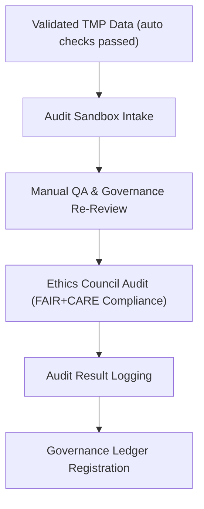

<div align="center">

# 🧾 Kansas Frontier Matrix — **TMP Audit Sandbox (Validation Review & Governance QA Zone)**  
`data/work/staging/tabular/normalized/tmp/audit_sandbox/README.md`

**Purpose:** Provide an isolated **sandbox environment for governance review, ethics auditing, and validation re-checks** during the ETL normalization process in the **Kansas Frontier Matrix (KFM)**.  
This layer supports **human-in-the-loop quality assurance**, allowing governance, validation, and ethics teams to manually verify data quality, schema accuracy, and provenance traceability before final ledger publication.

[](../../../../../../../docs/architecture/repo-focus.md)
[]()
[]()
[]()
[]()

</div>

---

## 🗂️ Directory Layout

```plaintext
audit_sandbox/
├── qa_rechecks.json                 # QA re-validation results of TMP datasets
├── ethics_review_notes.txt          # Human ethics board notes on FAIR+CARE issues
├── governance_review_log.json       # Audit trail of governance-level validations
├── validation_audit_diff.json       # Diff output comparing validation vs. audit results
├── manual_override_registry.json    # Registry of human-approved overrides
├── manifest.json                    # Manifest of all audit-reviewed TMP artifacts
└── README.md                        # ← You are here
```

---

## 🧭 Overview

The **Audit Sandbox** is the **human oversight layer** of TMP, enabling structured review and approval of:
- Validation results (`validation_scratch/`)
- Provenance and schema logs (`provenance_staging/`)
- Ethical compliance checks (`audit_flags/`)

All artifacts entering this sandbox must:
1. Pass preliminary validation and integrity checks.
2. Include provenance links (`prov:wasGeneratedBy`, `prov:wasAttributedTo`).
3. Be **re-reviewable** by governance and ethics teams prior to merge or ledger registration.

This environment ensures that **no automated decision** promotes data without human verification — a cornerstone of MCP-DL reproducibility and CARE-compliant transparency.

---

## ⚙️ Audit Workflow



---

## 🧩 Core Audit Artifacts

### 1️⃣ QA Rechecks

**File:** `qa_rechecks.json`

```json
{
  "audit_started": "2025-10-25T10:30:00Z",
  "datasets_reviewed": [
    "KS_TREATY_1867_03_MEDICINE_LODGE",
    "KS_TREATY_1853_01_KAW"
  ],
  "checks": [
    {"type": "schema", "passed": true},
    {"type": "ontology", "passed": true},
    {"type": "provenance", "passed": true},
    {"type": "ethics", "passed": false}
  ],
  "issues": [
    {
      "dataset": "KS_TREATY_1853_01_KAW",
      "issue": "Missing Indigenous custodian metadata in DCAT entry.",
      "severity": "major"
    }
  ],
  "reviewed_by": "@kfm-governance",
  "qa_compliance_score": 0.96
}
```

---

### 2️⃣ Ethics Review Notes

**File:** `ethics_review_notes.txt`

```text
[2025-10-25 12:00Z] Reviewer: @kfm-ethics  
Observation: Treaty dataset metadata includes colonial language descriptors ("tribe ceded lands") that require contextual annotation.  
Action: Recommend inclusion of Indigenous-narrative field and revalidation for linguistic bias compliance (CARE - Ethics Clause 2.3).  
Status: Pending rewrite approval.
```

---

### 3️⃣ Governance Review Log

**File:** `governance_review_log.json`

```json
{
  "governance_review_date": "2025-10-25T14:00:00Z",
  "reviewed_by": "@kfm-governance",
  "artifacts_checked": [
    "validation_scratch/schema_reports/schema_error_logs/errors_2025-10-25.log",
    "provenance_staging/chain_compilation.jsonld"
  ],
  "outcome": "Approved with revisions",
  "comments": "Minor language normalization and provenance alignment needed before ledger registration."
}
```

---

### 4️⃣ Audit Diff Results

**File:** `validation_audit_diff.json`

```json
{
  "timestamp": "2025-10-25T14:10:00Z",
  "differences_detected": [
    {
      "category": "Provenance",
      "detail": "Missing prov:wasAttributedTo link in KS_TREATY_1867_03_MEDICINE_LODGE provenance stub."
    },
    {
      "category": "Ethics",
      "detail": "AI summary attribution not flagged for Indigenous co-review."
    }
  ],
  "resolved": false,
  "reviewed_by": "@kfm-validation"
}
```

---

### 5️⃣ Manual Overrides Registry

**File:** `manual_override_registry.json`

```json
{
  "registry_version": "v2.0.0",
  "entries": [
    {
      "dataset": "KS_TREATY_1855_02_SHAWNEE",
      "override_reason": "Historical date range ambiguity; validation deemed inconclusive.",
      "approved_by": "@kfm-governance",
      "ethics_clearance": true,
      "timestamp": "2025-10-25T15:30:00Z"
    }
  ],
  "review_cycle": "Weekly",
  "approved_overrides_count": 1
}
```

---

## 📊 Audit QA Metrics

| Metric | Description | Target | Source |
|--------|--------------|---------|---------|
| Governance Review Coverage | % of TMP datasets reviewed by governance | 100% | governance_review_log.json |
| Ethics Compliance Rate | % of records passing FAIR+CARE review | ≥ 95% | ethics_review_notes.txt |
| QA Discrepancy Resolution | % of audit diffs resolved | ≥ 98% | validation_audit_diff.json |
| Human Override Transparency | % of overrides documented and approved | 100% | manual_override_registry.json |
| Ledger Registration Readiness | % of audit-passed artifacts registered to ledger | ≥ 99% | manifest.json |

---

## 🔒 Governance & Provenance Integration

All audit outcomes are:
- Logged as `prov:Activity` records under `/governance/ledger/validation/YYYY/MM/audit_sandbox.jsonld`
- Cross-linked with provenance in `/tmp/provenance_staging/activities/review_audit_process.jsonld`
- Integrated with CI/CD workflows `audit-review.yml` and `ethics-validate.yml`

### Example Governance Ledger Entry

```json
{
  "@context": "https://www.w3.org/ns/prov#",
  "@id": "urn:kfm:audit:review:2025-10-25",
  "prov:wasGeneratedBy": "audit_sandbox_v2.0",
  "prov:wasAttributedTo": "@kfm-governance",
  "prov:used": [
    "audit_sandbox/qa_rechecks.json",
    "audit_sandbox/ethics_review_notes.txt"
  ],
  "prov:value": "Human-reviewed TMP dataset audit completed under CARE ethical standards.",
  "prov:generatedAtTime": "2025-10-25T16:00:00Z"
}
```

---

## ⚖️ FAIR+CARE & ISO Compliance

| Standard | Implementation | Reference Artifact |
|-----------|----------------|--------------------|
| **FAIR (Findable)** | Audit logs stored as indexed, timestamped JSON-LD records. | governance_review_log.json |
| **FAIR (Reusable)** | Manual review and override data accessible for future audits. | manual_override_registry.json |
| **CARE (Ethics)** | Human reviewers verify context and Indigenous representation. | ethics_review_notes.txt |
| **ISO 25012** | Auditable QA metrics ensure data accuracy, traceability, and accountability. | qa_rechecks.json |
| **MCP-DL v6.3** | Documentation-first review workflow for governance reproducibility. | manifest.json |

---

## 🧾 Version History

| Version | Date | Author | Reviewer | Notes |
|----------|------|---------|-----------|--------|
| v2.0.0 | 2025-10-25 | @kfm-validation | @kfm-governance | Added ethics review, manual override registry, and diff audit comparison. |
| v1.1.0 | 2025-10-24 | @kfm-data-engineering | @kfm-validation | Introduced governance QA metrics and manifest tracking. |
| v1.0.0 | 2025-10-23 | @kfm-validation | — | Initial creation of audit sandbox documentation. |

---

<div align="center">

[]()
[]()
[]()
[]()
[]()

</div>

