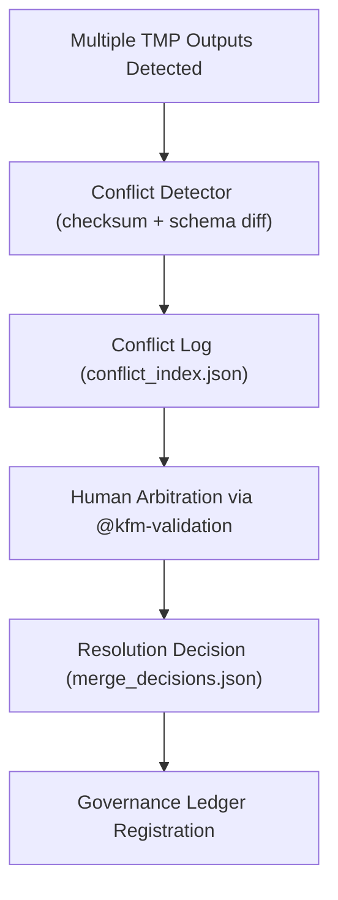

<div align="center">

# 🧩 Kansas Frontier Matrix — **TMP Conflict Resolution Layer (Data Merge & Schema Arbitration)**  
`data/work/staging/tabular/normalized/tmp/conflict_resolution/README.md`

**Purpose:** Provide a controlled workspace for **detecting, logging, and resolving data conflicts** during the normalization and validation processes within the **Kansas Frontier Matrix (KFM)** system.  
This directory ensures that competing ETL outputs, schema mismatches, or provenance discrepancies are handled deterministically and transparently under FAIR+CARE and MCP-DL governance.

[](../../../../../../../docs/architecture/repo-focus.md)
[]()
[]()
[]()
[]()

</div>

---

## 🗂️ Directory Layout

```plaintext
conflict_resolution/
├── conflict_index.json                # Index of all detected conflicts
├── schema_conflicts.json              # Schema mismatch logs (field type or structure)
├── provenance_conflicts.json          # Conflicts in lineage or attribution metadata
├── merge_decisions.json               # Resolution choices and rationale
├── reviewer_notes.txt                 # Human arbitration notes
├── audit_manifest.json                # Manifest linking conflict logs to provenance or schema reports
└── README.md                          # ← You are here
```

---

## 🧭 Overview

The **Conflict Resolution Layer** serves as a **sandboxed arbitration zone** for resolving discrepancies across:
- ETL pipeline outputs (`normalization_buffer/`)
- Schema validations (`validation_scratch/schema_reports/`)
- Provenance assemblies (`provenance_staging/`)

This ensures data promoted to `data/work/staging/tabular/normalized/treaties/` is **consistent, harmonized, and fully auditable**.  
Conflicts can include:
- Duplicate entries from concurrent ETL runs  
- Divergent schema definitions between validation batches  
- Overlapping temporal or spatial extents  
- Conflicting provenance or author attribution  

All resolutions are documented with **machine-verified diffs** and **human-reviewed notes** for long-term reproducibility.

---

## ⚙️ Conflict Workflow



---

## 🧩 Conflict Log Examples

### 1️⃣ Conflict Index

**File:** `conflict_index.json`

```json
{
  "generated_at": "2025-10-25T12:00:00Z",
  "conflicts_detected": 3,
  "conflict_types": ["schema", "provenance", "duplicate"],
  "entries": [
    {
      "dataset_id": "KS_TREATY_1867_03_MEDICINE_LODGE",
      "conflict_type": "schema",
      "description": "Field mismatch in `date_signed` (string vs datetime).",
      "files_in_conflict": [
        "normalization_buffer/treaty_metadata_tmp.csv",
        "validation_scratch/schema_reports/stac_validation_reports/KS_TREATY_1867_03_MEDICINE_LODGE_report.json"
      ]
    },
    {
      "dataset_id": "KS_TREATY_1853_01_KAW",
      "conflict_type": "provenance",
      "description": "Discrepancy in `prov:wasAttributedTo` (AI vs Human origin).",
      "files_in_conflict": [
        "provenance_staging/entities/ai_reports_entities.jsonld",
        "provenance_staging/entities/treaties_2025_10_entities.jsonld"
      ]
    }
  ],
  "review_required": true,
  "reviewer": "@kfm-validation"
}
```

---

### 2️⃣ Schema Conflicts

**File:** `schema_conflicts.json`

```json
{
  "timestamp": "2025-10-25T12:05:00Z",
  "validator": "@kfm-validation",
  "conflicts": [
    {
      "field": "date_signed",
      "expected_type": "datetime",
      "found_type": "string",
      "resolution": "normalize using ISO 8601 UTC standard"
    },
    {
      "field": "signatories",
      "expected_schema": "array[string]",
      "found_schema": "string",
      "resolution": "split field by delimiter ';' and cast to list"
    }
  ],
  "status": "Resolved",
  "notes": "Schema differences corrected automatically during re-normalization."
}
```

---

### 3️⃣ Provenance Conflicts

**File:** `provenance_conflicts.json`

```json
{
  "timestamp": "2025-10-25T12:20:00Z",
  "detected_by": "@kfm-governance",
  "conflicts": [
    {
      "entity": "KS_TREATY_1853_01_KAW",
      "issue": "prov:wasGeneratedBy references outdated activity.",
      "old_reference": "normalize_treaty_v5.8",
      "new_reference": "normalize_treaty_v6.3",
      "resolution": "Updated to current pipeline reference."
    }
  ],
  "review_status": "Pending Ethics Approval"
}
```

---

### 4️⃣ Merge Decisions

**File:** `merge_decisions.json`

```json
{
  "resolved_at": "2025-10-25T12:40:00Z",
  "resolved_by": "@kfm-validation",
  "merged_records": [
    {
      "dataset_id": "KS_TREATY_1867_03_MEDICINE_LODGE",
      "final_source": "normalization_buffer/treaty_metadata_tmp.csv",
      "conflict_files_merged": [
        "validation_scratch/schema_reports/stac_validation_reports/KS_TREATY_1867_03_MEDICINE_LODGE_report.json"
      ],
      "decision_basis": "Schema reconciliation and checksum verification passed."
    }
  ],
  "human_override": false,
  "checksum_verified": true
}
```

---

### 5️⃣ Reviewer Notes

**File:** `reviewer_notes.txt`

```text
[2025-10-25 12:30Z] Reviewer: @kfm-validation  
Comment: The provenance conflict for KS_TREATY_1853_01_KAW was resolved after reprocessing using normalize_treaty_v6.3.  
Checksum confirmed and consistent with archived records.  
Ethics review required only for AI-attribution clarification.
```

---

## 📊 QA Metrics Summary

| Metric | Description | Target | Source |
|--------|--------------|---------|--------|
| Schema Conflict Resolution Rate | % of schema mismatches resolved automatically | ≥ 90% | schema_conflicts.json |
| Provenance Alignment Rate | % of lineage corrections passing validation | ≥ 95% | provenance_conflicts.json |
| Governance Escalation Rate | % of unresolved conflicts requiring council input | ≤ 10% | merge_decisions.json |
| Data Integrity Verification | Files rechecked via SHA-256 before merge | 100% | conflict_index.json |
| FAIR+CARE Compliance | Ethical and open-data validation during merge | ≥ 95% | audit_manifest.json |

---

## 🔒 Governance & Provenance Integration

All resolutions and merges generate:
- A **prov:Activity** log in `/tmp/provenance_staging/activities/merge_resolution.jsonld`
- A **ledger record** in `/governance/ledger/validation/YYYY/MM/conflict_resolution.jsonld`
- A **checksum verification entry** in `/checksums/archive/treaties_2025_Q4.sha256`

### Example Governance Ledger Entry

```json
{
  "@context": "https://www.w3.org/ns/prov#",
  "@id": "urn:kfm:activity:conflict_resolution:2025-10-25",
  "prov:wasGeneratedBy": "merge_resolution_pipeline_v2.0",
  "prov:wasAttributedTo": "@kfm-validation",
  "prov:used": [
    "conflict_resolution/conflict_index.json",
    "conflict_resolution/merge_decisions.json"
  ],
  "prov:value": "TMP conflict successfully resolved and merged into normalized dataset.",
  "prov:generatedAtTime": "2025-10-25T12:45:00Z"
}
```

---

## ⚖️ FAIR+CARE & ISO Compliance

| Standard | Implementation | Reference Artifact |
|-----------|----------------|--------------------|
| **FAIR F1-F4** | Conflicts traceable by URN across TMP directories. | conflict_index.json |
| **CARE Principles** | Ensures transparent handling of Indigenous data representation. | reviewer_notes.txt |
| **ISO 25012** | Conflict and resolution integrity metrics validated by CI/CD. | audit_manifest.json |
| **ISO 19115** | Spatial-temporal data merges maintain metadata alignment. | schema_conflicts.json |
| **MCP-DL v6.3** | Documentation-first governance over merge arbitration. | merge_decisions.json |

---

## 🧾 Version History

| Version | Date | Author | Reviewer | Notes |
|----------|------|---------|-----------|--------|
| v2.0.0 | 2025-10-25 | @kfm-data-engineering | @kfm-governance | Added provenance conflict schema, governance ledger example, and QA metrics. |
| v1.1.0 | 2025-10-24 | @kfm-validation | @kfm-data-engineering | Introduced schema diffing and checksum validation. |
| v1.0.0 | 2025-10-23 | @kfm-validation | — | Initial conflict resolution directory and base schema specification. |

---

<div align="center">

[]()
[]()
[]()
[]()
[]()

</div>

