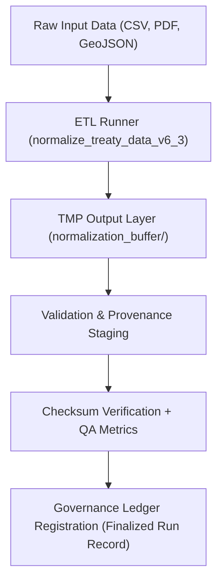

<div align="center">

# 🧰 Kansas Frontier Matrix — **TMP ETL Runs (Execution Logs & Runtime Metadata)**  
`data/work/staging/tabular/normalized/tmp/etl_runs/README.md`

**Purpose:** Provide a structured record of **ETL executions**, including their parameters, runtime metrics, provenance metadata, and audit logs.  
This directory serves as the **operational logbook** for temporary ETL processes during the normalization phase of the **Kansas Frontier Matrix (KFM)** system.

[](../../../../../../../docs/architecture/repo-focus.md)
[]()
[]()
[]()
[]()

</div>

---

## 🗂️ Directory Layout

```plaintext
etl_runs/
├── run_2025-10-25_001.json              # ETL process metadata for normalization batch
├── run_2025-10-25_002.json              # ETL process metadata for AI enrichment batch
├── run_2025-10-24_005.json              # Previous day ETL log
├── etl_summary_metrics.json             # Aggregated metrics for daily runs
├── runtime_errors.log                   # Log of ETL warnings, errors, and retries
├── process_manifest.json                # Manifest linking each run to input/output artifacts
└── README.md                            # ← You are here
```

---

## 🧭 Overview

This directory documents each **ETL job execution** within the TMP staging environment — capturing all relevant:
- Runtime parameters (start/end timestamps, seed versions)
- Process lineage (source → transformation → output)
- Checksum and provenance references
- Quality assurance outcomes
- Performance metrics (duration, CPU/memory usage)
- Error and retry events

ETL runs are generated automatically through:
- `make data`
- `make normalize`
- `make ai-summarize`
- or CI pipelines like `etl-run.yml`

Each run is reproducible and auditable through its stored **execution manifest** and **provenance JSON-LD links**.

---

## ⚙️ ETL Execution Lifecycle



---

## 🧩 ETL Run File Specification

### Example: `run_2025-10-25_001.json`

```json
{
  "etl_run_id": "run_2025-10-25_001",
  "executed_by": "@kfm-data-engineering",
  "etl_pipeline": "normalize_treaty_data_v6_3",
  "start_time": "2025-10-25T10:15:00Z",
  "end_time": "2025-10-25T10:24:32Z",
  "runtime_seconds": 572,
  "datasets_processed": [
    "KS_TREATY_1867_03_MEDICINE_LODGE",
    "KS_TREATY_1853_01_KAW"
  ],
  "input_sources": [
    "data/raw/treaties/1867_medicine_lodge.csv",
    "data/raw/treaties/1853_kaw_treaty.pdf"
  ],
  "output_files": [
    "data/work/staging/tabular/normalized/tmp/normalization_buffer/treaty_metadata_tmp.csv",
    "data/work/staging/tabular/normalized/tmp/normalization_buffer/treaty_geodata_tmp.geojson"
  ],
  "transformations_applied": [
    "Text OCR extraction",
    "Entity normalization",
    "Schema mapping",
    "Geocoding"
  ],
  "qa_passed": true,
  "checksum_verified": true,
  "provenance_ref": "data/work/staging/tabular/normalized/tmp/provenance_staging/activities/normalize_treaty_v6.3.jsonld"
}
```

---

### Example: `runtime_errors.log`

```text
[2025-10-25 10:17:45] WARNING: Missing column header in raw input (data/raw/treaties/1853_kaw_treaty.csv)
[2025-10-25 10:20:12] ERROR: Invalid CRS detected for treaty_geodata_tmp.geojson (expected EPSG:4326)
[2025-10-25 10:21:50] INFO: Attempting automatic CRS correction...
[2025-10-25 10:23:30] SUCCESS: All corrections applied successfully; normalization resumed.
```

---

### Example: `etl_summary_metrics.json`

```json
{
  "report_date": "2025-10-25",
  "total_runs": 2,
  "successful_runs": 2,
  "failed_runs": 0,
  "avg_runtime_sec": 540,
  "total_datasets_processed": 7,
  "avg_field_normalization_rate": 0.982,
  "qa_compliance_rate": 0.995,
  "checksum_verification_success": 1.0,
  "reviewed_by": "@kfm-validation"
}
```

---

### Example: `process_manifest.json`

```json
{
  "etl_runs": [
    {
      "run_id": "run_2025-10-25_001",
      "etl_pipeline": "normalize_treaty_data_v6_3",
      "linked_outputs": [
        "normalization_buffer/treaty_metadata_tmp.csv",
        "normalization_buffer/treaty_geodata_tmp.geojson"
      ],
      "linked_provenance": "provenance_staging/activities/normalize_treaty_v6.3.jsonld"
    },
    {
      "run_id": "run_2025-10-25_002",
      "etl_pipeline": "ai_summary_generation_v3",
      "linked_outputs": [
        "metadata/ai/summaries/KS_TREATY_1867_03_MEDICINE_LODGE.json"
      ],
      "linked_provenance": "provenance_staging/activities/ai_summary_generation.jsonld"
    }
  ]
}
```

---

## 🧮 QA & Telemetry Metrics

| Metric | Description | Target | Source |
|--------|--------------|---------|--------|
| **Average Runtime** | Mean execution duration across all ETL jobs | ≤ 10 min | etl_summary_metrics.json |
| **QA Pass Rate** | % of runs with zero validation errors | ≥ 95% | process_manifest.json |
| **Checksum Success Rate** | Files with matching SHA-256 after ETL | 100% | checksums/archive/ |
| **Reproducibility Score** | Runs with deterministic output (seed check) | ≥ 99% | provenance_staging/ |
| **Governance Integration** | Runs successfully linked to ledger | 100% | governance/ledger/validation/ |

---

## 🔒 Governance & Provenance Integration

Each ETL run is automatically registered to the **Governance Ledger** once validation passes.  
The system uses `prov:Activity` records (stored in `/tmp/provenance_staging/activities/`) to link execution metadata with downstream entities and agents.

### Example Ledger Entry

```json
{
  "@context": "https://www.w3.org/ns/prov#",
  "@id": "urn:kfm:etl:run:2025-10-25_001",
  "prov:wasGeneratedBy": "normalize_treaty_data_v6_3",
  "prov:wasAttributedTo": "@kfm-data-engineering",
  "prov:generatedAtTime": "2025-10-25T10:24:32Z",
  "prov:value": "ETL normalization batch completed and validated.",
  "prov:used": [
    "data/raw/treaties/1867_medicine_lodge.csv",
    "data/raw/treaties/1853_kaw_treaty.pdf"
  ]
}
```

---

## ⚖️ FAIR+CARE & ISO Compliance

| Standard | Implementation | Example Artifact |
|-----------|----------------|------------------|
| **FAIR (Findable)** | Unique `etl_run_id` per execution and metadata cataloging. | run_2025-10-25_001.json |
| **FAIR (Reusable)** | All ETL steps documented for reproducibility. | process_manifest.json |
| **CARE (Responsibility)** | Ethical lineage tracking for Indigenous dataset handling. | provenance_staging/activities/*.jsonld |
| **ISO 25012** | Data quality, accuracy, and completeness audits logged. | etl_summary_metrics.json |
| **MCP-DL v6.3** | Documentation-first reproducible ETL workflow. | etl_runs/*.json |

---

## 🧾 Version History

| Version | Date | Author | Reviewer | Notes |
|----------|------|---------|-----------|--------|
| v2.0.0 | 2025-10-25 | @kfm-data-engineering | @kfm-governance | Added governance integration, manifest linking, and telemetry schema. |
| v1.1.0 | 2025-10-24 | @kfm-validation | @kfm-data-engineering | Introduced process manifest and error tracking log. |
| v1.0.0 | 2025-10-23 | @kfm-validation | — | Initial ETL run documentation and directory creation. |

---

<div align="center">

[]()
[]()
[]()
[]()
[]()

</div>

