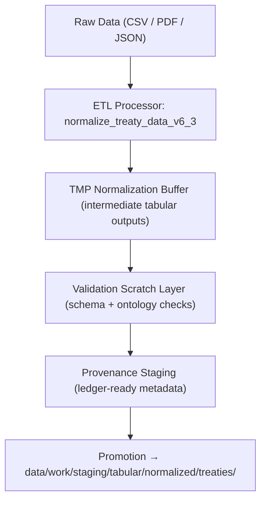

<div align="center">

# 🧮 Kansas Frontier Matrix — **TMP Normalization Buffer (ETL Intermediate Layer)**  
`data/work/staging/tabular/normalized/tmp/normalization_buffer/README.md`

**Purpose:** Serve as the **transient buffer for normalized data outputs** during ETL processing within the **Kansas Frontier Matrix (KFM)**.  
This layer captures all pre-validated, pre-checksummed tabular outputs before they are promoted to the **main normalized datasets** or passed into downstream **validation and provenance tests**.

[](../../../../../../../docs/architecture/repo-focus.md)
[]()
[]()
[]()
[]()

</div>

---

## 🗂️ Directory Layout

```plaintext
normalization_buffer/
├── treaty_metadata_tmp.csv             # Temporary normalized treaty metadata table
├── treaty_parties_tmp.csv              # Processed tabular representation of signatories
├── treaty_geodata_tmp.geojson          # Geospatial treaty extent polygons
├── ai_summary_tmp.json                 # AI-generated summaries pre-validation
├── schema_diagnostics.json             # Field mapping and normalization QA report
├── provenance_stub.jsonld              # Initial provenance entry (pre-assembly)
├── manifest.json                       # Manifest linking temporary normalized files
└── README.md                           # ← You are here
```

---

## 🧭 Overview

The **Normalization Buffer** acts as the **ETL handoff zone** between raw ingestion and validated normalization.  
Files here are temporary but **fully reconstructable** and contain intermediate mappings, merged metadata, and early-stage provenance.  
They are processed by the `normalize_treaty_data_v6_3` pipeline within `src/pipelines/normalize.py`.

### Objectives
- Provide **cleaned, schema-aligned tabular outputs** before final validation.
- Enable **staged transformation rollback** for reproducibility.
- Maintain **lineage traceability** from raw data to normalized datasets.
- Reduce risk of contamination to production data via controlled quarantine of pre-approved results.

---

## ⚙️ ETL Dataflow



---

## 🧩 Schema & Field Mapping

### Example Field Mapping (treaty_metadata_tmp.csv)
| Raw Field | Normalized Field | Transformation | Notes |
|------------|------------------|----------------|-------|
| `Treaty_Name` | `title` | Trim + Case Normalize | Title-case all entries |
| `Sign_Date` | `date_signed` | ISO 8601 Formatting | Convert to UTC timezone |
| `Tribes_Involved` | `parties` | Tokenize + Cross-map to Entity IDs | Validated against KFM Tribal Registry |
| `Treaty_Location` | `location` | Geocode via GeoNames | Verified spatial coordinates |
| `Treaty_Text` | `document_ref` | Path reference | OCR-indexed source file URI |

### Example File: `schema_diagnostics.json`

```json
{
  "generated_at": "2025-10-25T13:45:00Z",
  "pipeline_version": "v6.3",
  "dataset": "KS_TREATY_1867_03_MEDICINE_LODGE",
  "fields_normalized": 25,
  "missing_values": 0,
  "transformations_applied": [
    "Case normalization",
    "Date ISO formatting",
    "Entity linking",
    "Geocoding"
  ],
  "qa_pass_rate": 0.994,
  "reviewed_by": "@kfm-validation"
}
```

---

## 🧮 Provenance Stub Example

**File:** `provenance_stub.jsonld`

```json
{
  "@context": "https://www.w3.org/ns/prov#",
  "@id": "urn:kfm:tmp:entity:KS_TREATY_1867_03_MEDICINE_LODGE",
  "prov:type": "Dataset",
  "prov:wasDerivedFrom": "data/raw/treaties/1867_medicine_lodge.pdf",
  "prov:wasGeneratedBy": "normalize_treaty_v6.3",
  "prov:wasAttributedTo": "@kfm-data-engineering",
  "prov:generatedAtTime": "2025-10-25T12:15:00Z",
  "prov:value": "Intermediate normalized dataset — pending schema validation"
}
```

---

## 🔍 Quality & Validation Controls

| Check | Tool / Workflow | Description |
|--------|------------------|--------------|
| **Schema Conformance** | `stac-validate.yml` | Checks tabular schema alignment with STAC/DCAT. |
| **Ontology Alignment** | `ontology-check.yml` | Verifies field relationships map to CIDOC CRM / OWL-Time. |
| **Provenance Generation** | `prov-check.yml` | Confirms every TMP artifact has a provenance record. |
| **Checksum Verification** | `checksum-verify.yml` | Runs hash validation before file promotion. |
| **Audit Integration** | `qa-audit.yml` | Escalates anomalies for governance review. |

---

## 📈 ETL QA Metrics

**File:** `schema_diagnostics.json`  
Tracked via telemetry in `/data/work/staging/tabular/normalized/treaties/reports/validation/telemetry/metrics/`.

| Metric | Description | Target |
|--------|--------------|---------|
| Field Normalization Coverage | % of fields mapped to canonical schema | ≥ 95% |
| Missing Values | Fields with NULL or incomplete mappings | 0 |
| Provenance Completeness | TMP artifacts with valid lineage links | 100% |
| STAC/DCAT Compliance | Schema conformance success rate | ≥ 97% |
| FAIR+CARE Adherence | Ethical and open-data compliance level | ≥ 90% |

---

## 🔒 Governance Integration

When TMP files in the normalization buffer are validated:
1. They are **checksummed** and logged to `/checksums/ai/` and `/checksums/archive/`.
2. Their provenance is linked to `/tmp/provenance_staging/entities/`.
3. They are promoted to `/data/work/staging/tabular/normalized/treaties/` via CI (`make promote-normalized`).
4. The promotion event is recorded as a **prov:Activity** in the Governance Ledger.

Example ledger entry:

```json
{
  "@context": "https://www.w3.org/ns/prov#",
  "@id": "urn:kfm:activity:promote_normalized_treaty_2025_10_25",
  "prov:wasGeneratedBy": "@kfm-validation",
  "prov:wasAttributedTo": "@kfm-governance",
  "prov:used": "data/work/staging/tabular/normalized/tmp/normalization_buffer/KS_TREATY_1867_03_MEDICINE_LODGE.json",
  "prov:value": "Normalized TMP dataset successfully validated and promoted.",
  "prov:generatedAtTime": "2025-10-25T15:30:00Z"
}
```

---

## ⚖️ FAIR+CARE & ISO Compliance

| Standard | Implementation | Artifact |
|-----------|----------------|-----------|
| **FAIR (Findable)** | Metadata indexed with persistent identifiers. | manifest.json |
| **FAIR (Accessible)** | Intermediate files accessible via secure TMP storage. | treaty_metadata_tmp.csv |
| **CARE (Responsibility)** | Human review ensures Indigenous context integrity. | provenance_stub.jsonld |
| **ISO 19115** | Geospatial fields normalized and validated for coordinates and CRS. | treaty_geodata_tmp.geojson |
| **ISO 25012** | Accuracy and consistency metrics verified before promotion. | schema_diagnostics.json |
| **MCP-DL v6.3** | Documentation-first ETL reproducibility and traceability. | manifest.json |

---

## 🧾 Version History

| Version | Date | Author | Reviewer | Notes |
|----------|------|---------|-----------|--------|
| v2.0.0 | 2025-10-25 | @kfm-data-engineering | @kfm-governance | Added field mapping schema, QA metrics table, and governance workflow integration. |
| v1.1.0 | 2025-10-24 | @kfm-validation | @kfm-data-engineering | Introduced provenance stubs and STAC/DCAT schema diagnostics. |
| v1.0.0 | 2025-10-23 | @kfm-validation | — | Initial normalization buffer specification. |

---

<div align="center">

[]()
[]()
[]()
[]()
[]()

</div>

