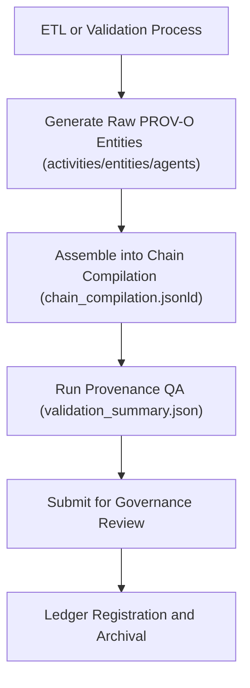

<div align="center">

# 🔗 Kansas Frontier Matrix — **TMP Provenance Staging (Pre-Ledger Lineage Assembly)**  
`data/work/staging/tabular/normalized/tmp/provenance_staging/README.md`

**Purpose:** Act as the **intermediate provenance assembly area** for ETL and validation processes in the **Kansas Frontier Matrix (KFM)**.  
This directory holds **temporary PROV-O lineage files**, **activity chains**, and **entity relationship definitions** before they are finalized, signed, and promoted into the **Governance Ledger**.  
It bridges the gap between **raw lineage generation (TMP)** and **immutable governance registration (Ledger)**.

[](../../../../../../../docs/architecture/repo-focus.md)
[]()
[]()
[]()
[]()

</div>

---

## 🗂️ Directory Layout

```plaintext
provenance_staging/
├── activities/                 # PROV-O activity records generated from ETL and validation runs
│   ├── normalize_treaty_v6.3.jsonld
│   ├── stac_validation_batch.jsonld
│   └── ai_summary_generation.jsonld
├── entities/                   # Dataset entities and derived objects awaiting ledger registration
│   ├── treaties_2025_10_entities.jsonld
│   ├── ai_reports_entities.jsonld
│   └── stac_catalog_entities.jsonld
├── agents/                     # Human or machine agents responsible for transformations
│   ├── kfm_data_engineering.jsonld
│   ├── kfm_validation.jsonld
│   └── kfm_ai_lab.jsonld
├── chain_compilation.jsonld    # Combined temporary provenance graph (activities + entities + agents)
├── validation_summary.json     # Provenance schema QA metrics and alignment checks
├── manifest.json               # Index of all files pending ledger promotion
└── README.md                   # ← You are here
```

---

## 🧭 Overview

The **Provenance Staging Layer** acts as a **sandbox for assembling, cross-referencing, and validating** provenance chains generated by:
- **ETL pipelines** (`src/pipelines/normalize.py`)
- **Schema validation modules** (`stac-validator`, `dcat-validator`)
- **Ontology linkers** (CIDOC CRM / OWL-Time)
- **AI validation engines** (`reviewer_agent.py`)

Each record describes **how, when, and by whom** a dataset was created, validated, or modified — using a standardized **PROV-O + CIDOC CRM hybrid model**.  
Artifacts in this directory are considered **transient but reproducible** until approved and sealed in the **Governance Ledger**.

---

## ⚙️ Provenance Assembly Workflow



---

## 🧩 Core Artifacts

### 1️⃣ Activity Provenance (`activities/*.jsonld`)

Records discrete transformation or validation actions as **prov:Activity** instances.

```json
{
  "@context": "https://www.w3.org/ns/prov#",
  "@id": "urn:kfm:activity:normalize_treaty_v6.3",
  "prov:type": "NormalizationActivity",
  "prov:used": "data/raw/treaties/1867_medicine_lodge.csv",
  "prov:wasAssociatedWith": "@kfm-data-engineering",
  "prov:generatedAtTime": "2025-10-25T12:20:00Z",
  "prov:generated": "data/work/staging/tabular/normalized/tmp/normalization_buffer/KS_TREATY_1867_03_MEDICINE_LODGE.json"
}
```

---

### 2️⃣ Entity Provenance (`entities/*.jsonld`)

Tracks data products (e.g., treaty JSON, AI summary) as **prov:Entity** nodes.

```json
{
  "@context": "https://www.w3.org/ns/prov#",
  "@id": "urn:kfm:entity:KS_TREATY_1867_03_MEDICINE_LODGE",
  "prov:type": "Dataset",
  "prov:wasGeneratedBy": "urn:kfm:activity:normalize_treaty_v6.3",
  "prov:wasDerivedFrom": "data/raw/treaties/1867_medicine_lodge.pdf",
  "prov:value": "Normalized treaty dataset JSON (v6.3)",
  "prov:generatedAtTime": "2025-10-25T12:25:00Z"
}
```

---

### 3️⃣ Agent Provenance (`agents/*.jsonld`)

Defines human or system actors involved in provenance creation.

```json
{
  "@context": "https://www.w3.org/ns/prov#",
  "@id": "urn:kfm:agent:kfm_validation",
  "prov:type": "SoftwareAgent",
  "prov:actedOnBehalfOf": "@kfm-governance",
  "prov:label": "KFM Validation Pipeline (v6.3)"
}
```

---

### 4️⃣ Chain Compilation (`chain_compilation.jsonld`)

Aggregates all provenance nodes (activities, entities, agents) into a single composite graph for submission.

```json
{
  "@context": "https://www.w3.org/ns/prov#",
  "@graph": [
    {"@id": "urn:kfm:activity:normalize_treaty_v6.3", "prov:type": "NormalizationActivity"},
    {"@id": "urn:kfm:entity:KS_TREATY_1867_03_MEDICINE_LODGE", "prov:wasGeneratedBy": "urn:kfm:activity:normalize_treaty_v6.3"},
    {"@id": "urn:kfm:agent:kfm_data_engineering", "prov:type": "Agent"}
  ],
  "compiled_at": "2025-10-25T12:40:00Z",
  "compiled_by": "@kfm-data-engineering"
}
```

---

### 5️⃣ Validation Summary (`validation_summary.json`)

Summarizes QA metrics for the entire provenance staging batch.

```json
{
  "generated_at": "2025-10-25T13:00:00Z",
  "activities_checked": 12,
  "entities_verified": 48,
  "agents_verified": 5,
  "invalid_references": 0,
  "missing_links": 0,
  "cross_schema_alignment": "PASS",
  "reviewed_by": "@kfm-validation"
}
```

---

### 6️⃣ Manifest (`manifest.json`)

Tracks all files pending governance submission.

```json
{
  "batch_id": "tmp_prov_2025-10-25",
  "files": [
    "activities/normalize_treaty_v6.3.jsonld",
    "entities/treaties_2025_10_entities.jsonld",
    "chain_compilation.jsonld"
  ],
  "pending_approval": true,
  "expected_ledger_entry": "governance/ledger/validation/2025/10/provenance_entry.jsonld"
}
```

---

## 🔒 Governance & Compliance

Each compiled chain must pass:
- **Checksum validation:** (linked to `/checksums/archive/`)  
- **Ontology mapping verification:** (CIDOC CRM / PROV-O)  
- **Human review:** via `@kfm-validation` or `@kfm-ethics`  
- **Digital signature registration:** in `/governance/ledger/validation/YYYY/MM/`

Once approved, entries are archived under `/data/work/staging/tabular/normalized/treaties/reports/provenance/`.

---

## 📊 Provenance QA Metrics

| Metric | Description | Target |
|--------|--------------|---------|
| PROV-O Chain Completeness | % of nodes linked correctly (activity → entity → agent) | 100% |
| Ontology Alignment | CIDOC CRM + PROV-O mapping rate | ≥ 95% |
| Pending Ledger Entries | Items awaiting governance approval | ≤ 10 |
| Provenance Drift | Chain mismatch vs. final ledger | 0% |
| Validation Success Rate | Overall pass rate per batch | ≥ 98% |

---

## ⚖️ FAIR+CARE & ISO Alignment Summary

| Standard | Implementation | Artifact |
|-----------|----------------|-----------|
| **FAIR F1-F4** | Persistent URN-based identifiers in all PROV-O entities. | chain_compilation.jsonld |
| **CARE (Ethics)** | Provenance ensures responsible and transparent lineage for Indigenous-related data. | validation_summary.json |
| **ISO 19115** | Provenance metadata links spatial and temporal elements from STAC/OWL-Time. | entities/*.jsonld |
| **ISO 25012** | Validates data quality: accuracy, consistency, traceability, accountability. | validation_summary.json |
| **MCP-DL v6.3** | Enforces documentation-first, verifiable provenance chain across workflows. | manifest.json |

---

## 🧾 Version History

| Version | Date | Author | Reviewer | Notes |
|----------|------|---------|-----------|--------|
| v2.0.0 | 2025-10-25 | @kfm-data-engineering | @kfm-governance | Added chain compilation schema, governance linkage, and FAIR+CARE mapping. |
| v1.1.0 | 2025-10-24 | @kfm-validation | @kfm-data-engineering | Added agent provenance handling and validation summary reporting. |
| v1.0.0 | 2025-10-23 | @kfm-validation | — | Initial creation of provenance staging directory and pre-ledger assembly specification. |

---

<div align="center">

[]()
[]()
[]()
[]()
[]()

</div>

