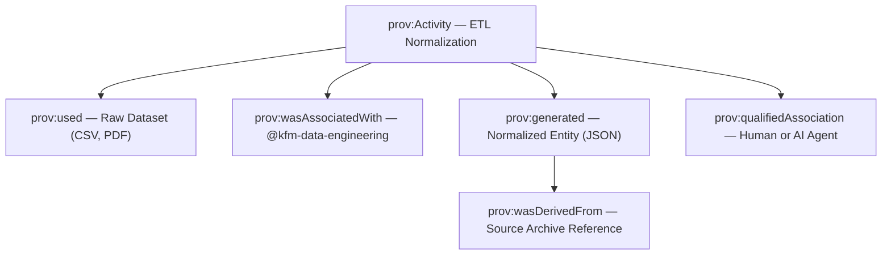

<div align="center">

# ⚙️ Kansas Frontier Matrix — **TMP Provenance Staging: Activity Records**  
`data/work/staging/tabular/normalized/tmp/provenance_staging/activities/README.md`

**Purpose:** Record all **ETL, validation, AI, and metadata transformation activities** that occur during the **TMP staging process** within the **Kansas Frontier Matrix (KFM)** system.  
Each JSON-LD file in this directory represents a discrete **prov:Activity** under the **PROV-O ontology**, detailing the process that generated or modified a dataset, who performed it, and when it occurred.

[](../../../../../../../../../../../../docs/architecture/repo-focus.md)
[]()
[]()
[]()
[]()

</div>

---

## 🗂️ Directory Layout

```plaintext
activities/
├── normalize_treaty_v6.3.jsonld       # ETL normalization provenance record
├── stac_validation_batch.jsonld       # Schema validation process record
├── ai_summary_generation.jsonld       # AI summarization workflow record
├── ontology_alignment_check.jsonld    # Ontology validation process record
├── review_audit_process.jsonld        # Human review or audit record
├── ledger_submission_pipeline.jsonld  # Governance ledger registration activity
└── README.md                          # ← You are here
```

---

## 🧭 Overview

Each file in this directory describes a **single transformation or validation event** as defined in the **W3C PROV-O ontology** and aligned with **CIDOC CRM (E7_Activity)**.  
An *activity* represents a verifiable process step — e.g., data normalization, STAC validation, AI summary generation, or human audit — that transforms an input dataset (`prov:used`) into an output entity (`prov:generated`).

All activities logged here are **temporary** until the full provenance chain is validated and published to the **Governance Ledger** at:  
`/governance/ledger/validation/YYYY/MM/provenance_entry.jsonld`

---

## ⚙️ Provenance Structure (PROV-O Activity Model)


%% END OF MERMAID %%

---

## 🧩 Activity Schema Example

### Example: `normalize_treaty_v6.3.jsonld`

```json
{
  "@context": "https://www.w3.org/ns/prov#",
  "@id": "urn:kfm:activity:normalize_treaty_v6.3",
  "prov:type": "NormalizationActivity",
  "prov:used": [
    "data/raw/treaties/1867_medicine_lodge.csv",
    "schemas/normalized_treaty_schema.json"
  ],
  "prov:wasAssociatedWith": "@kfm-data-engineering",
  "prov:qualifiedAssociation": {
    "prov:agent": "@kfm-validation",
    "prov:role": "Validator"
  },
  "prov:generated": "data/work/staging/tabular/normalized/tmp/normalization_buffer/KS_TREATY_1867_03_MEDICINE_LODGE.json",
  "prov:generatedAtTime": "2025-10-25T12:20:00Z",
  "prov:endedAtTime": "2025-10-25T12:22:00Z",
  "prov:value": "Normalization of raw treaty CSV to FAIR-compliant JSON.",
  "prov:wasDerivedFrom": "data/raw/treaties/1867_medicine_lodge.pdf"
}
```

---

### Example: `ai_summary_generation.jsonld`

```json
{
  "@context": "https://www.w3.org/ns/prov#",
  "@id": "urn:kfm:activity:ai_summary_generation",
  "prov:type": "AISummarizationActivity",
  "prov:used": [
    "data/work/staging/tabular/normalized/treaties/metadata/ai/summaries/prompts/summarization_prompt.md",
    "data/raw/treaties/1867_medicine_lodge.pdf"
  ],
  "prov:wasAssociatedWith": "@kfm-ai-lab",
  "prov:generated": "data/work/staging/tabular/normalized/treaties/metadata/ai/summaries/KS_TREATY_1867_03_MEDICINE_LODGE.json",
  "prov:generatedAtTime": "2025-10-25T13:00:00Z",
  "prov:value": "AI-generated structured summary from canonical treaty text.",
  "prov:wasInformedBy": "data/work/staging/tabular/normalized/tmp/provenance_staging/activities/normalize_treaty_v6.3.jsonld"
}
```

---

## 🧠 Semantic Alignment

All activity records map **PROV-O** relationships to equivalent **CIDOC CRM** classes for cross-ontology interoperability:

| PROV-O Property | CIDOC CRM Equivalent | Description |
|------------------|----------------------|--------------|
| `prov:Activity` | `E7_Activity` | Represents an event or process in historical data modeling. |
| `prov:Agent` | `E39_Actor` | Person, group, or software responsible for the action. |
| `prov:Entity` | `E28_Conceptual_Object` | Data object or document being acted upon. |
| `prov:used` | `P16_used_specific_object` | Links the input to an activity. |
| `prov:wasGeneratedBy` | `P94_has_created` | Denotes creation or transformation of an entity. |
| `prov:qualifiedAssociation` | `P14_carried_out_by` | Links an actor to an activity. |

---

## 📊 Activity Validation Metrics

| Metric | Description | Target |
|--------|--------------|---------|
| Activity Completeness | % of activity records with valid `prov:used` and `prov:generated` links | 100% |
| CIDOC CRM Mapping Rate | Successful ontology alignment rate | ≥ 95% |
| Timestamp Consistency | Start/end time alignment across workflow | ≥ 99% |
| Validation Coverage | Activities with QA checks passed | 100% |
| Governance Readiness | Activities approved for ledger integration | ≥ 98% |

All metrics are logged in `provenance_staging/validation_summary.json`.

---

## 🔒 Governance Integration

Upon validation, activity files from this directory are:
1. **Aggregated** into `/tmp/provenance_staging/chain_compilation.jsonld`
2. **Reviewed** by `@kfm-validation`
3. **Digitally signed** by `@kfm-governance`
4. **Registered** in the Governance Ledger under `/governance/ledger/validation/YYYY/MM/`

Example ledger entry:

```json
{
  "@context": "https://www.w3.org/ns/prov#",
  "@id": "urn:kfm:ledger:activity:2025-10-25:normalize_treaty_v6.3",
  "prov:wasGeneratedBy": "normalize_treaty_v6.3",
  "prov:wasAttributedTo": "@kfm-data-engineering",
  "prov:generatedAtTime": "2025-10-25T12:20:00Z",
  "prov:value": "TMP activity record successfully validated and logged."
}
```

---

## ⚖️ FAIR+CARE & ISO Compliance

| Standard | Implementation | Artifact |
|-----------|----------------|-----------|
| **FAIR F1-F4** | Persistent URNs ensure activity traceability across systems. | normalize_treaty_v6.3.jsonld |
| **CARE Principles** | Records attribute Indigenous data stewardship in historical contexts. | ai_summary_generation.jsonld |
| **ISO 19115** | Provenance metadata conforms to event-based geospatial models. | ledger_submission_pipeline.jsonld |
| **ISO 25012** | Activity records enforce data quality and reproducibility. | validation_summary.json |
| **MCP-DL v6.3** | Documentation-first lineage registration across ETL and validation. | all activities/*.jsonld |

---

## 🧾 Version History

| Version | Date | Author | Reviewer | Notes |
|----------|------|---------|-----------|--------|
| v2.0.0 | 2025-10-25 | @kfm-data-engineering | @kfm-governance | Added ledger submission workflow, CIDOC mapping table, and governance linkage. |
| v1.1.0 | 2025-10-24 | @kfm-validation | @kfm-data-engineering | Introduced AI summarization and ontology validation activity records. |
| v1.0.0 | 2025-10-23 | @kfm-validation | — | Initial provenance activity directory and structure. |

---

<div align="center">

[]()
[]()
[]()
[]()
[]()

</div>

