<div align="center">

# 👥 Kansas Frontier Matrix — **TMP Provenance Staging: Agent Records**  
`data/work/staging/tabular/normalized/tmp/provenance_staging/agents/README.md`

**Purpose:** Maintain definitions and provenance metadata for all **human, organizational, and system agents** participating in **TMP-stage activities** of the **Kansas Frontier Matrix (KFM)**.  
Each JSON-LD file represents a **prov:Agent** node under the **PROV-O ontology**, aligned with **CIDOC CRM’s E39_Actor**, and establishes **accountability, authorship, and ethical stewardship** across the KFM data pipeline.

[](../../../../../../../../../../../../docs/architecture/repo-focus.md)
[]()
[]()
[]()
[]()

</div>

---

## 🗂️ Directory Layout

```plaintext
agents/
├── kfm_data_engineering.jsonld     # Provenance agent for ETL operations
├── kfm_validation.jsonld           # Validation and QA agent record
├── kfm_ai_lab.jsonld               # AI summarization and NLP agent record
├── kfm_ethics.jsonld               # Ethics council or review agent record
├── external_contributor_template.jsonld  # Template for contributor declarations
├── agent_manifest.json             # Manifest indexing all active agent definitions
└── README.md                       # ← You are here
```

---

## 🧭 Overview

This directory functions as the **registry of all accountable agents** in the KFM TMP provenance system.  
Agents may represent:
- Human reviewers and engineers (`prov:Person`)  
- Institutional bodies (`prov:Organization`)  
- Software and pipelines (`prov:SoftwareAgent`)  

Every dataset, validation, or AI action in TMP must reference at least one agent via:
- `prov:wasAssociatedWith` (participation in an activity)  
- `prov:wasAttributedTo` (authorship or responsibility)  
- `prov:actedOnBehalfOf` (delegated authority)

Agents ensure traceability and **ethical responsibility** for every computational or human intervention performed on KFM data.

---

## ⚙️ Provenance Model

```mermaid
flowchart TD
    A["prov:Activity — Normalization / AI Task"] --> B["prov:Agent — Human or System"]
    B --> C["prov:actedOnBehalfOf — Governance or Institutional Entity"]
    B --> D["prov:wasAssociatedWith — Specific Activity Context"]
    C --> E["Ledger Registration (Governance Ledger)"]
```



---

## 🧩 Agent Record Examples

### 1️⃣ Data Engineering Agent

**File:** `kfm_data_engineering.jsonld`

```json
{
  "@context": "https://www.w3.org/ns/prov#",
  "@id": "urn:kfm:agent:kfm_data_engineering",
  "prov:type": "SoftwareAgent",
  "prov:label": "KFM ETL Engine (Normalization Pipeline)",
  "prov:actedOnBehalfOf": "@kfm-governance",
  "prov:wasAttributedTo": "@kfm-data-engineering",
  "prov:value": "Automates ETL and normalization for treaty datasets.",
  "crm:equivalentEntity": "E39_Actor",
  "crm:P107_has_current_or_former_member": "@kfm-data-team"
}
```

---

### 2️⃣ Validation Agent

**File:** `kfm_validation.jsonld`

```json
{
  "@context": "https://www.w3.org/ns/prov#",
  "@id": "urn:kfm:agent:kfm_validation",
  "prov:type": "SoftwareAgent",
  "prov:label": "KFM Validation & QA Service",
  "prov:actedOnBehalfOf": "@kfm-governance",
  "prov:wasAttributedTo": "@kfm-validation",
  "prov:value": "Runs schema, ontology, and FAIR+CARE validation workflows.",
  "crm:equivalentEntity": "E39_Actor",
  "crm:P14_carried_out_by": "@kfm-validation"
}
```

---

### 3️⃣ AI Laboratory Agent

**File:** `kfm_ai_lab.jsonld`

```json
{
  "@context": "https://www.w3.org/ns/prov#",
  "@id": "urn:kfm:agent:kfm_ai_lab",
  "prov:type": "SoftwareAgent",
  "prov:label": "KFM AI Summarization and NLP Engine",
  "prov:actedOnBehalfOf": "@kfm-data-engineering",
  "prov:wasAttributedTo": "@kfm-ai-lab",
  "prov:value": "Generates structured treaty summaries and performs linguistic enrichment.",
  "prov:qualifiedAssociation": {
    "prov:agent": "@kfm-ethics",
    "prov:role": "Ethical Oversight"
  },
  "crm:equivalentEntity": "E39_Actor"
}
```

---

### 4️⃣ Ethics Council Agent

**File:** `kfm_ethics.jsonld`

```json
{
  "@context": "https://www.w3.org/ns/prov#",
  "@id": "urn:kfm:agent:kfm_ethics",
  "prov:type": "Organization",
  "prov:label": "KFM Ethics & Indigenous Data Stewardship Council",
  "prov:wasAttributedTo": "@kfm-ethics",
  "prov:value": "Reviews Indigenous and ethical implications of AI and data use.",
  "crm:equivalentEntity": "E74_Group",
  "crm:P107_has_current_or_former_member": "@kfm-governance"
}
```

---

### 5️⃣ External Contributor Template

**File:** `external_contributor_template.jsonld`

A reusable form for registering new or community agents.

```json
{
  "@context": "https://www.w3.org/ns/prov#",
  "@id": "urn:kfm:agent:EXTERNAL_CONTRIBUTOR_TEMPLATE",
  "prov:type": "Person",
  "prov:label": "External Contributor (Template)",
  "prov:actedOnBehalfOf": "Organization Name or URI",
  "prov:wasAttributedTo": "Contributor Handle (e.g., @username)",
  "prov:value": "Specify contribution context (e.g., data entry, QA validation, etc.)",
  "crm:equivalentEntity": "E21_Person"
}
```

---

## 🧮 Agent Manifest

**File:** `agent_manifest.json`

```json
{
  "generated_at": "2025-10-25T14:30:00Z",
  "total_agents": 5,
  "human_agents": 2,
  "software_agents": 2,
  "organizational_agents": 1,
  "ethics_reviewed": true,
  "checksum_verification": true,
  "ledger_link": "governance/ledger/validation/2025/10/agents.jsonld",
  "reviewed_by": "@kfm-validation"
}
```

---

## 🔒 Governance Integration

Each `prov:Agent` record links to one or more ledger entries under  
`/governance/ledger/validation/YYYY/MM/agents.jsonld`.

**Example Ledger Entry:**

```json
{
  "@context": "https://www.w3.org/ns/prov#",
  "@id": "urn:kfm:ledger:agent:kfm_ai_lab:2025-10-25",
  "prov:wasGeneratedBy": "provenance_staging_agent_registration",
  "prov:wasAttributedTo": "@kfm-validation",
  "prov:value": "AI Lab Agent registered to ledger with ethics oversight.",
  "prov:wasAssociatedWith": "@kfm-governance",
  "prov:generatedAtTime": "2025-10-25T14:45:00Z"
}
```

---

## ⚖️ FAIR+CARE & ISO Compliance Summary

| Standard | Implementation | Example Artifact |
|-----------|----------------|------------------|
| **FAIR F1–F4** | Unique, persistent URNs for all agents ensuring findability and attribution. | kfm_ai_lab.jsonld |
| **CARE (Authority to Control)** | Ethical oversight by Indigenous council represented in agent provenance. | kfm_ethics.jsonld |
| **ISO 19115** | Agent metadata included in dataset lineage records. | agent_manifest.json |
| **ISO 25012** | Completeness and accountability metrics tracked in QA summaries. | validation_summary.json |
| **MCP-DL v6.3** | Documentation-first design for reproducible and transparent agent provenance. | all agents/*.jsonld |

---

## 🧾 Version History

| Version | Date | Author | Reviewer | Notes |
|----------|------|---------|-----------|--------|
| v2.0.0 | 2025-10-25 | @kfm-data-engineering | @kfm-governance | Added external contributor template and ethics integration. |
| v1.1.0 | 2025-10-24 | @kfm-validation | @kfm-architecture | Introduced agent manifest and human/software classification metrics. |
| v1.0.0 | 2025-10-23 | @kfm-validation | — | Initial agent provenance structure and MCP-DL schema. |

---

<div align="center">

[]()
[]()
[]()
[]()
[]()

</div>

